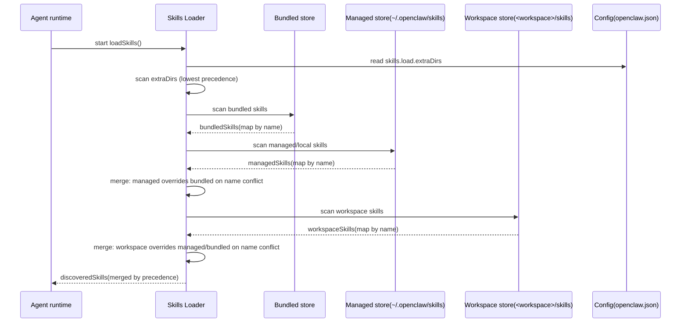
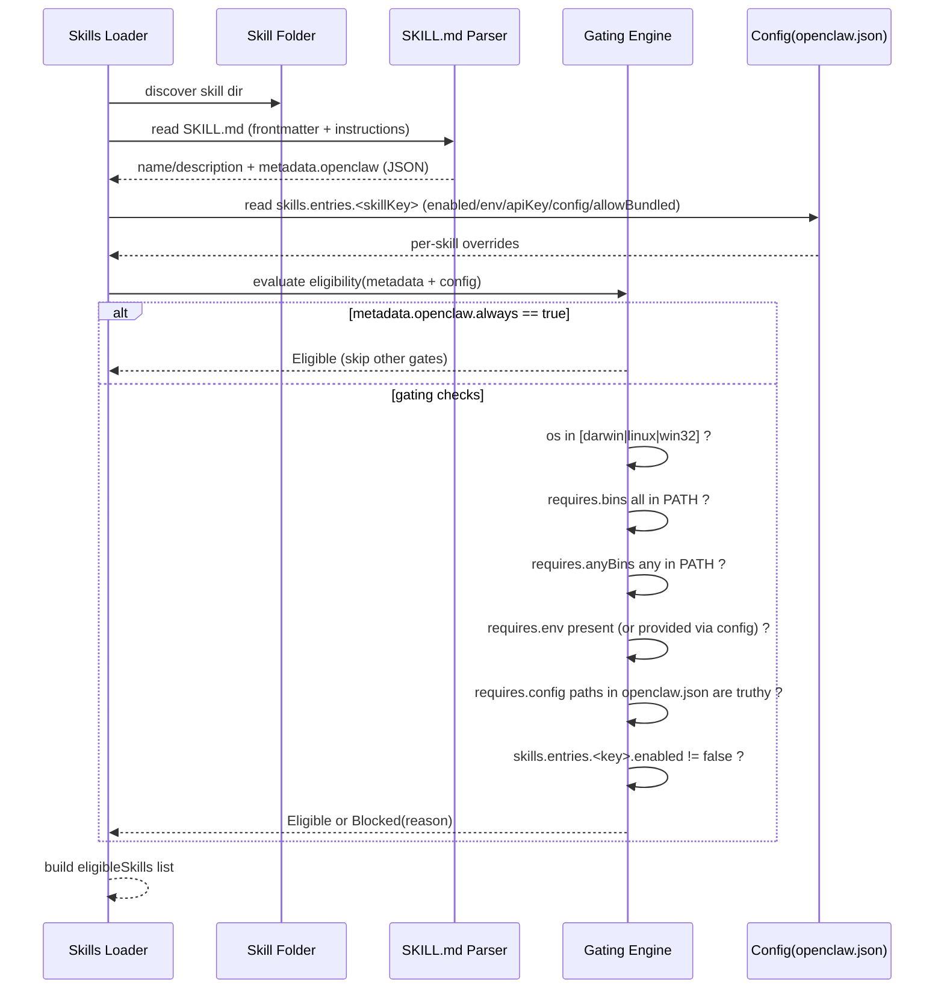
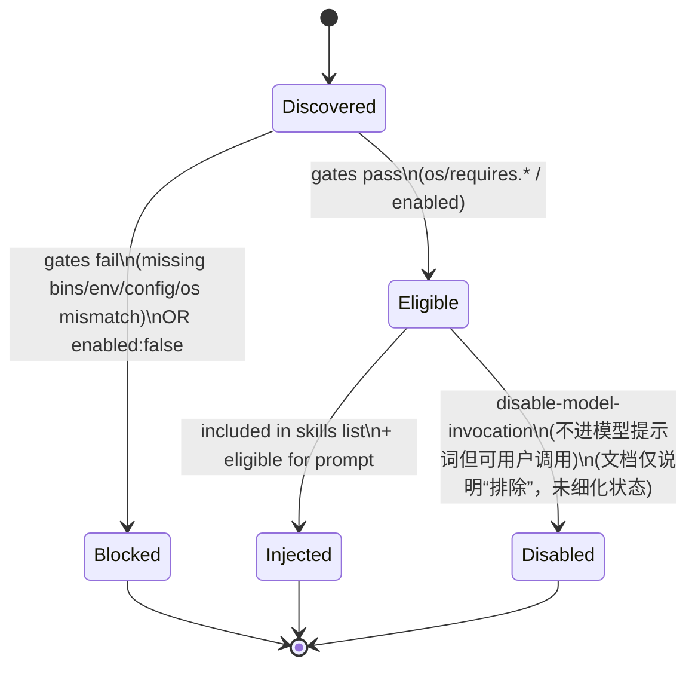
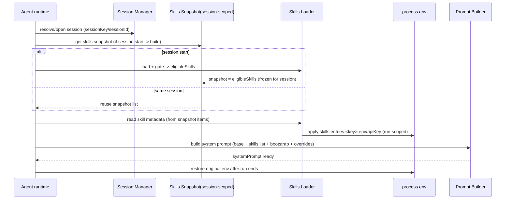
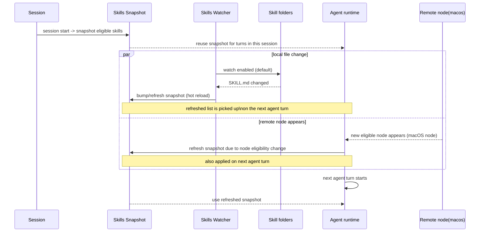

# OpenClaw skills控制系统设计

### 0) 名词对齐（最多 10 行）

- **Bundled skills**：随 OpenClaw 安装包自带的 baseline skills（最低优先级）。 ([OpenClaw](https://docs.openclaw.ai/tools/skills))
- **Managed(Local) skills**：本机托管/本地 skills，位于 `~/.openclaw/skills`，可被同机多个 agent 共享。 ([OpenClaw](https://docs.openclaw.ai/tools/skills))
- **Workspace skills**：单个工作区（某个 agent/workspace）专属 skills，位于 `<workspace>/skills`（最高优先级）。 ([OpenClaw](https://docs.openclaw.ai/tools/skills))
- **precedence（覆盖优先级）**：同名 skill 冲突时，按位置优先级覆盖。 ([OpenClaw](https://docs.openclaw.ai/tools/skills))
- **gating（资格门控）**：load-time 基于 `SKILL.md` 的 `metadata.openclaw`（os / requires.* / config 等）筛掉不符合环境的 skills。 ([OpenClaw](https://docs.openclaw.ai/zh-CN/tools/skills))
- **snapshot（会话快照）**：session start 时把 “eligible skills 列表” 固化，并在同一 session 内复用。 ([OpenClaw](https://docs.openclaw.ai/tools/skills))
- **watcher（监视热更）**：默认监听 skill 文件夹，`SKILL.md` 变化会 bump snapshot，并在**下一次 agent turn**生效。 ([OpenClaw](https://docs.openclaw.ai/tools/skills))
- **per-run env injection**：每次 agent run 临时把 `skills.entries.*.env/apiKey` 注入 `process.env`，run 结束后还原。 ([OpenClaw](https://docs.openclaw.ai/tools/skills))

## **关键生命周期状态总结**

| **阶段** | **状态** | **说明** |
| --- | --- | --- |
| **会话启动** | 创建快照 | 冻结可用技能列表，提升性能 |
| **技能加载** | 三层优先级 | `<workspace>/skills` ＞ `~/.openclaw/skills` ＞ bundled；`skills.load.extraDirs` 扫描到的目录**最低优先级**。 ([OpenClaw](https://docs.openclaw.ai/tools/skills)) |
| **过滤阶段** | Gate 检查 | OS、bins、env、config 多维度验证 |
| **环境注入** | 临时生效 | 仅在 Agent Turn 期间注入环境变量 |
| **热更新** | Watcher 监听 | 检测 SKILL.md 变化并刷新快照 |
| **远程节点** | 动态判定 | macOS 节点上线后技能变为 eligible |
| **Sandbox** | 容器隔离 | 需在容器内预装依赖 binary |

---

## 1) 时序图 A：Skills 加载与优先级覆盖（Locations + Precedence）



- 冲突覆盖：同名 skill 以 **Workspace 覆盖 Managed 覆盖 Bundled**。 ([OpenClaw](https://docs.openclaw.ai/tools/skills))
- `skills.load.extraDirs`：作为额外扫描目录，但位置是**最低优先级**（比 bundled 还低）。 ([OpenClaw](https://docs.openclaw.ai/tools/skills))

---

## 2) 时序图 B：Skills Eligibility / Gating（load-time filters）





- gating 字段来源：`SKILL.md` 的 `metadata.openclaw`（os / requires.bins / anyBins / env / config / always）。 ([OpenClaw](https://docs.openclaw.ai/zh-CN/tools/skills))
- `always: true`：**始终包含**该 skill，跳过其他门控。 ([OpenClaw](https://docs.openclaw.ai/zh-CN/tools/skills))
- `requires.env`：要求 env “存在或在配置中提供”；`requires.config` 要求 `openclaw.json` 路径为真值。 ([OpenClaw](https://docs.openclaw.ai/zh-CN/tools/skills))

> 注：`disable-model-invocation` 的“从模型提示词中排除”在文档里有描述，但没有给出更细的运行态转换细节；上面状态机仅把它表达为一种 “Injected 的变体/旁路”。 ([OpenClaw](https://docs.openclaw.ai/zh-CN/tools/skills))
> 

---

## 3) 时序图 C：一次 Agent Run 中 Skills 的“注入与还原”（per-run env injection + prompt build）



- run 级别：env 注入只在**本次 agent run**生效，结束后还原；不影响全局 shell 环境。 ([OpenClaw](https://docs.openclaw.ai/tools/skills))
- session 级别：eligible skills 在 session start **snapshot 并复用**；同 session 多轮保持一致。 ([OpenClaw](https://docs.openclaw.ai/tools/skills))
- 对调试/一致性：同 session 的“可用 skills 列表”稳定；env 变更可定位到具体 run。 ([OpenClaw](https://docs.openclaw.ai/tools/skills))
- prompt build 位置：Agent Loop 明确 “skills snapshot + env/prompt 注入”发生在 session/workspace preparation 与 prompt assembly 阶段。 ([OpenClaw](https://docs.openclaw.ai/concepts/agent-loop))

---

## 4) 时序图 D：Session Snapshot + Watcher 热更新（mid-session refresh）



- 生效时机：watcher/远程节点导致的 snapshot 刷新，**不会打断当前 turn**，在**下一次 agent turn**才拾取。 ([OpenClaw](https://docs.openclaw.ai/tools/skills))
- 为什么：文档把它描述为“hot reload”，并明确 “picked up on the next agent turn”。 ([OpenClaw](https://docs.openclaw.ai/tools/skills))
- 同类刷新：新 macOS 远程节点出现会让某些 macOS-only skills 变为 eligible，从而触发 mid-session refresh。 ([OpenClaw](https://docs.openclaw.ai/tools/skills))

---

## 5) 可选补充：Managed Skills Lifecycle（bundled vs local override vs workspace-owned）

```mermaid
flowchart LR
  B[Bundled baseline skills\n(install ships)] --> M[Managed/local overrides\n~/.openclaw/skills]
  M --> W[Workspace (user-owned) skills\n<workspace>/skills]

  X[Name conflict?] -->|yes| P[Precedence:\nWorkspace > Managed > Bundled]
  B --> X
  M --> X
  W --> X
```

- bundled 是 baseline；`~/.openclaw/skills` 用于本地 override（例如 pin/patch）；workspace skills 作为 user-owned override，冲突时覆盖前两者。 ([OpenClaw](https://docs.openclaw.ai/tools/skills))

---

（按你给的约束：以上只画 Skills 相关生命周期；未在文档中明确的实现细节均未扩写。）