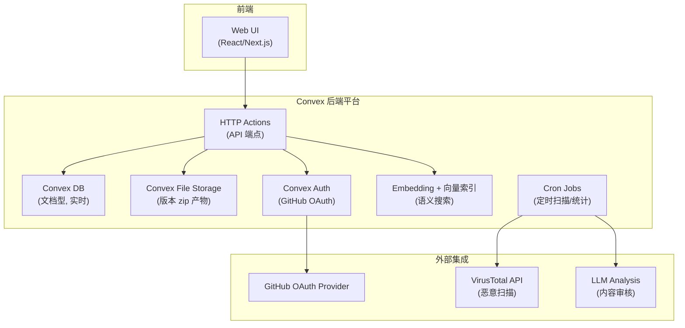
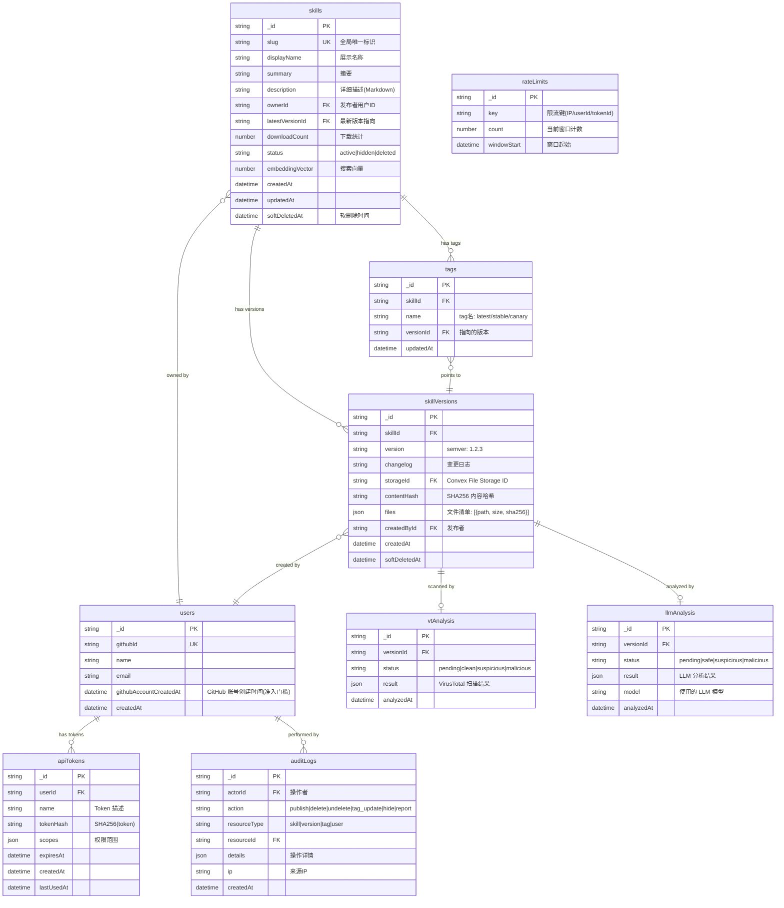

# ClawHub API 全景逆向分析 技术设计文档

## 1. 文档元信息
- **模块**: ClawHub API 全景逆向分析
- **版本**: v0.1-draft
- **作者**: [待填]
- **日期**: 2026-02-25
- **状态**: Draft
- **关联需求**: Feature-2026-02-25.md §1-§4（第一部分：ClawHub 私有化逆向分析）
- **前置依赖文档**: 无（本文档为其他模块提供基础输入）

## 2. 目标与范围

### 核心问题
对 ClawHub v1 公开 API、技术栈、CLI 行为协议与安全机制进行全面逆向分析，为后续私有化 Registry 的兼容性设计（`02-api-compatibility.md`）与数据模型定义（`03-data-model.md`）提供事实依据。

### In-Scope
- ClawHub v1 API 完整端点列表（请求参数、响应结构、认证方式、分页模式）
- ClawHub 技术栈与数据模型逆向（Convex 后端、Auth、向量搜索等）
- `clawhub` CLI 完整命令集与交互协议
- ClawHub 安全机制现状评估

### Out-of-Scope
- 私有化 Registry 的设计方案（见 `02-api-compatibility.md` 及后续文档）
- Skill 格式规范与签名方案（见 `04-package-signing.md`）
- 与 OpenClaw 执行层联动（见 `09-openclaw-integration.md`）

## 3. 设计约束与前提假设

- 逆向分析基于 ClawHub 公开文档、CLI 源码 README、Schema 公开信息，不涉及对私有 API 的未授权探测
- ClawHub 使用 Convex 作为后端平台（DB + file storage + HTTP actions），Convex Auth 集成 GitHub OAuth
- ClawHub CLI 已支持 `--registry` 参数，说明其设计已预留多 Registry 切换能力
- 本文档结论将作为 `02-api-compatibility.md` 兼容性决策的核心输入

## 4. 详细设计

### 4.1 ClawHub API 端点全景

Base URL: `https://clawhub.com/api/v1`

#### 4.1.1 只读查询端点

| Method | Path | 参数 | 响应结构 | 认证 | 分页 |
|--------|------|------|----------|------|------|
| GET | `/search` | `q` (关键词), `limit`, `cursor` | `{ results: Skill[], nextCursor? }` | 否（公开） | cursor-based |
| GET | `/skills` | `limit`, `sort` (downloads/updated/name), `tag`, `cursor` | `{ skills: Skill[], nextCursor? }` | 否（公开） | cursor-based |
| GET | `/skills/{slug}` | - | `{ skill: SkillDetail }` | 否（公开） | - |
| GET | `/skills/{slug}/versions` | `limit`, `cursor` | `{ versions: SkillVersion[], nextCursor? }` | 否（公开） | cursor-based |
| GET | `/download` | `slug`, `version` | binary stream (zip) 或 302 重定向 | 否（公开） | - |
| GET | `/skills/{slug}/file` | `version`, `path` | 文本内容（限制大小） | 否（公开） | - |

#### 4.1.2 认证与身份端点

| Method | Path | 参数 | 响应结构 | 认证 | 说明 |
|--------|------|------|----------|------|------|
| GET | `/whoami` | - | `{ user: { id, name, email, github } }` | Bearer Token / API Key | CLI `whoami` 命令调用 |
| POST | `/auth/token` | OAuth code / refresh | `{ accessToken, refreshToken, expiresIn }` | - | Token 交换 |

#### 4.1.3 写入端点

| Method | Path | 参数 | 响应结构 | 认证 | 说明 |
|--------|------|------|----------|------|------|
| POST | `/skills` | multipart: files + metadata (name, version, changelog, tags) | `{ skill: SkillDetail, version: SkillVersion }` | Bearer Token | 发布新版本 |
| POST | `/uploads` | `{ slug, fileCount }` | `{ uploadId, presignedUrls[] }` | Bearer Token | 两阶段上传-初始化 |
| DELETE | `/skills/{slug}` | - | `{ success: true }` | Bearer Token | 软删除（owner/mod） |
| POST | `/skills/{slug}/undelete` | - | `{ skill: SkillDetail }` | Bearer Token | 恢复已删除 |
| POST | `/skills/{slug}/tags` | `{ tag, version }` | `{ tag: TagDetail }` | Bearer Token | 设置/移动 tag |
| DELETE | `/skills/{slug}/tags/{tag}` | - | `{ success: true }` | Bearer Token | 删除 tag |

#### 4.1.4 认证方式

- **Bearer Token**: `Authorization: Bearer <access_token>`，来源于 GitHub OAuth 授权流
- **API Key**: `Authorization: ApiKey <key>` 或 `X-API-Key: <key>`，用于 CI/自动化场景
- **免认证端点**: search / skills 列表 / download / file 预览均为公开只读

#### 4.1.5 分页模式

ClawHub 使用 **cursor-based 分页**（非 offset-based）：
- 请求参数: `limit` (默认 20, 最大 100) + `cursor` (不透明字符串)
- 响应包含 `nextCursor`，为 `null` 时表示最后一页
- 优点: 在数据持续变化时保持一致性，避免 offset 漂移

#### 4.1.6 错误响应规范

```json
{
  "error": {
    "code": "SKILL_NOT_FOUND",
    "message": "Skill 'unknown-skill' does not exist",
    "requestId": "req_01JNE9..."
  }
}
```

已知错误码：

| 错误码 | HTTP Status | 说明 |
|--------|-------------|------|
| `SKILL_NOT_FOUND` | 404 | 技能不存在 |
| `SKILL_VERSION_CONFLICT` | 409 | 版本号已存在（不可变） |
| `UNAUTHORIZED` | 401 | 认证失败 |
| `FORBIDDEN` | 403 | 权限不足 |
| `RATE_LIMITED` | 429 | 请求频率超限 |
| `SKILL_HIDDEN` | 403 | 技能已被隐藏（举报/恶意检测） |
| `VALIDATION_ERROR` | 400 | 请求参数校验失败 |

### 4.2 ClawHub 技术栈与数据模型逆向

#### 4.2.1 技术栈



**关键技术选型:**
- **后端平台**: Convex（提供 DB + 文件存储 + HTTP Actions + 实时订阅 + Cron）
- **认证**: Convex Auth 集成 GitHub OAuth（发布者必须有 GitHub 账号）
- **搜索**: Embedding 向量索引（Convex 内置向量搜索能力）
- **文件存储**: Convex File Storage（存储版本 zip 产物）
- **安全扫描**: VirusTotal API + LLM 内容分析（异步 Cron 驱动）

#### 4.2.2 核心数据模型（Schema 逆向）

基于 ClawHub 公开 README/Schema 信息还原的实体关系：



### 4.3 ClawHub CLI 行为协议

#### 4.3.1 完整命令集

| 命令 | 语法 | 说明 |
|------|------|------|
| `login` | `clawhub login [--registry <url>]` | GitHub OAuth 浏览器授权流 |
| `whoami` | `clawhub whoami [--registry <url>]` | 验证当前 token 有效性 |
| `search` | `clawhub search <query> [--limit N] [--registry <url>]` | 搜索技能（关键词 + 语义） |
| `install` | `clawhub install <slug>[@version] [--tag <tag>] [--workdir <path>] [--dir <dir>] [--force] [--no-input]` | 安装到 `<workdir>/<dir>/<skillName>/` |
| `update` | `clawhub update [<slug>] [--all] [--workdir <path>] [--force]` | 更新已安装技能 |
| `list` | `clawhub list [--workdir <path>]` | 列出已安装技能（基于 lockfile） |
| `uninstall` | `clawhub uninstall <slug> [--workdir <path>] [--yes]` | 删除本地技能并更新 lockfile |
| `inspect` | `clawhub inspect <slug> [--versions] [--files] [--registry <url>]` | 查看远端元数据（不安装） |
| `publish` | `clawhub publish <dir> [--version <semver>] [--tags <tag,...>] [--registry <url>]` | 发布新版本 |
| `delete` | `clawhub delete <slug> [--registry <url>]` | 软删除技能 |
| `undelete` | `clawhub undelete <slug> [--registry <url>]` | 恢复已删除技能 |
| `sync` | `clawhub sync [--workdir <path>]` | 同步 lockfile 与实际目录状态 |

#### 4.3.2 全局参数

| 参数 | 说明 | 默认值 |
|------|------|--------|
| `--workdir <path>` | 工作目录（lockfile 和技能安装的根） | `.`（当前目录） |
| `--dir <name>` | 技能安装子目录名 | `skills` |
| `--registry <url>` | Registry URL | `https://clawhub.com`（内置默认） |
| `--no-input` | 非交互模式，跳过所有确认提示 | `false` |
| `--verbose` | 详细输出 | `false` |

#### 4.3.3 Lockfile 格式与内容哈希校验

Lockfile 路径: `<workdir>/.clawhub/lock.json`

```json
{
  "version": 1,
  "skills": {
    "pdf-processing": {
      "version": "1.2.3",
      "tag": "latest",
      "contentHash": "sha256:a1b2c3d4e5f6...",
      "registry": "https://clawhub.com",
      "installedAt": "2026-02-20T10:00:00Z"
    },
    "web-scraper": {
      "version": "2.0.0",
      "tag": "stable",
      "contentHash": "sha256:f6e5d4c3b2a1...",
      "registry": "https://clawhub.com",
      "installedAt": "2026-02-21T15:30:00Z"
    }
  }
}
```

**内容哈希校验逻辑:**

```mermaid
flowchart TD
  A["CLI install/update 触发"] --> B["下载 zip + 计算 sha256"]
  B --> C["与 Registry 返回的 contentHash 比对"]
  C -->|匹配| D["解压到 skills/"]
  C -->|不匹配| E["拒绝安装, 报错"]
  D --> F["写入/更新 lockfile"]

  G["CLI update 检查"] --> H["计算本地技能目录 contentHash"]
  H --> I["比对 lockfile 中记录的 contentHash"]
  I -->|匹配| J["本地未修改, 可安全更新"]
  I -->|不匹配| K["本地有修改"]
  K --> L{"交互模式?"}
  L -->|是| M["提示用户确认覆盖"]
  L -->|否(--no-input)| N["跳过更新, 输出警告"]
  M -->|确认| J
  M -->|取消| O["跳过该技能"]
```

**冲突处理策略:**
- 安装时: 若目标目录已存在且 contentHash 与 lockfile 不匹配（本地有修改），默认拒绝覆盖
- 交互模式: 提示用户选择覆盖/跳过/备份
- `--force`: 强制覆盖本地修改
- `--no-input`: 非交互模式下跳过有冲突的技能

### 4.4 ClawHub 安全机制现状

#### 4.4.1 发布准入机制

| 机制 | 说明 | 评估 |
|------|------|------|
| GitHub 账号年龄 | 发布者 GitHub 账号需满足最低创建时间要求 | 基础门槛，可防一次性恶意账号 |
| 单一身份绑定 | 发布者必须通过 GitHub OAuth 认证 | 可追溯，但不保证身份可信 |
| 举报阈值自动隐藏 | 收到足够举报数后自动隐藏技能 | 被动防御，依赖社区 |
| API Token 作用域 | Token 可限定操作范围 | 降低 Token 泄露的爆炸半径 |

#### 4.4.2 恶意扫描机制

| 机制 | 实现 | 触发时机 | 覆盖范围 |
|------|------|----------|----------|
| VirusTotal 扫描 | 通过 VT API 提交产物扫描 | 发布后异步 | 已知恶意签名/行为模式 |
| LLM 内容分析 | LLM 模型审查 SKILL.md 指令内容 | 发布后异步 | 社会工程/可疑命令模式/凭据收集意图 |
| 结果存储 | `vtAnalysis` / `llmAnalysis` 表 | - | 与版本关联，可按需查询 |

#### 4.4.3 审计日志能力

- **覆盖动作**: publish、delete、undelete、tag 更新、举报、隐藏
- **记录粒度**: 操作者 ID、操作类型、资源类型/ID、详情 JSON、来源 IP、时间戳
- **访问控制**: 仅管理员/审计角色可查询
- **保留策略**: 未公开（推测为长期保留）

#### 4.4.4 安全能力差距分析

| 能力 | ClawHub 现状 | 企业私有化需求 | 差距 |
|------|-------------|---------------|------|
| 发布签名 | 无强制签名 | 必须强制签名 | **关键差距** |
| Quarantine/审批 | 举报后被动隐藏 | 发布前主动 quarantine | **关键差距** |
| RBAC | 仅 owner/public 二元模型 | Org→Team→Skill 多级 RBAC | **关键差距** |
| 组织/命名空间 | 无组织概念 | 多租户/命名空间隔离 | **关键差距** |
| 离线/断网 | 不支持 | 必须支持离线降级 | **关键差距** |
| 扫描深度 | VT + LLM（基础） | 可定制策略引擎 + 多扫描器 | 中等差距 |
| SBOM | 无 | 供应链合规需要 | 中等差距 |
| TUF 防回滚 | 无 | 高安全场景需要 | 长期演进 |

## 5. 设计决策记录（ADR）

### ADR-01: 以公开信息逆向为主，不依赖私有 API

- **决策**: 所有分析基于 ClawHub 公开文档、CLI README、Schema 公开部分
- **理由（Why）**: 确保分析可复现、可引用；避免对私有系统的未授权探测带来的法律与道德风险
- **替代方案（Alternatives Considered）**: 直接抓包分析 CLI 网络请求——信息更丰富但存在合规风险，暂不采用

### ADR-02: 以 Convex 平台特征理解 ClawHub 的约束与能力边界

- **决策**: 将 Convex 的"文档型 DB + 文件存储 + HTTP Actions + 向量索引"特征作为逆向 ClawHub 行为的基础假设
- **理由（Why）**: ClawHub 的许多设计选择（cursor 分页、嵌入式向量搜索、文件存储 URL 模式）可由底层平台特性解释
- **替代方案（Alternatives Considered）**: 按通用 REST API 逆向，不假设实现——但这会丢失对搜索、分页、存储等行为模式的深度理解

## 6. 安全考量

### 商店侧
- ClawHub 的安全机制以"被动 + 异步"为主（举报隐藏 + 异步扫描），不满足企业"主动 + 前置"的准入要求
- 缺少强制签名意味着无法证明产物未被篡改
- 单一 GitHub 账号准入门槛可被规避（购买老账号、盗号等）

### 执行侧
- ClawHub 本身不涉及执行层安全（由 OpenClaw 运行时负责）
- 但恶意技能在 ClawHub 上分发后，执行层的 sandbox 是最后一道防线
- API Token 泄露可导致恶意发布——ClawHub 的 Token scope 机制是必要但不充分的控制

## 7. 接口与依赖

### 对外暴露
本文档不暴露接口，作为分析报告提供给其他设计文档引用。

### 其他模块的依赖关系
- `02-api-compatibility.md`: 依赖本文档的 API 端点全景，以确定兼容/扩展/延后决策
- `03-data-model.md`: 依赖本文档的数据模型逆向，以设计私有化 Registry 的对象模型
- `04-package-signing.md`: 依赖本文档的安全差距分析，确定签名方案优先级
- `06-search.md`: 依赖本文档对 embedding 向量搜索的技术栈分析
- `11-cli-spec.md`: 依赖本文档的 CLI 行为协议，确保兼容性

## 8. 测试策略

### 关键验收条件
- API 端点列表与 ClawHub CLI 实际行为一致（通过 CLI `--verbose` 模式验证）
- 数据模型实体关系与 ClawHub 公开 Schema 信息吻合
- 安全差距分析覆盖所有企业级安全需求

### 建议测试方法
- **对比验证**: 使用 `clawhub` CLI 命令配合 `--verbose` 选项，对比文档记录的端点与实际请求
- **Schema 验证**: 对 ClawHub 公开 README/Convex schema 做交叉引用，确保不遗漏实体
- **同行评审**: 安全差距分析部分由安全工程师复核

## 9. 开放问题（Open Questions）

1. **Rate Limit 具体配额**: ClawHub 的限流阈值（每分钟/每小时请求数）未公开，需进一步确认
2. **两阶段上传的具体行为**: `POST /uploads` 的 presigned URL 有效期与分片策略细节待确认
3. **向量搜索维度**: ClawHub 使用的 embedding 模型与向量维度未公开，影响搜索兼容性评估
4. **Webhook/事件通知**: ClawHub 是否支持发布/更新的 Webhook 回调（影响代理层的缓存失效设计）
5. **CLI 版本演进**: `clawhub` CLI 是否有版本化的 API 兼容承诺（影响长期兼容策略）

## 10. 参考资料

- [OpenClaw Skills 文档](https://docs.openclaw.ai/tools/skills) — 技能格式、加载机制、gating 规范
- [ClawHub 文档](https://docs.openclaw.ai/tools/clawhub) — ClawHub CLI 使用指南
- [ClawHub 公开 README / Schema](https://github.com/openclaw/clawhub) — Convex schema、技术栈信息
- [Microsoft Security Blog: Running OpenClaw Safely](https://www.microsoft.com/en-us/security/blog/2026/02/19/running-openclaw-safely-identity-isolation-runtime-risk/) — OpenClaw 安全运行指南
- [1Password Blog: From Magic to Malware](https://1password.com/blog/from-magic-to-malware-how-openclaws-agent-skills-become-an-attack-surface) — ClawHub 恶意技能攻击面分析
- 项目内部文档: `基本概念.md`、`工作空间与 Skill 商店设计方案深度调研与技术方案建议.md`
