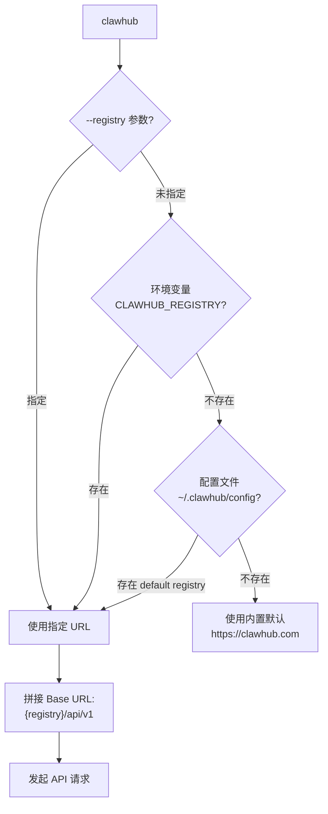
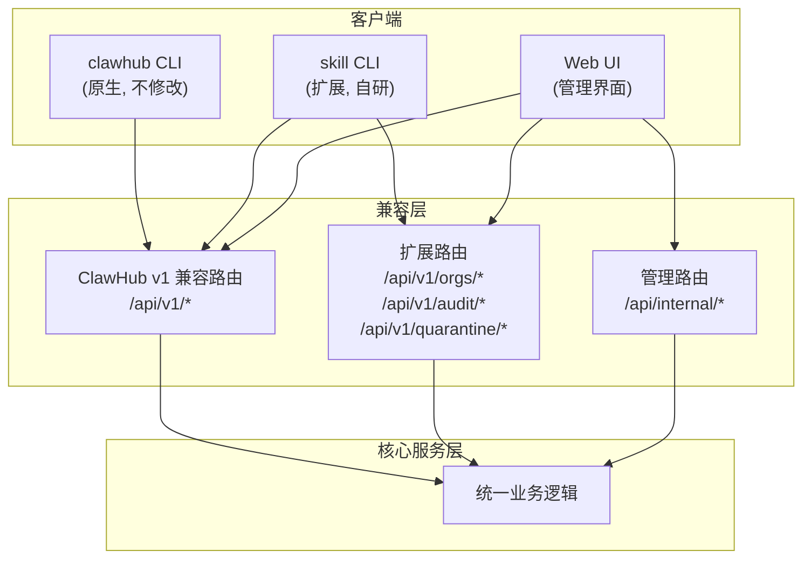
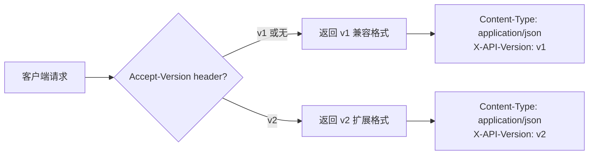

# API 兼容性设计 技术设计文档

## 1. 文档元信息
- **模块**: API 兼容性设计
- **版本**: v0.1-draft
- **作者**: [待填]
- **日期**: 2026-02-25
- **状态**: Draft
- **关联需求**: Feature-2026-02-25.md §5（第二部分：兼容性设计）
- **前置依赖文档**: `01-clawhub-api-analysis.md`（ClawHub API 全景）

## 2. 目标与范围

### 核心问题
制定私有化 Registry 对 ClawHub v1 API 的兼容性策略，确保 `clawhub --registry <private>` 能透明切换到私有 Registry，同时明确哪些端点需要扩展以满足企业级需求。

### In-Scope
- ClawHub v1 端点的 1:1 兼容决策
- 企业扩展端点（组织/RBAC/签名/quarantine/yank）的设计
- `--registry` 透明切换的完整技术方案
- 兼容/扩展/延后的决策矩阵

### Out-of-Scope
- 具体数据模型字段定义（见 `03-data-model.md`）
- 签名方案细节（见 `04-package-signing.md`）
- CLI 完整规范（见 `11-cli-spec.md`）

## 3. 设计约束与前提假设

- **硬约束**: `clawhub --registry <private-url>` 必须能直接使用，不修改 CLI 源码
- **硬约束**: 私有 Registry 的 Base URL 格式必须为 `https://<host>/api/v1`
- **假设**: 现有 `clawhub` CLI 对 API 响应结构做了严格校验，字段不能缺失
- **假设**: 未来可能需要自研 CLI（`skill` 命令），兼容 + 扩展并行
- **接口约定**: 所有兼容端点保持与 `01-clawhub-api-analysis.md` 记录的请求/响应格式一致

## 4. 详细设计

### 4.1 端点兼容性决策矩阵

#### 分类标准

| 分类 | 定义 | 实现优先级 |
|------|------|-----------|
| **1:1 兼容** | 请求/响应格式与 ClawHub v1 完全一致，`clawhub` CLI 无需修改即可使用 | **P0**（阶段一） |
| **兼容 + 扩展** | 保持 ClawHub v1 兼容格式，同时支持额外参数/字段（向后兼容） | **P1**（阶段一/二） |
| **新增端点** | ClawHub 不存在，为企业需求新增 | **P1-P2**（阶段二/三） |
| **延后端点** | 可后续实现，MVP 不需要 | **P3**（阶段四+） |

#### 完整决策矩阵

| 端点 | Method | Path | 分类 | 优先级 | 兼容性说明 |
|------|--------|------|------|--------|-----------|
| 健康检查 | GET | `/health` | 新增 | P0 | ClawHub 无此端点，私有部署必须 |
| 身份校验 | GET | `/whoami` | 1:1 兼容 | P0 | CLI `whoami` 直接调用 |
| 搜索 | GET | `/search` | 兼容 + 扩展 | P0 | 兼容 `q/limit/cursor`；扩展 `namespace/scope` 过滤 |
| 技能列表 | GET | `/skills` | 兼容 + 扩展 | P0 | 兼容 `limit/sort/tag/cursor`；扩展 `namespace/status` |
| 技能详情 | GET | `/skills/{slug}` | 1:1 兼容 | P0 | 响应结构保持一致 |
| 版本列表 | GET | `/skills/{slug}/versions` | 1:1 兼容 | P0 | cursor 分页保持一致 |
| 下载 | GET | `/download` | 1:1 兼容 | P0 | `slug + version` 参数，返回 zip stream |
| 文件预览 | GET | `/skills/{slug}/file` | 1:1 兼容 | P1 | 可延后到阶段二 |
| 发布 | POST | `/skills` | 兼容 + 扩展 | P1 | 兼容 multipart 上传；扩展签名/namespace 字段 |
| 两阶段上传 | POST | `/uploads` | 兼容 + 扩展 | P1 | 支持 presigned URL + commit 协议 |
| 软删除 | DELETE | `/skills/{slug}` | 1:1 兼容 | P1 | 保持 ClawHub 行为 |
| 恢复 | POST | `/skills/{slug}/undelete` | 1:1 兼容 | P1 | 保持 ClawHub 行为 |
| Tag 设置 | POST | `/skills/{slug}/tags` | 1:1 兼容 | P1 | Tag 移动用于回滚 |
| Tag 删除 | DELETE | `/skills/{slug}/tags/{tag}` | 1:1 兼容 | P1 | 保持 ClawHub 行为 |
| **Yank** | POST | `/skills/{slug}/versions/{ver}/yank` | **新增** | P1 | 企业级版本封禁 |
| **签名查询** | GET | `/skills/{slug}/signatures` | **新增** | P2 | 返回 cosign bundle |
| **审计日志** | GET | `/audit` | **新增** | P2 | 管理员审计接口 |
| **组织管理** | GET/POST | `/orgs/*` | **新增** | P2 | RBAC 组织管理 |
| **团队管理** | GET/POST | `/orgs/{org}/teams/*` | **新增** | P2 | RBAC 团队管理 |
| **Quarantine** | GET/POST | `/quarantine/*` | **新增** | P2 | 隔离审批管理 |
| **Token 管理** | GET/POST/DELETE | `/tokens/*` | **新增** | P2 | API Token CRUD |
| **SBOM 查询** | GET | `/skills/{slug}/versions/{ver}/sbom` | **延后** | P3 | 供应链 BOM |
| **Provenance** | GET | `/skills/{slug}/versions/{ver}/provenance` | **延后** | P3 | SLSA 来源证明 |
| **Webhook 管理** | GET/POST | `/webhooks/*` | **延后** | P3 | 事件推送订阅 |

### 4.2 `--registry` 透明切换方案

#### 4.2.1 切换机制



#### 4.2.2 Registry URL 解析规则

| 优先级 | 来源 | 示例 |
|--------|------|------|
| 1（最高） | `--registry` 命令行参数 | `clawhub --registry https://skills.corp.internal install ...` |
| 2 | `CLAWHUB_REGISTRY` 环境变量 | `export CLAWHUB_REGISTRY=https://skills.corp.internal` |
| 3 | `~/.clawhub/config` 配置文件 | `registry: https://skills.corp.internal` |
| 4（最低） | CLI 内置默认值 | `https://clawhub.com` |

#### 4.2.3 多 Registry 配置方案

私有 CLI（`skill` 命令）扩展支持多 Registry 配置（`.skillrc.yaml`）：

```yaml
registries:
  clawhub:
    type: clawhub-v1
    url: "https://clawhub.com"
  private:
    type: clawhub-v1
    url: "https://skills.corp.internal"
defaults:
  registry: "private"
```

对 `clawhub` CLI 的兼容方案（无需修改 CLI 源码）：

```bash
# 方案 A: 环境变量（推荐团队统一配置）
export CLAWHUB_REGISTRY=https://skills.corp.internal

# 方案 B: Shell alias
alias clawhub-corp='clawhub --registry https://skills.corp.internal'

# 方案 C: 代理层（DNS/反向代理将 clawhub.com 指向私有实例）
# 适用于严格管控环境，需配合 TLS 证书
```

### 4.3 兼容层实现架构



### 4.4 响应格式兼容策略

#### 原则: 超集兼容（Superset Compatibility）

- **ClawHub 字段全部保留**: 确保 `clawhub` CLI 的解析不会出错
- **扩展字段追加**: 新字段放在响应 JSON 中，旧客户端忽略未知字段
- **不修改已有字段语义**: 字段名、类型、枚举值保持一致

#### 示例: `/skills/{slug}` 响应

```json
{
  // ---- ClawHub v1 兼容字段（不可修改） ----
  "slug": "pdf-processing",
  "displayName": "PDF Processing",
  "summary": "Process and extract data from PDF files",
  "owner": { "id": "user_abc", "name": "john" },
  "latestVersion": "1.2.3",
  "tags": { "latest": "1.2.3" },
  "downloadCount": 1500,
  "status": "active",
  "createdAt": "2026-01-15T00:00:00Z",
  "updatedAt": "2026-02-20T00:00:00Z",

  // ---- 扩展字段（旧客户端自动忽略） ----
  "namespace": "corp-data",
  "organization": { "id": "org_xyz", "name": "DataTeam" },
  "signatureStatus": "signed",
  "quarantineStatus": "approved",
  "riskLevel": "low"
}
```

### 4.5 版本协商与 API 演进策略



- **v1（默认）**: 完全 ClawHub 兼容，扩展字段作为可选追加
- **v2（未来）**: 可能调整响应结构（如嵌套/重组），但保持 v1 不变
- **弃用策略**: 最少 6 个月弃用通知 + `Sunset` header

## 5. 设计决策记录（ADR）

### ADR-01: 以 ClawHub v1 兼容为 P0，而非全新 API 设计

- **决策**: 私有 Registry 优先实现 ClawHub v1 兼容端点，确保 `clawhub` CLI 可直接使用
- **理由（Why）**: 最小迁移成本；团队可立即使用现有工具链；降低"新 CLI + 新 API"同时开发的风险
- **替代方案（Alternatives Considered）**:
  - 全新 API 设计（REST/GraphQL）：灵活但需同时开发 CLI，初期成本高
  - 仅做反向代理：无法添加企业扩展能力

### ADR-02: 采用超集兼容（Superset）而非严格镜像

- **决策**: 响应中追加扩展字段，而非维持与 ClawHub 严格相同的响应结构
- **理由（Why）**: 扩展字段不影响旧客户端（JSON 反序列化忽略未知字段）；避免维护两套响应映射
- **替代方案（Alternatives Considered）**:
  - 严格镜像 + 独立扩展端点：维护成本高，扩展字段的发现性差
  - 通过 HTTP header 区分格式：增加客户端复杂度

### ADR-03: 三层 Registry URL 优先级与环境变量注入

- **决策**: 采用 `--registry` > `CLAWHUB_REGISTRY` > 配置文件 > 内置默认 的优先级
- **理由（Why）**: 与 ClawHub CLI 现有行为一致；环境变量方便 CI/批量配置；配置文件支持持久化
- **替代方案（Alternatives Considered）**:
  - 仅支持 `--registry` 参数：CI 场景不便
  - DNS 重写方案：侵入性高，TLS 证书管理复杂

## 6. 安全考量

### 商店侧
- 兼容端点必须保持与 ClawHub 相同的认证要求（公开读 + 认证写）
- 扩展端点（审计/组织/quarantine）必须强制认证 + RBAC 鉴权
- API 版本协商不能被绕过（恶意客户端伪造 header 获取更多信息）

### 执行侧
- `--registry` 的切换是安全边界的转移点：从公共信任切换到内部信任
- 环境变量 `CLAWHUB_REGISTRY` 可被恶意脚本覆写——高安全环境应使用配置文件锁定
- 代理模式下必须验证上游 TLS 证书，防止中间人攻击

## 7. 接口与依赖

### 对外暴露的接口
- **兼容路由**: `/api/v1/*`（与 ClawHub v1 一致的公共 API）
- **扩展路由**: `/api/v1/orgs/*`、`/api/v1/audit/*`、`/api/v1/quarantine/*`、`/api/v1/tokens/*`
- **内部路由**: `/api/internal/*`（管理 UI 专用）

### 对其他模块的依赖
- `01-clawhub-api-analysis.md`: 提供 ClawHub v1 端点全景作为兼容基线
- `03-data-model.md`: 定义响应中对象的字段结构
- `08-rbac.md`: 提供扩展端点的鉴权规则
- `11-cli-spec.md`: CLI 命令与 API 的映射关系

## 8. 测试策略

### 关键验收条件
- `clawhub --registry <private> search "test"` 返回结果与 ClawHub 格式一致
- `clawhub --registry <private> install <slug>` 成功安装并写入 lockfile
- `clawhub --registry <private> publish <dir>` 成功发布
- `clawhub --registry <private> whoami` 返回正确用户信息
- 扩展字段不影响 `clawhub` CLI 正常工作

### 建议测试方法
- **兼容性回归测试**: 录制 `clawhub` CLI 与 ClawHub 的所有 API 交互，作为测试基线对私有 Registry 重放
- **契约测试**: 使用 Pact 或类似工具定义 v1 API 契约，每次发布前验证
- **模糊测试**: 对扩展字段的边界值进行 fuzz 测试，确保不影响 v1 兼容
- **E2E 测试**: 完整的 search → install → publish → update → uninstall 流程测试

## 9. 开放问题（Open Questions）

1. **ClawHub CLI 对未知字段的容忍度**: 需确认 `clawhub` CLI 是否使用严格反序列化（遇到未知字段报错）还是宽松模式（忽略未知字段）
2. **认证方式切换**: 私有 Registry 使用内部 OAuth/OIDC，`clawhub login` 流程需要适配——是否需要在兼容层模拟 GitHub OAuth 回调？
3. **分页 cursor 格式**: `clawhub` CLI 是否对 cursor 字符串做了格式校验（如 base64/JWT 解析），影响 cursor 实现方式的选择
4. **并行 Registry**: 是否需要支持从多个 Registry 聚合搜索结果？（影响搜索端点设计）

## 10. 参考资料

- `01-clawhub-api-analysis.md` — ClawHub API 端点全景与行为分析
- [ClawHub CLI 文档](https://docs.openclaw.ai/tools/clawhub) — CLI 参数与行为规范
- [npm Registry API](https://github.com/npm/registry/blob/master/docs/REGISTRY-API.md) — npm 的兼容性设计参考（`--registry` 切换模式）
- [Verdaccio](https://verdaccio.org/) — npm 兼容私有 Registry 代理的实现参考
- 项目内部文档: `工作空间与 Skill 商店设计方案深度调研与技术方案建议.md` §API/CLI 规范草案
