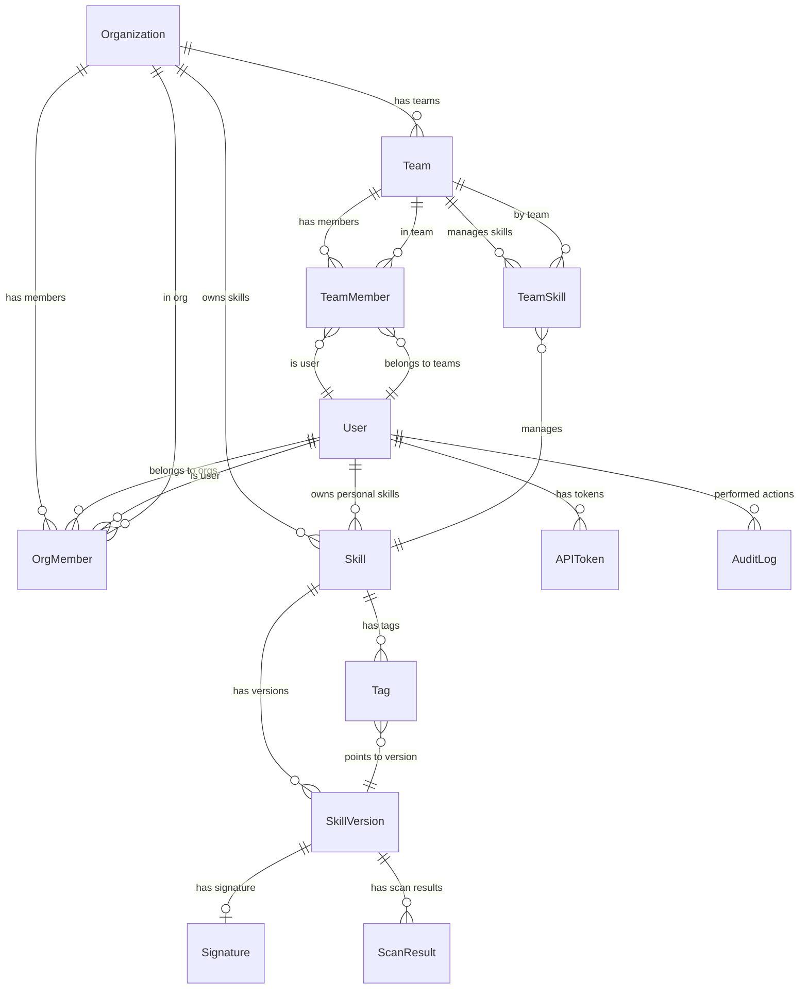
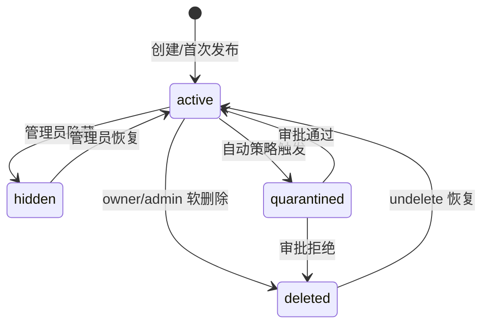
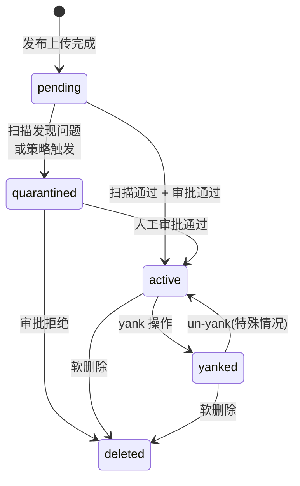

# 核心对象模型 技术设计文档

## 1. 文档元信息
- **模块**: 核心对象模型
- **版本**: v0.1-draft
- **作者**: [待填]
- **日期**: 2026-02-25
- **状态**: Draft
- **关联需求**: Feature-2026-02-25.md §6（第二部分：核心对象模型）
- **前置依赖文档**: `01-clawhub-api-analysis.md`（ClawHub 数据模型逆向）、`02-api-compatibility.md`（兼容与扩展的决策）

## 2. 目标与范围

### 核心问题
定义私有化 Skill Registry 的核心对象模型（ER 图 + 字段级表结构），覆盖技能全生命周期管理、组织权限、安全审计所需的全部实体，并确保与 ClawHub v1 的数据语义兼容。

### In-Scope
- 完整 ER 图（实体关系与基数）
- 字段级表结构定义（字段名/类型/约束/说明）
- 核心实体: Skill、SkillVersion、Tag、User、Organization、Team、APIToken、AuditLog、ScanResult、Signature
- 索引与查询模式建议

### Out-of-Scope
- 物理数据库选型（见 `10-deployment.md`）
- 搜索索引模型（见 `06-search.md`）
- RBAC 角色权限矩阵（见 `08-rbac.md`，本文仅定义数据结构）

## 3. 设计约束与前提假设

- **ClawHub 兼容约束**: `Skill.slug`、`SkillVersion.version`（semver）、`Tag.name` 等核心字段的语义和格式必须与 ClawHub v1 一致
- **AgentSkills 格式约束**: `Skill.slug` 必须匹配 `SKILL.md` 的 `name` 字段（小写字母/数字/连字符）
- **不可变版本约束**: 已发布的 `SkillVersion` 内容不可修改，只可通过发布新版本或 yank 来管理
- **元数据库**: 假设使用支持 JSON 字段的关系型数据库（如 PostgreSQL），可通过 `pgvector` 扩展支持向量搜索
- **软删除优先**: 所有实体优先使用软删除（`deletedAt`），保留审计追溯能力

## 4. 详细设计

### 4.1 核心 ER 图

### 4.2 字段级表结构定义

#### 4.2.1 Skill（技能）

| 字段 | 类型 | 约束 | 说明 |
|------|------|------|------|
| `id` | UUID | PK | 主键 |
| `slug` | VARCHAR(128) | UK, NOT NULL | 全局唯一标识（小写字母/数字/连字符），匹配 `SKILL.md` 的 `name` |
| `display_name` | VARCHAR(256) | NOT NULL | 展示名称 |
| `summary` | VARCHAR(500) | | 简短摘要 |
| `description` | TEXT | | 详细描述（Markdown） |
| `owner_type` | ENUM('user','org') | NOT NULL | 拥有者类型 |
| `owner_id` | UUID | FK, NOT NULL | 拥有者 ID（指向 User 或 Organization） |
| `namespace` | VARCHAR(128) | | 命名空间（如 `corp-data`，可选） |
| `latest_version_id` | UUID | FK | 指向最新版本 |
| `download_count` | BIGINT | DEFAULT 0 | 累计下载次数 |
| `status` | ENUM('active','hidden','quarantined','deleted') | NOT NULL, DEFAULT 'active' | 状态 |
| `visibility` | ENUM('public','org','private') | NOT NULL, DEFAULT 'org' | 可见性范围 |
| `risk_level` | ENUM('low','medium','high','critical') | DEFAULT 'low' | 风险分级（基于 gating 元数据分析） |
| `metadata` | JSONB | | 扩展元数据（从 SKILL.md frontmatter 提取） |
| `created_at` | TIMESTAMPTZ | NOT NULL | 创建时间 |
| `updated_at` | TIMESTAMPTZ | NOT NULL | 最后更新时间 |
| `deleted_at` | TIMESTAMPTZ | | 软删除时间 |

**索引:**
- `UNIQUE INDEX idx_skill_slug ON skills(slug) WHERE deleted_at IS NULL`
- `INDEX idx_skill_owner ON skills(owner_type, owner_id)`
- `INDEX idx_skill_namespace ON skills(namespace)`
- `INDEX idx_skill_status ON skills(status)`
- `GIN INDEX idx_skill_metadata ON skills USING gin(metadata)`

#### 4.2.2 SkillVersion（技能版本）

| 字段 | 类型 | 约束 | 说明 |
|------|------|------|------|
| `id` | UUID | PK | 主键 |
| `skill_id` | UUID | FK(skills), NOT NULL | 所属技能 |
| `version` | VARCHAR(64) | NOT NULL | SemVer 版本号 (如 `1.2.3`) |
| `changelog` | TEXT | | 变更日志 |
| `content_hash` | VARCHAR(128) | NOT NULL | 产物 SHA256 哈希 (`sha256:abcdef...`) |
| `artifact_path` | VARCHAR(512) | NOT NULL | 对象存储中的产物路径 |
| `artifact_size` | BIGINT | NOT NULL | 产物字节大小 |
| `files` | JSONB | NOT NULL | 文件清单 `[{path, size, sha256}]` |
| `skill_md_frontmatter` | JSONB | | 从 SKILL.md 解析的 frontmatter |
| `openclaw_metadata` | JSONB | | `metadata.openclaw` 提取（gating 条件等） |
| `download_count` | BIGINT | DEFAULT 0 | 该版本下载次数 |
| `status` | ENUM('pending','active','quarantined','yanked','deleted') | NOT NULL, DEFAULT 'pending' | 版本状态 |
| `quarantine_reason` | TEXT | | 隔离原因 |
| `yank_reason` | TEXT | | Yank 原因 |
| `created_by` | UUID | FK(users), NOT NULL | 发布者 |
| `approved_by` | UUID | FK(users) | 审批者（quarantine 通过时） |
| `created_at` | TIMESTAMPTZ | NOT NULL | 发布时间 |
| `approved_at` | TIMESTAMPTZ | | 审批通过时间 |
| `yanked_at` | TIMESTAMPTZ | | Yank 时间 |
| `deleted_at` | TIMESTAMPTZ | | 软删除时间 |

**索引:**
- `UNIQUE INDEX idx_version_skill_ver ON skill_versions(skill_id, version) WHERE deleted_at IS NULL`
- `INDEX idx_version_status ON skill_versions(status)`
- `INDEX idx_version_created ON skill_versions(created_at DESC)`
- `INDEX idx_version_hash ON skill_versions(content_hash)`

#### 4.2.3 Tag（标签/dist-tag）

| 字段 | 类型 | 约束 | 说明 |
|------|------|------|------|
| `id` | UUID | PK | 主键 |
| `skill_id` | UUID | FK(skills), NOT NULL | 所属技能 |
| `name` | VARCHAR(64) | NOT NULL | Tag 名称 (如 `latest`, `stable`, `canary`) |
| `version_id` | UUID | FK(skill_versions), NOT NULL | 指向的版本 |
| `updated_by` | UUID | FK(users) | 最后更新者 |
| `updated_at` | TIMESTAMPTZ | NOT NULL | 更新时间 |

**索引:**
- `UNIQUE INDEX idx_tag_skill_name ON tags(skill_id, name)`

**约束:**
- 每个 Skill 至少有一个 `latest` tag
- Tag 移动（指向不同版本）即为"回滚"操作，必须记录审计日志

#### 4.2.4 User（用户）

| 字段 | 类型 | 约束 | 说明 |
|------|------|------|------|
| `id` | UUID | PK | 主键 |
| `external_id` | VARCHAR(256) | UK | 外部身份标识（GitHub ID / OIDC sub） |
| `provider` | ENUM('github','oidc','local') | NOT NULL | 认证来源 |
| `username` | VARCHAR(128) | UK, NOT NULL | 用户名 |
| `display_name` | VARCHAR(256) | | 展示名称 |
| `email` | VARCHAR(256) | | 邮箱 |
| `avatar_url` | VARCHAR(512) | | 头像 URL |
| `is_admin` | BOOLEAN | DEFAULT false | 全局管理员 |
| `is_active` | BOOLEAN | DEFAULT true | 账号是否可用 |
| `external_created_at` | TIMESTAMPTZ | | 外部账号创建时间（准入门槛参考） |
| `created_at` | TIMESTAMPTZ | NOT NULL | 注册时间 |
| `last_login_at` | TIMESTAMPTZ | | 最后登录 |

**索引:**
- `UNIQUE INDEX idx_user_external ON users(provider, external_id)`
- `UNIQUE INDEX idx_user_username ON users(username)`

#### 4.2.5 Organization（组织）

| 字段 | 类型 | 约束 | 说明 |
|------|------|------|------|
| `id` | UUID | PK | 主键 |
| `slug` | VARCHAR(128) | UK, NOT NULL | 组织标识（小写字母/数字/连字符） |
| `display_name` | VARCHAR(256) | NOT NULL | 组织名称 |
| `description` | TEXT | | 组织描述 |
| `settings` | JSONB | DEFAULT '{}' | 组织级配置（安全策略/签名要求等） |
| `created_at` | TIMESTAMPTZ | NOT NULL | 创建时间 |
| `updated_at` | TIMESTAMPTZ | NOT NULL | 更新时间 |

#### 4.2.6 Team（团队）

| 字段 | 类型 | 约束 | 说明 |
|------|------|------|------|
| `id` | UUID | PK | 主键 |
| `org_id` | UUID | FK(organizations), NOT NULL | 所属组织 |
| `slug` | VARCHAR(128) | NOT NULL | 团队标识 |
| `display_name` | VARCHAR(256) | NOT NULL | 团队名称 |
| `description` | TEXT | | 团队描述 |
| `created_at` | TIMESTAMPTZ | NOT NULL | 创建时间 |

**索引:**
- `UNIQUE INDEX idx_team_org_slug ON teams(org_id, slug)`

#### 4.2.7 OrgMember / TeamMember（组织/团队成员关系）

**OrgMember:**

| 字段 | 类型 | 约束 | 说明 |
|------|------|------|------|
| `id` | UUID | PK | 主键 |
| `org_id` | UUID | FK(organizations), NOT NULL | 组织 |
| `user_id` | UUID | FK(users), NOT NULL | 用户 |
| `role` | ENUM('owner','admin','member','viewer') | NOT NULL | 组织内角色 |
| `joined_at` | TIMESTAMPTZ | NOT NULL | 加入时间 |

**TeamMember:**

| 字段 | 类型 | 约束 | 说明 |
|------|------|------|------|
| `id` | UUID | PK | 主键 |
| `team_id` | UUID | FK(teams), NOT NULL | 团队 |
| `user_id` | UUID | FK(users), NOT NULL | 用户 |
| `role` | ENUM('maintainer','member') | NOT NULL | 团队内角色 |
| `joined_at` | TIMESTAMPTZ | NOT NULL | 加入时间 |

**TeamSkill:**

| 字段 | 类型 | 约束 | 说明 |
|------|------|------|------|
| `id` | UUID | PK | 主键 |
| `team_id` | UUID | FK(teams), NOT NULL | 团队 |
| `skill_id` | UUID | FK(skills), NOT NULL | 技能 |
| `permission` | ENUM('admin','publish','read') | NOT NULL | 团队对该技能的权限 |

#### 4.2.8 APIToken（API 令牌）

| 字段 | 类型 | 约束 | 说明 |
|------|------|------|------|
| `id` | UUID | PK | 主键 |
| `user_id` | UUID | FK(users), NOT NULL | 所属用户 |
| `name` | VARCHAR(128) | NOT NULL | Token 描述/名称 |
| `token_hash` | VARCHAR(128) | UK, NOT NULL | SHA256(token) — 不存储明文 |
| `token_prefix` | VARCHAR(16) | NOT NULL | Token 前缀，用于用户辨识 (如 `sk_abc1...`) |
| `scopes` | JSONB | NOT NULL | 权限范围 `["read","publish","admin"]` |
| `allowed_skills` | JSONB | | 可操作的技能范围 `["slug1","slug2"]` 或 `["*"]` |
| `expires_at` | TIMESTAMPTZ | | 过期时间（NULL 表示不过期，但建议设置） |
| `last_used_at` | TIMESTAMPTZ | | 最后使用时间 |
| `is_active` | BOOLEAN | DEFAULT true | 是否可用 |
| `created_at` | TIMESTAMPTZ | NOT NULL | 创建时间 |
| `revoked_at` | TIMESTAMPTZ | | 撤销时间 |

**索引:**
- `UNIQUE INDEX idx_token_hash ON api_tokens(token_hash)`
- `INDEX idx_token_user ON api_tokens(user_id)`

#### 4.2.9 AuditLog（审计日志）

| 字段 | 类型 | 约束 | 说明 |
|------|------|------|------|
| `id` | UUID | PK | 主键 |
| `actor_id` | UUID | FK(users) | 操作者（NULL 表示系统自动） |
| `actor_type` | ENUM('user','token','system') | NOT NULL | 操作者类型 |
| `action` | VARCHAR(64) | NOT NULL | 操作类型（见枚举） |
| `resource_type` | VARCHAR(64) | NOT NULL | 资源类型 |
| `resource_id` | UUID | | 资源 ID |
| `org_id` | UUID | FK(organizations) | 关联组织（用于组织级审计查询） |
| `details` | JSONB | | 操作详情 |
| `ip_address` | INET | | 来源 IP |
| `user_agent` | VARCHAR(512) | | 客户端标识 |
| `request_id` | VARCHAR(128) | | 请求追踪 ID |
| `created_at` | TIMESTAMPTZ | NOT NULL | 操作时间 |

**审计动作枚举:**

| action | 说明 |
|--------|------|
| `skill.create` | 创建新技能 |
| `skill.delete` | 软删除技能 |
| `skill.undelete` | 恢复已删除技能 |
| `skill.update_visibility` | 修改可见性 |
| `version.publish` | 发布新版本 |
| `version.yank` | Yank 版本 |
| `version.quarantine` | 版本进入隔离 |
| `version.approve` | 审批通过隔离版本 |
| `tag.set` | 设置/移动 Tag |
| `tag.delete` | 删除 Tag |
| `token.create` | 创建 API Token |
| `token.revoke` | 撤销 Token |
| `org.member_add` | 添加组织成员 |
| `org.member_remove` | 移除组织成员 |
| `org.role_change` | 变更成员角色 |
| `scan.complete` | 扫描完成 |
| `signature.verify_fail` | 签名验证失败 |
| `download` | 下载事件（高频，可单独分表） |

**索引:**
- `INDEX idx_audit_actor ON audit_logs(actor_id, created_at DESC)`
- `INDEX idx_audit_resource ON audit_logs(resource_type, resource_id, created_at DESC)`
- `INDEX idx_audit_action ON audit_logs(action, created_at DESC)`
- `INDEX idx_audit_org ON audit_logs(org_id, created_at DESC)`
- `INDEX idx_audit_time ON audit_logs(created_at DESC)`

**约束:**
- 审计日志表为 **append-only**，不允许 UPDATE 或 DELETE 操作（通过数据库权限控制）
- 高频下载事件可分离到独立的 `download_logs` 表

#### 4.2.10 ScanResult（扫描结果）

| 字段 | 类型 | 约束 | 说明 |
|------|------|------|------|
| `id` | UUID | PK | 主键 |
| `version_id` | UUID | FK(skill_versions), NOT NULL | 扫描的版本 |
| `scanner` | VARCHAR(64) | NOT NULL | 扫描器类型 (`static_rules`, `virustotal`, `llm_analysis`, `custom`) |
| `status` | ENUM('pending','running','clean','suspicious','malicious','error') | NOT NULL | 扫描状态 |
| `severity` | ENUM('none','low','medium','high','critical') | | 发现的最高严重程度 |
| `findings` | JSONB | | 扫描发现详情 `[{rule, severity, description, location}]` |
| `raw_result` | JSONB | | 扫描器原始返回 |
| `started_at` | TIMESTAMPTZ | | 扫描开始时间 |
| `completed_at` | TIMESTAMPTZ | | 扫描完成时间 |
| `created_at` | TIMESTAMPTZ | NOT NULL | 记录创建时间 |

**索引:**
- `INDEX idx_scan_version ON scan_results(version_id)`
- `INDEX idx_scan_status ON scan_results(status)`

#### 4.2.11 Signature（签名）

| 字段 | 类型 | 约束 | 说明 |
|------|------|------|------|
| `id` | UUID | PK | 主键 |
| `version_id` | UUID | FK(skill_versions), NOT NULL | 签名的版本 |
| `signer_identity` | VARCHAR(256) | NOT NULL | 签名者身份（OIDC email / key fingerprint） |
| `signature_type` | ENUM('cosign_keyless','cosign_key','internal_ca') | NOT NULL | 签名类型 |
| `signature_bundle` | TEXT | NOT NULL | cosign bundle 或签名值（Base64） |
| `certificate` | TEXT | | 签名证书（keyless 模式） |
| `transparency_log_id` | VARCHAR(256) | | Rekor 透明日志 ID（keyless 模式） |
| `timestamp` | TIMESTAMPTZ | NOT NULL | 签名时间 |
| `verified` | BOOLEAN | DEFAULT false | 服务端是否已验证 |
| `verified_at` | TIMESTAMPTZ | | 验证时间 |
| `created_at` | TIMESTAMPTZ | NOT NULL | 记录创建时间 |

**索引:**
- `UNIQUE INDEX idx_sig_version_type ON signatures(version_id, signature_type)`

### 4.3 实体状态机

#### Skill 状态流转

#### SkillVersion 状态流转

### 4.4 数据完整性规则

| 规则 | 说明 |
|------|------|
| **版本不可变** | `SkillVersion` 一旦 `status=active`，`content_hash`/`artifact_path`/`files` 不可修改 |
| **slug 唯一性** | `Skill.slug` 在全局（含软删除）范围内唯一，防止复用已删除 slug 造成混淆 |
| **Tag 完整性** | `latest` tag 必须指向 status=active 的版本 |
| **签名关联** | 签名记录不可删除，版本 yank/delete 后签名仍保留供审计 |
| **审计不可篡改** | audit_logs 表禁止 UPDATE/DELETE，仅通过数据库角色权限实施 |
| **组织隔离** | 组织内的 Skill 默认仅对组织成员可见（`visibility='org'`） |

## 5. 设计决策记录（ADR）

### ADR-01: PostgreSQL + JSONB 作为元数据存储方案

- **决策**: 使用 PostgreSQL 关系表 + JSONB 字段存储可变元数据（frontmatter/扫描结果/settings）
- **理由（Why）**: 关系模型保证核心字段的强一致性和外键完整性；JSONB 为不断演进的元数据字段提供灵活性；pgvector 扩展可无缝支持后续向量搜索
- **替代方案（Alternatives Considered）**:
  - 纯文档型数据库（MongoDB/Convex）：灵活但缺少外键约束和复杂查询能力
  - 关系表 + 独立 JSON 字段全部拍平：初期更规范但字段频繁变更时迁移成本高

### ADR-02: 软删除优先，append-only 审计

- **决策**: 所有核心实体使用 `deleted_at` 软删除; 审计日志表 append-only
- **理由（Why）**: 保留完整的历史数据用于合规审计和事故调查；软删除允许恢复误操作
- **替代方案（Alternatives Considered）**:
  - 硬删除 + 外部归档：实现简单但不可恢复
  - 事件溯源（Event Sourcing）：完整但实现复杂度过高

### ADR-03: 下载日志分离

- **决策**: download 事件能从 audit_logs 分离至独立的 `download_logs` 表
- **理由（Why）**: 下载事件高频（可达数千/日），与低频管理操作混存会显著增加审计表体积和查询成本
- **替代方案（Alternatives Considered）**:
  - 统一存储 + 分区：可行但分区策略复杂
  - 仅在缓存/CDN 层记录：丢失审计级别的可追溯性

## 6. 安全考量

### 商店侧
- `api_tokens.token_hash`: 只存储哈希值，永不存储明文 Token
- `api_tokens.scopes` + `allowed_skills`: 最小权限原则，限制 Token 可操作的范围
- `audit_logs` append-only: 通过数据库角色权限实施，应用层无 DELETE 权限
- `signatures` 记录不可删除: 即使版本被 yank/delete，签名证据仍保留
- `Skill.risk_level`: 基于 `openclaw_metadata.requires.*` 自动计算（见 `09-openclaw-integration.md`）

### 执行侧
- `SkillVersion.openclaw_metadata` 存储 gating 条件，由 OpenClaw 运行时在加载时评估
- 高风险版本（`risk_level=high/critical`）需要在 `09-openclaw-integration.md` 中定义的 sandbox 策略下执行
- `skill_md_frontmatter` 中的 `env/apiKey` 声明影响运行时环境注入安全边界

## 7. 接口与依赖

### 对外暴露
- 本文档定义的表结构为 `02-api-compatibility.md` 的 API 响应字段提供来源
- ER 关系为 `08-rbac.md` 的权限判定提供数据查询路径

### 对其他模块的依赖
- `01-clawhub-api-analysis.md`: ClawHub 数据模型逆向作为兼容性基线
- `02-api-compatibility.md`: API 响应格式决定哪些字段必须存在
- `04-package-signing.md`: `Signature` 表结构需与签名方案对齐
- `06-search.md`: 搜索索引基于本模型的字段
- `08-rbac.md`: 角色权限基于 `OrgMember/TeamMember` 的 `role` 字段

## 8. 测试策略

### 关键验收条件
- 所有表结构可通过迁移脚本在 PostgreSQL 15+ 上成功创建
- 外键和唯一约束覆盖所有数据完整性规则
- 软删除 + undelete 流程完整可回溯
- 审计日志 append-only 在应用层和数据库角色层均有效

### 建议测试方法
- **迁移测试**: 使用 Flyway/Alembic 迁移脚本在空库上创建全部表，验证无错误
- **约束测试**: 尝试违反唯一约束、外键约束、NOT NULL 约束，验证数据库拒绝
- **状态机测试**: 对 Skill/SkillVersion 的每个状态转换编写单元测试
- **性能基准**: 在百万级 version 数据下测试关键查询（slug 查找、版本列表、审计查询）的 p95 延迟

## 9. 开放问题（Open Questions）

1. **slug 复用策略**: 已软删除的 Skill 的 slug 是否允许被新 Skill 使用？当前设计为全局唯一（含软删除），需确认是否过于严格
2. **多 Registry 来源标记**: 是否需要在 Skill 表中记录 `source_registry`（标记来自代理缓存还是本地发布）？影响 `05-proxy-mirror.md` 的缓存模型
3. **下载计数精度**: 下载计数是否需要精确（事务更新）还是近似（异步聚合）？影响高并发下载的性能
4. **JSONB 字段 Schema 校验**: `metadata`/`files`/`settings` 等 JSONB 字段是否需要在数据库层做 JSON Schema 校验？
5. **分区策略**: `audit_logs` 和 `download_logs` 是否需要按时间分区？初期数据量如何预估？

## 10. 参考资料

- `01-clawhub-api-analysis.md` — ClawHub 核心数据模型逆向
- [AgentSkills 规范](https://docs.openclaw.ai/tools/skills) — SKILL.md frontmatter 字段定义
- [PostgreSQL JSONB 文档](https://www.postgresql.org/docs/current/datatype-json.html) — JSONB 类型与索引
- [pgvector](https://github.com/pgvector/pgvector) — PostgreSQL 向量搜索扩展
- [npm Registry Data Model](https://github.com/npm/registry) — 版本/Tag/不可变性的参考
- 项目内部文档: `基本概念.md`（Skill/SemVer/Lockfile 定义）、`工作空间与 Skill 商店设计方案深度调研与技术方案建议.md`（核心对象模型建议）
