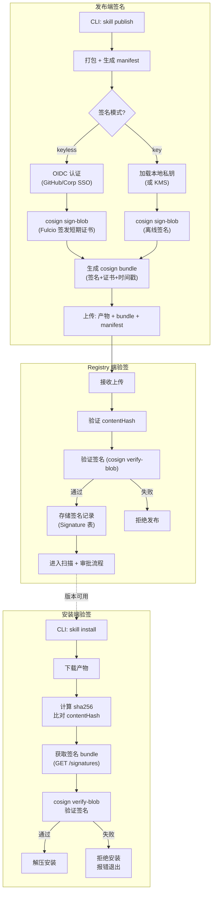
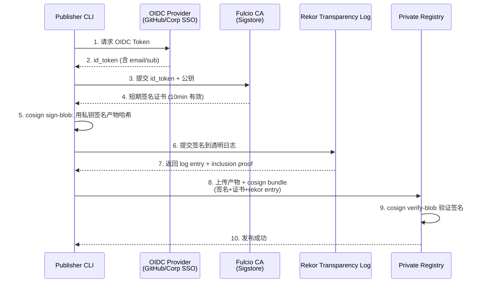
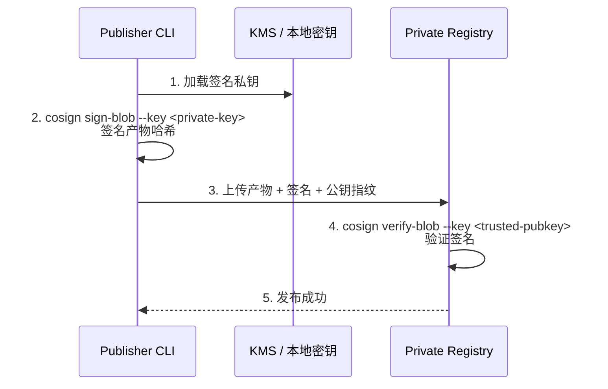
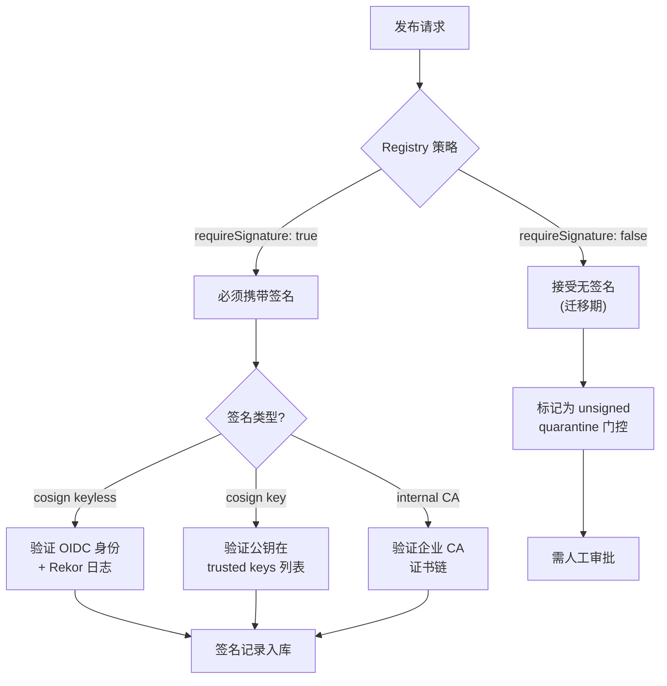

# 包格式与签名方案 技术设计文档

## 1. 文档元信息
- **模块**: 包格式与签名方案
- **版本**: v0.1-draft
- **作者**: [待填]
- **日期**: 2026-02-25
- **状态**: Draft
- **关联需求**: Feature-2026-02-25.md §7（第二部分：包格式与签名方案）
- **前置依赖文档**: `01-clawhub-api-analysis.md`（安全差距分析）、`03-data-model.md`（Signature 表结构）

## 2. 目标与范围

### 核心问题
定义 Skill 包的标准格式规范与内容完整性保障方案，以及基于 cosign 的签名/验签方案（含 keyless OIDC 与离线私钥两种模式的选择矩阵），确保产物从发布到安装全链路可验证、不可篡改。

### In-Scope
- 包格式规范（目录结构、manifest.json、zip/tar 打包规则）
- cosign blob 签名方案（keyless OIDC 模式 + 离线私钥模式）
- 签名/验签的完整集成方案（发布端 + Registry 端 + 安装端）
- 模式选择矩阵（公有云 vs 私有化 vs 断网环境）

### Out-of-Scope
- 发布流水线的完整时序（见 `07-publish-pipeline.md`）
- TUF 更新框架（中长期演进，本文档仅做参考提及）
- SBOM 生成规范（见 `07-publish-pipeline.md`）

## 3. 设计约束与前提假设

- **AgentSkills 兼容**: 包内必须包含合法的技能目录（至少有 `SKILL.md`），解压后直接可被 OpenClaw 加载
- **ClawHub 兼容**: 产物为 zip 格式（与 ClawHub 下载行为一致），同时支持 tar.gz
- **不可变性**: 已发布版本的产物 hash 不可变更
- **签名工具**: 采用 Sigstore/cosign 作为签名基础设施（业界标准，npm/PyPI/容器生态广泛采用）
- **渐进式强制**: 签名在迁移期可选，最终目标为全量强制

## 4. 详细设计

### 4.1 包格式规范

#### 4.1.1 目录结构

```
my-skill/
├── SKILL.md                    # [必需] 技能定义文件 (YAML frontmatter + Markdown 指令)
├── manifest.json               # [必需] 包元数据清单 (由 CLI 生成)
├── README.md                   # [建议] 技能说明文档
├── assets/                     # [可选] 资源文件 (模板/脚本/配置等)
│   ├── template.md
│   └── config.yaml
└── examples/                   # [可选] 使用示例
    └── usage.md
```

#### 4.1.2 manifest.json 规范

```json
{
  "$schema": "https://skills.example.com/schemas/manifest/v1.json",
  "manifestVersion": 1,
  "name": "my-skill",
  "version": "1.2.3",
  "description": "A skill for processing PDF files",
  "authors": ["alice@example.com"],
  "license": "MIT",
  "repository": "https://github.com/org/my-skill",
  "keywords": ["pdf", "document", "processing"],
  "openclaw": {
    "minVersion": "1.5.0",
    "requires": {
      "os": ["darwin", "linux"],
      "bins": ["pdftotext"],
      "env": ["PDF_API_KEY"]
    },
    "primaryEnv": "PDF_API_KEY",
    "riskDeclaration": {
      "network": true,
      "fileWrite": false,
      "exec": true,
      "domains": ["api.pdfservice.com"]
    }
  },
  "files": [
    { "path": "SKILL.md", "size": 2048, "sha256": "abc123..." },
    { "path": "manifest.json", "size": 512, "sha256": "def456..." },
    { "path": "assets/template.md", "size": 1024, "sha256": "ghi789..." }
  ],
  "contentHash": "sha256:overall-hash-of-all-files...",
  "createdAt": "2026-02-25T10:00:00Z"
}
```

**字段说明:**

| 字段 | 类型 | 必需 | 说明 |
|------|------|------|------|
| `manifestVersion` | number | ✓ | 清单格式版本，当前为 `1` |
| `name` | string | ✓ | 技能名（须匹配 SKILL.md 的 name，小写+连字符） |
| `version` | string | ✓ | SemVer 版本号 |
| `description` | string | ✓ | 技能描述 |
| `authors` | string[] | | 作者列表 |
| `license` | string | | SPDX 许可证标识 |
| `repository` | string | | 源码仓库 URL |
| `keywords` | string[] | | 搜索关键词 |
| `openclaw` | object | | OpenClaw 特定元数据 |
| `openclaw.minVersion` | string | | 最低兼容的 OpenClaw 版本 |
| `openclaw.requires` | object | | Gating 条件（同 SKILL.md frontmatter） |
| `openclaw.riskDeclaration` | object | | 风险声明（网络/文件写入/执行/域名） |
| `files` | array | ✓ | 文件清单 (path + size + sha256) |
| `contentHash` | string | ✓ | 所有文件的聚合哈希 |
| `createdAt` | string | ✓ | ISO 8601 创建时间 |

#### 4.1.3 contentHash 计算规则

```
contentHash = SHA256(
  sort(files.map(f => f.sha256)).join("\n")
)
```

- 对所有文件的独立 sha256 按字典序排序后拼接
- 确保文件顺序不影响最终哈希
- 与 ClawHub 的内容哈希语义对齐（用于 lockfile 校验与冲突检测）

#### 4.1.4 打包规则

| 格式 | 扩展名 | 压缩 | 说明 |
|------|--------|------|------|
| **zip** | `.skill.zip` | deflate | 默认格式（ClawHub 兼容）|
| **tar.gz** | `.skill.tar.gz` | gzip | 可选格式（Unix 生态友好）|

**打包约束:**
- 根目录为技能目录名（如 `my-skill/`）
- 不包含隐藏文件（`.git/`、`.DS_Store` 等）
- 不包含 `node_modules/`、`__pycache__/` 等构建产物
- 单包最大 50MB（初始限制，可配置）
- manifest.json 必须在根目录

### 4.2 签名方案

#### 4.2.1 签名架构总览



#### 4.2.2 Keyless OIDC 模式（推荐公有云/标准部署）

**工作原理:**



**签名 bundle 结构:**
```json
{
  "base64Signature": "MEUCIQDx...",
  "cert": "-----BEGIN CERTIFICATE-----\n...",
  "rekorBundle": {
    "logIndex": 12345,
    "logId": "c0d23d...",
    "integratedTime": 1740000000,
    "inclusionProof": { "..." },
    "signedEntryTimestamp": "MEUCIQDy..."
  }
}
```

**优点:**
- 无需管理长期密钥
- 签名者身份绑定 OIDC 身份（可追溯到 GitHub 账号 / 企业 SSO）
- 透明日志提供不可否认性
- 证书 10 分钟有效期极大降低密钥泄露窗口

**限制:**
- 依赖外部 Fulcio/Rekor 服务（或需自建）
- 需要 OIDC Provider 可达

#### 4.2.3 离线私钥模式（推荐断网/高安全环境）

**工作原理:**



**密钥管理方案:**

| 方案 | 安全性 | 便捷性 | 适用场景 |
|------|--------|--------|----------|
| KMS 托管密钥 (AWS KMS / GCP KMS / Vault) | 高 | 中 | 标准生产环境 |
| HSM 硬件密钥 | 最高 | 低 | 高安全/金融/政府 |
| 本地密钥文件 + 密码保护 | 中 | 高 | 开发/PoC 环境 |
| CI/CD Secret 注入 | 中 | 高 | 自动化发布流水线 |

**优点:**
- 完全离线，无外部依赖
- 密钥生命周期可控

**限制:**
- 需要自行管理密钥轮换
- 签名者身份绑定到密钥而非人（需配合审计日志追溯）

#### 4.2.4 签名模式选择矩阵

| 维度 | Keyless OIDC | 离线私钥 |
|------|-------------|---------|
| **网络要求** | 需要 OIDC + Fulcio + Rekor 可达 | 完全离线 |
| **身份绑定** | 强（OIDC email/sub） | 弱（密钥指纹，需审计日志补充） |
| **密钥管理** | 无需（自动短期证书） | 需要（KMS/HSM/文件） |
| **透明日志** | 有（Rekor） | 无（需自建或放弃） |
| **部署复杂度** | 中（需 OIDC Provider 配置） | 低（密钥分发即可） |
| **推荐场景** | 公有云 / 标准生产 | 断网 / 高安全 / 单机 |
| **迁移期默认** | ✓ 推荐 | 备选 |

#### 4.2.5 混合模式（推荐的渐进方案）



**组织级策略配置:**

```yaml
# Organization settings
signing:
  requireSignature: true           # 是否强制签名
  allowedSignatureTypes:
    - cosign_keyless
    - cosign_key
  trustedOIDCIssuers:
    - "https://accounts.google.com"
    - "https://github.com/login/oauth"
    - "https://sso.corp.internal"
  trustedIdentities:
    - "ci-bot@corp.example"        # CI 自动发布身份
    - "*@corp.example"             # 企业域名下所有身份
  trustedPublicKeys:
    - name: "release-key-2026"
      publicKey: "-----BEGIN PUBLIC KEY-----\n..."
  unsignedPolicy: "quarantine"     # unsigned 产物的处理: quarantine / reject / allow
```

### 4.3 验签流程详细规范

#### 安装端验签 (CLI)

```bash
# 1. 下载产物
skill install pdf-processing --tag latest

# CLI 内部流程:
# 1) GET /api/v1/skills/pdf-processing -> resolve version
# 2) GET /api/v1/download?slug=pdf-processing&version=1.2.3 -> zip
# 3) 计算 sha256(zip) 与 API 返回的 contentHash 比对
# 4) GET /api/v1/skills/pdf-processing/signatures?version=1.2.3 -> bundle
# 5) cosign verify-blob --bundle bundle.json --certificate-identity <expected>
#    --certificate-oidc-issuer <expected> artifact.zip
# 6) 全部通过 -> 解压安装; 任一失败 -> 拒绝安装
```

**信任策略配置（CLI 侧）:**

```yaml
# ~/.skillrc.yaml
trust:
  requireSignature: true
  trustedIssuers:
    - "https://sso.corp.internal"
  trustedIdentities:
    - "*@corp.example"
  trustedPublicKeys:
    - path: "~/.skill/trusted-keys/release-2026.pub"
  allowUnsignedForRegistries:
    - "clawhub"                    # 迁移期: ClawHub 来源允许无签名
```

### 4.4 SBOM 集成（发布时生成）

每次发布自动生成 SBOM（Software Bill of Materials）：

```json
{
  "bomFormat": "CycloneDX",
  "specVersion": "1.5",
  "serialNumber": "urn:uuid:...",
  "version": 1,
  "metadata": {
    "component": {
      "type": "library",
      "name": "pdf-processing",
      "version": "1.2.3"
    }
  },
  "components": [
    {
      "type": "file",
      "name": "SKILL.md",
      "hashes": [{ "alg": "SHA-256", "content": "abc123..." }]
    }
  ],
  "externalReferences": [
    {
      "type": "distribution",
      "url": "https://skills.corp.internal/api/v1/download?slug=pdf-processing&version=1.2.3"
    }
  ]
}
```

## 5. 设计决策记录（ADR）

### ADR-01: 选择 cosign 作为签名工具链

- **决策**: 采用 Sigstore/cosign 进行 blob 签名与验证
- **理由（Why）**: 业界广泛采用（npm provenance、PyPI、Docker）；同时支持 keyless（OIDC）和离线密钥两种模式；cosign bundle 格式包含签名/证书/时间戳/透明日志的完整证据链
- **替代方案（Alternatives Considered）**:
  - GPG 签名：工具链成熟但密钥管理困难，缺少 keyless 模式
  - minisign：轻量但生态覆盖不如 cosign，无透明日志集成
  - 自建签名服务：灵活但开发和维护成本高

### ADR-02: zip 作为默认包格式

- **决策**: 默认使用 zip 格式（`.skill.zip`），可选支持 tar.gz
- **理由（Why）**: 与 ClawHub 下载格式一致（兼容性优先）；跨平台解压支持好；Windows/macOS 原生支持
- **替代方案（Alternatives Considered）**:
  - 仅 tar.gz：Unix 生态标准但 Windows 支持需额外工具
  - OCI artifact：标准化好但引入容器生态依赖，对 Skill 场景过重

### ADR-03: contentHash 基于文件级哈希聚合而非 archive 哈希

- **决策**: contentHash 基于文件列表的 sha256 排序拼接，而非 zip/tar 文件的 sha256
- **理由（Why）**: 不同压缩工具/参数对同一内容可能产生不同 archive 哈希；基于文件级哈希可确保内容相同则 contentHash 相同，与 ClawHub 的哈希语义对齐
- **替代方案（Alternatives Considered）**:
  - archive 文件哈希：简单但不能保证可重复性
  - Merkle tree：强完整性但实现复杂度高，初期不需要

### ADR-04: 迁移期允许 unsigned 但 quarantine

- **决策**: 迁移期可接受 unsigned 产物，但自动进入 quarantine 需人工审批
- **理由（Why）**: 避免迁移期因签名强制导致无法使用已有技能；quarantine 保证未签名产物有人工审核兜底
- **替代方案（Alternatives Considered）**:
  - 全量强制签名：安全但迁移成本过高
  - 完全允许 unsigned：缺少安全兜底

## 6. 安全考量

### 商店侧
- **签名不可伪造**: cosign 签名基于 ECDSA/ED25519，密钥安全由 KMS/Fulcio 保证
- **签名不可否认**: Rekor 透明日志提供时间戳和 inclusion proof
- **密钥轮换**: 离线模式需制定密钥轮换策略（建议 6-12 个月），旧密钥签名仍可验证
- **信任根管理**: trusted issuers/identities/public keys 的变更必须记录审计日志
- **manifest.json 校验**: Registry 必须独立重新解析 SKILL.md 并与 manifest 比对，防止 manifest 被篡改

### 执行侧
- **安装前验签**: CLI 必须在解压前完成哈希校验 + 签名验证，任一失败立即终止
- **离线安装**: 断网环境需预分发 trusted public keys 和产物，验签不依赖外部服务
- **签名绕过风险**: `--skip-verify` 选项仅限开发环境，生产环境通过 CLI 配置禁止

## 7. 接口与依赖

### 对外暴露的接口
- **签名 API**: `GET /api/v1/skills/{slug}/signatures?version=<ver>` — 返回 cosign bundle
- **包格式**: manifest.json schema（`$schema` URL 可供 CLI 和第三方工具校验）
- **CLI 配置**: `~/.skillrc.yaml` 的 `trust` 部分

### 对其他模块的依赖
- `03-data-model.md`: `Signature` 表结构（存储签名记录）
- `07-publish-pipeline.md`: 发布流程中签名步骤的时序
- `10-deployment.md`: Fulcio/Rekor 的部署方案（可选自建或使用公共实例）
- `11-cli-spec.md`: CLI 的签名/验签命令规范

## 8. 测试策略

### 关键验收条件
- Keyless 模式: 使用 GitHub OIDC 签名 → 另一台机器仅通过 public bundle 验签成功
- 离线模式: 使用本地密钥签名 → 使用对应公钥验签成功
- 篡改检测: 修改 zip 中任一字节 → contentHash 校验失败
- 签名篡改: 修改 bundle 中签名值 → cosign verify-blob 失败
- 策略执行: `requireSignature=true` 时上传 unsigned 产物 → 拒绝或 quarantine

### 建议测试方法
- **单元测试**: contentHash 计算逻辑、manifest.json 校验逻辑
- **集成测试**: 完整的签名→上传→验签→安装流程（keyless + key 两种模式）
- **安全测试**: 篡改产物/签名/证书的各种攻击场景
- **回归测试**: 密钥轮换后旧签名仍可验证

## 9. 开放问题（Open Questions）

1. **自建 Fulcio/Rekor**: 标准部署是否自建 Sigstore 基础设施？还是使用 Sigstore 公共实例 + 内部 OIDC？成本和运维复杂度需评估
2. **签名的存储位置**: cosign bundle 是存在 Registry DB 还是与产物一起存在对象存储？影响查询效率和一致性
3. **多签名支持**: 是否需要支持一个版本多个签名（如发布者签名 + CI bot 签名 + 安全审核签名）？
4. **签名过期**: keyless 证书 10 分钟有效——验签时是否需要 Rekor 时间戳证明签名在证书有效期内？cosign bundle 已包含此信息，需确认验证逻辑
5. **manifest.json 与 SKILL.md 的字段同步**: 如何处理两者 name/description 不一致的情况？以谁为准？

## 10. 参考资料

- [Sigstore / cosign 文档](https://docs.sigstore.dev/) — cosign sign-blob / verify-blob 用法
- [cosign Blob Signing](https://docs.sigstore.dev/cosign/signing/signing_with_blobs/) — Blob 签名规范
- [Fulcio CA](https://docs.sigstore.dev/certificate_authority/overview/) — Keyless 签名的证书颁发
- [Rekor Transparency Log](https://docs.sigstore.dev/logging/overview/) — 签名透明日志
- [npm Provenance](https://docs.npmjs.com/generating-provenance-statements) — npm 的签名与来源证明实践
- [SLSA Framework](https://slsa.dev/) — 供应链安全等级框架
- [CycloneDX SBOM](https://cyclonedx.org/) — SBOM 格式规范
- 项目内部文档: `01-clawhub-api-analysis.md`（安全差距分析）、`工作空间与 Skill 商店设计方案深度调研与技术方案建议.md`（签名建议章节）
