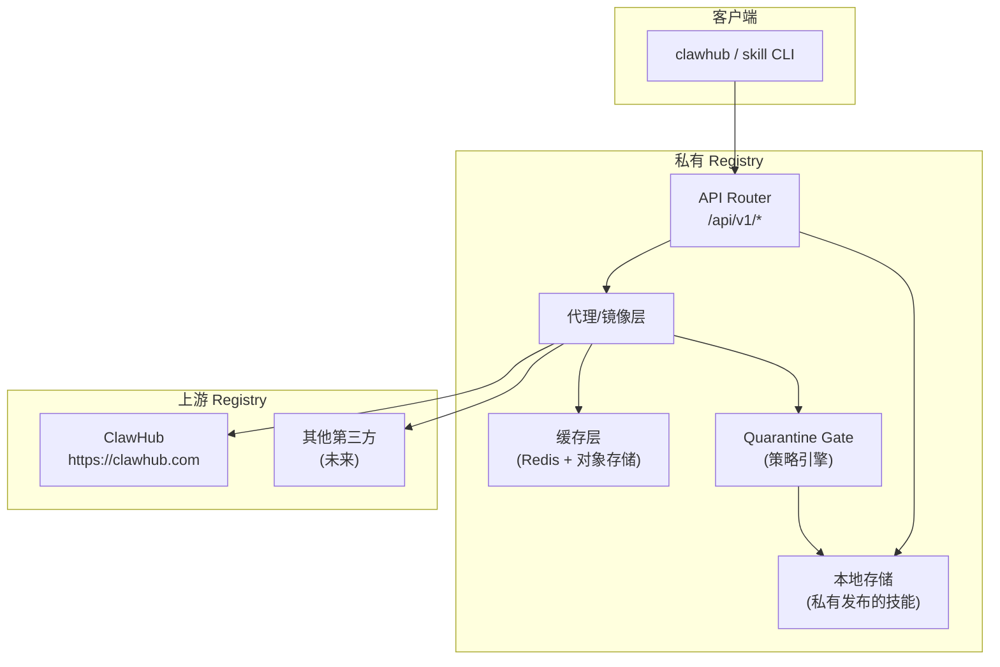
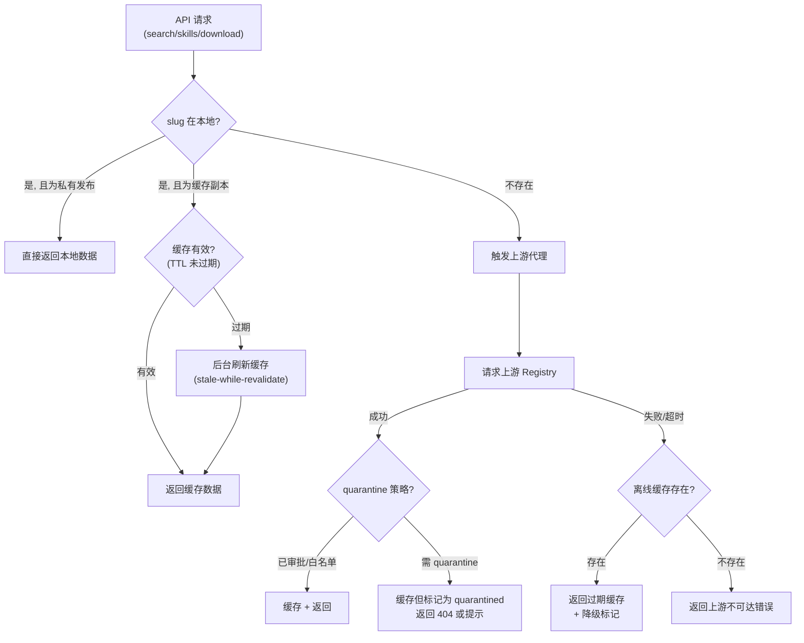
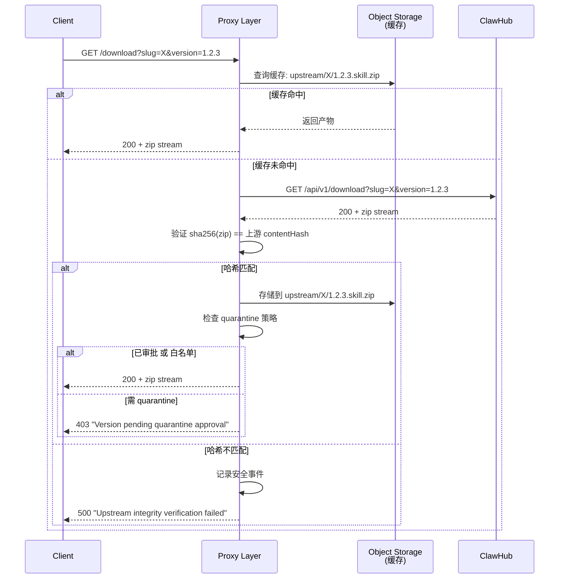
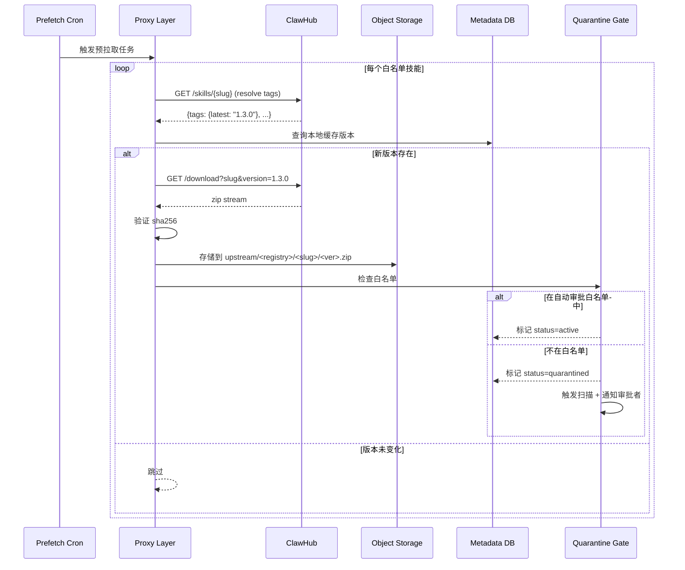
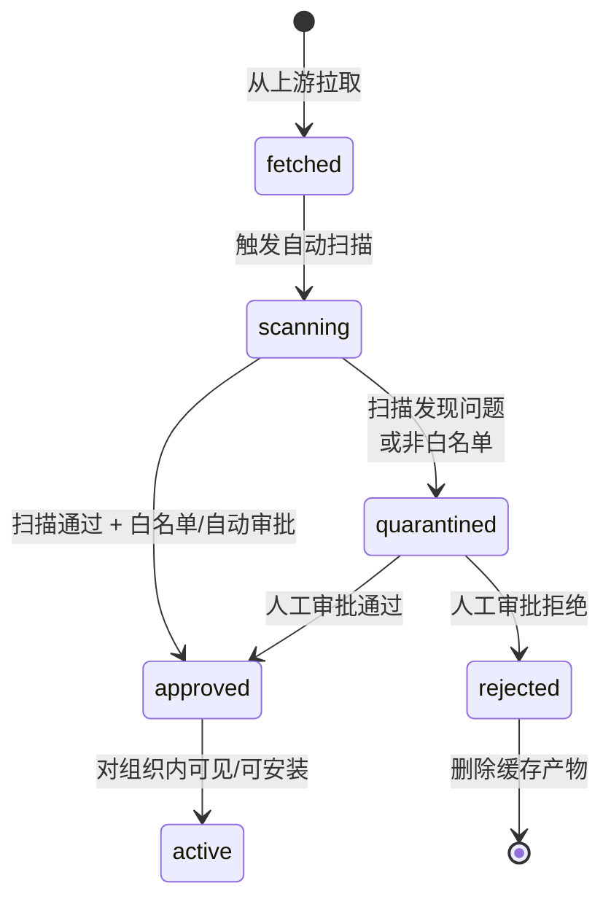
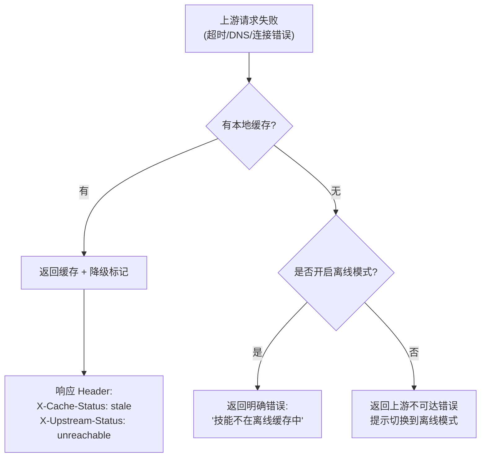
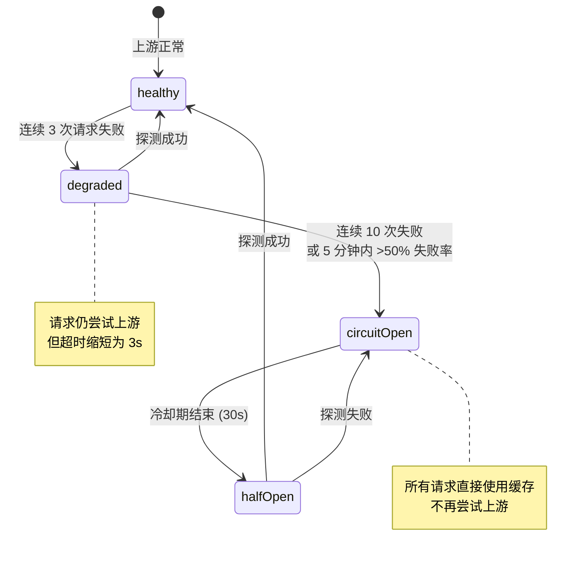

# 上游代理/镜像层设计 技术设计文档

## 1. 文档元信息
- **模块**: 上游代理/镜像层设计
- **版本**: v0.1-draft
- **作者**: [待填]
- **日期**: 2026-02-25
- **状态**: Draft
- **关联需求**: Feature-2026-02-25.md §8（第二部分：代理/镜像层设计）
- **前置依赖文档**: `01-clawhub-api-analysis.md`（ClawHub API 端点）、`02-api-compatibility.md`（兼容层路由）、`03-data-model.md`（缓存实体模型）

## 2. 目标与范围

### 核心问题
设计对上游 ClawHub（及其他第三方 Registry）的代理/镜像层，实现 on-demand 缓存、预拉取、quarantine 门控、缓存失效策略与离线降级方案，使组织内所有技能安装统一经由私有 Registry，保障审计与安全策略的一致执行。

### In-Scope
- On-demand 缓存机制（首次请求触发上游拉取）
- 预拉取（Prefetch）白名单/热门技能定时同步
- Quarantine 门控（上游引入的版本默认进入隔离审批）
- 缓存失效策略（TTL + 事件驱动 + 版本不可变优化）
- 离线降级方案（断网/半断网环境可用性保障）

### Out-of-Scope
- 私有发布流程（见 `07-publish-pipeline.md`）
- 搜索代理（见 `06-search.md`）
- 第三方非 ClawHub 协议适配（如 Vercel Marketplace 转换，列入延后项）

## 3. 设计约束与前提假设

- **ClawHub CLI 兼容**: `clawhub --registry <proxy>` 必须透明可用，代理层对 CLI 行为无感知
- **版本不可变**: ClawHub 已发布版本的内容不可变（同版本号的哈希永远一致），可作为缓存优化依据
- **上游可用性不保证**: 代理层必须容忍上游临时不可达，使用缓存或降级策略
- **安全优先**: 从上游引入的任何新版本默认为"不可信"，需经 quarantine 门控才对组织内可见
- **与 `02-api-compatibility.md` 的接口约定**: 代理层在 v1 兼容路由内部透明工作，不暴露额外路由

## 4. 详细设计

### 4.1 代理层架构总览



### 4.2 请求路由决策



### 4.3 On-Demand 缓存机制

#### 4.3.1 元数据缓存

| 数据类型 | 缓存位置 | TTL | 失效策略 |
|----------|----------|-----|----------|
| 技能详情 (`/skills/{slug}`) | Redis | 5 分钟 | TTL 过期 + 下载触发刷新 |
| 版本列表 (`/skills/{slug}/versions`) | Redis | 5 分钟 | TTL 过期 + 新版本事件 |
| 搜索结果 (`/search`) | Redis | 2 分钟 | 短 TTL（搜索结果变化频繁） |
| 下载 URL / contentHash | Redis | 24 小时 | 版本不可变——哈希值稳定 |

#### 4.3.2 产物缓存



#### 4.3.3 缓存存储结构

```
<object-storage>/
├── local/                       # 本地发布的技能
│   ├── my-skill/
│   │   ├── 1.0.0.skill.zip
│   │   └── 1.0.1.skill.zip
├── upstream/                    # 上游缓存
│   ├── clawhub/
│   │   ├── pdf-processing/
│   │   │   ├── 1.2.3.skill.zip
│   │   │   └── 1.2.3.sig.json  # 签名 bundle（如有）
│   │   └── web-scraper/
│   │       └── 2.0.0.skill.zip
│   └── other-registry/
│       └── ...
└── quarantine/                  # 隔离区（待审批）
    └── clawhub/
        └── suspicious-skill/
            └── 0.9.0.skill.zip
```

### 4.4 预拉取（Prefetch）策略

#### 4.4.1 预拉取配置

```yaml
# Registry 代理配置
proxy:
  upstreams:
    - name: clawhub
      url: "https://clawhub.com"
      enabled: true
      prefetch:
        enabled: true
        schedule: "0 2 * * *"    # 每天凌晨 2 点
        skills:
          - slug: "pdf-processing"
            tags: ["latest", "stable"]
          - slug: "web-scraper"
            tags: ["latest"]
        strategy: "whitelist"     # whitelist | popular | all-tags
      quarantine:
        enabled: true
        autoApproveWhitelist:     # 白名单内自动审批
          - "pdf-processing"
          - "web-scraper"
        defaultAction: "quarantine"  # quarantine | reject | allow
```

#### 4.4.2 预拉取流程



### 4.5 Quarantine 门控

#### 4.5.1 门控策略矩阵

| 条件 | 操作 | 说明 |
|------|------|------|
| 技能在自动审批白名单中 | 自动 approve | 可信技能直通 |
| 技能已有历史版本被 approve | 触发自动扫描，扫描通过后 approve | 已知技能的新版本 |
| 全新技能（首次引入） | quarantine + 人工审批 | 新引入的技能需要人工审核 |
| 扫描发现问题 | quarantine + 标记发现 | 等待安全团队处置 |
| 来自不可信上游 | reject | 直接拒绝 |

#### 4.5.2 Quarantine 状态流转



### 4.6 缓存失效策略

| 策略 | 适用数据 | 实现 |
|------|----------|------|
| **TTL 过期** | 搜索结果、技能列表 | Redis TTL，2-5 分钟 |
| **Stale-While-Revalidate** | 技能详情、版本列表 | 返回过期缓存 + 后台异步刷新 |
| **不可变缓存** | 版本产物（zip）+ contentHash | 永不失效（版本一旦发布内容不变）|
| **事件驱动失效** | Tag 变更（如 latest 移动） | 预拉取检测到 tag 变更时清除对应缓存 |
| **手动失效** | 管理员触发 | API `POST /api/internal/cache/invalidate` |
| **LRU 淘汰** | 低频使用的缓存产物 | 对象存储生命周期策略（如 90 天未访问） |

### 4.7 离线降级方案

#### 4.7.1 降级策略



#### 4.7.2 离线模式配置

```yaml
proxy:
  offlineMode:
    enabled: false               # 全局离线模式开关
    autoDetect: true             # 自动检测上游是否可达
    autoDetectInterval: 60       # 检测间隔(秒)
    fallbackBehavior: "cache"    # cache(使用缓存) | reject(拒绝) | warn(警告)
```

#### 4.7.3 离线包导出/导入

支持将已缓存的技能导出为离线包，供断网环境导入：

```bash
# 导出所有已审批的上游缓存
skill admin export-cache --output /mnt/usb/skill-cache-2026-02.tar.gz

# 在断网环境导入
skill admin import-cache --input /mnt/usb/skill-cache-2026-02.tar.gz
```

导出格式：

```
skill-cache-export/
├── manifest.json               # 导出清单（技能列表 + 版本 + 哈希）
├── artifacts/                   # 产物文件
│   ├── pdf-processing/
│   │   └── 1.2.3.skill.zip
│   └── web-scraper/
│       └── 2.0.0.skill.zip
├── signatures/                  # 签名 bundle
│   └── ...
└── metadata/                    # 元数据 JSON
    └── ...
```

### 4.8 上游健康检查与熔断



## 5. 设计决策记录（ADR）

### ADR-01: 默认 quarantine 而非默认 allow

- **决策**: 从上游引入的新版本默认进入 quarantine，而非直接可用
- **理由（Why）**: 公开市场已出现恶意技能，"默认不信任"是企业安全底线；quarantine + 白名单的组合在安全性和可用性之间取得平衡
- **替代方案（Alternatives Considered）**:
  - 默认 allow + 异步扫描：可用性好但存在恶意技能被安装的窗口
  - 默认 reject（仅白名单）：安全但新技能发现成本过高

### ADR-02: 版本级不可变缓存

- **决策**: 版本产物（zip + contentHash）作为不可变缓存，永不过期
- **理由（Why）**: ClawHub 的版本语义保证同版本号内容不变；不可变缓存极大减少上游请求和带宽，提升离线场景的可用性
- **替代方案（Alternatives Considered）**:
  - 统一 TTL：简单但浪费带宽（重复下载不变内容）
  - ETag/304：减少带宽但仍需上游可达

### ADR-03: Stale-while-revalidate 策略

- **决策**: 对元数据缓存采用 stale-while-revalidate 模式
- **理由（Why）**: 保证客户端体验（始终快速响应）的同时保持数据新鲜度；上游临时不可达时自动降级为缓存
- **替代方案（Alternatives Considered）**:
  - 严格 TTL（过期则阻塞刷新）：延迟不可控
  - 长 TTL + 手动刷新：新版本发现延迟大

## 6. 安全考量

### 商店侧
- **上游产物完整性**: 每次从上游拉取必须验证 sha256（与上游返回的 contentHash 比对）
- **MITM 防护**: 上游连接必须使用 TLS，代理层验证上游证书（可配置证书锁定）
- **缓存投毒防护**: 缓存写入前必须通过哈希校验；缓存读取时可选二次校验
- **白名单维护**: 自动审批白名单的变更必须经过审批 + 审计日志记录
- **隔离区存储**: quarantine 产物存储在独立路径，避免与已审批产物混淆

### 执行侧
- 代理层不直接涉及执行侧安全，但 quarantine 门控为执行层提供第一道过滤
- 高风险版本（被 quarantine 标记的）即使最终 approve，也应在 `09-openclaw-integration.md` 中配置更严格的 sandbox 策略

## 7. 接口与依赖

### 对外暴露的接口
- **代理层对 CLI 透明**: 所有 `/api/v1/*` 请求在兼容层内部路由到代理层，CLI 无感知
- **管理 API**:
  - `POST /api/internal/cache/invalidate` — 手动失效缓存
  - `GET /api/internal/proxy/status` — 上游健康状态
  - `POST /api/internal/quarantine/{id}/approve` — 审批 quarantine 项
  - `POST /api/internal/quarantine/{id}/reject` — 拒绝 quarantine 项
  - `POST /api/internal/export-cache` — 导出离线缓存包
  - `POST /api/internal/import-cache` — 导入离线缓存包

### 对其他模块的依赖
- `01-clawhub-api-analysis.md`: ClawHub API 端点格式（代理请求目标）
- `02-api-compatibility.md`: 兼容路由中的代理集成点
- `03-data-model.md`: 缓存元数据的存储格式
- `07-publish-pipeline.md`: 扫描流水线复用（quarantine 扫描）
- `08-rbac.md`: quarantine 审批权限

## 8. 测试策略

### 关键验收条件
- 首次安装上游技能: 代理拉取 + 缓存 + 哈希校验 + quarantine 判定全流程正确
- 二次安装: 命中缓存，不请求上游
- 上游不可达: 缓存命中时返回 stale 数据；缓存未命中时返回明确错误
- Quarantine: 新技能默认 quarantine；白名单技能自动 approve
- 离线包导出/导入: 导出后在断网环境导入，安装成功

### 建议测试方法
- **集成测试**: 使用 mock 上游 + 真实代理层，测试所有缓存命中/未命中/失效场景
- **混沌测试**: 随机注入上游超时/错误，验证熔断和降级行为
- **性能测试**: 大规模并发下载（100并发），验证缓存命中率和响应延迟
- **E2E 测试**: `clawhub --registry <proxy>` 完整安装/更新流程

## 9. 开放问题（Open Questions）

1. **多上游 Registry 支持**: 初期仅支持 ClawHub 作为上游，是否需要在架构上预留多上游的扩展性？（如 Vercel 未来可能提供 Skill Registry）
2. **缓存容量管理**: LRU 淘汰策略的阈值如何设定？（按存储容量 / 按技能数 / 按时间）
3. **Quarantine 审批 SLA**: 新版本进入 quarantine 后，审批的目标时间是多少？影响预拉取频率和用户体验
4. **Tag 变更的实时性**: 上游 `latest` tag 移动后，代理层感知延迟最大可接受多少？（决定预拉取频率）
5. **签名代理**: 上游版本如果有签名（cosign bundle），是否缓存并转发？还是在代理层重新签名（"二次签名"）？

## 10. 参考资料

- [Verdaccio](https://verdaccio.org/) — npm 代理/缓存/私有发布的开源实现
- [Nexus Repository](https://www.sonatype.com/products/nexus-repository) — 通用包管理代理（proxy + hosted + group）
- [Docker Registry Mirror](https://docs.docker.com/registry/recipes/mirror/) — 容器 Registry 镜像模式参考
- ClawHub CLI `--registry` 切换行为: `01-clawhub-api-analysis.md` §4.3
- 项目内部文档: `工作空间与 Skill 商店设计方案深度调研与技术方案建议.md`（镜像/代理策略章节）
