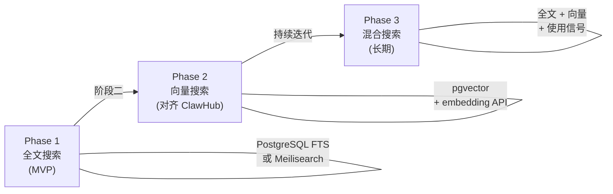
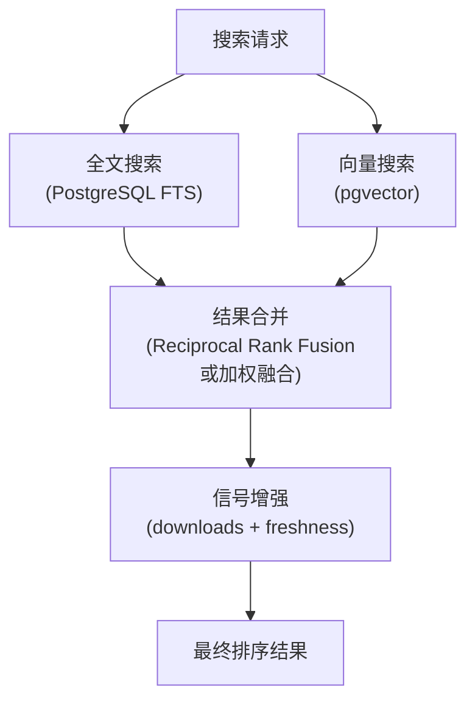

# 搜索方案 技术设计文档

## 1. 文档元信息
- **模块**: 搜索方案
- **版本**: v0.1-draft
- **作者**: [待填]
- **日期**: 2026-02-25
- **状态**: Draft
- **关联需求**: Feature-2026-02-25.md §9（第二部分：搜索实现）
- **前置依赖文档**: `01-clawhub-api-analysis.md`（ClawHub 搜索机制分析）、`02-api-compatibility.md`（搜索端点兼容性）、`03-data-model.md`（可索引字段）

## 2. 目标与范围

### 核心问题
设计分阶段的搜索方案：Phase 1 基于全文搜索实现最小可用搜索能力，Phase 2 引入 embedding 向量搜索对齐 ClawHub 的语义搜索体验，确保 `skill search <query>` 的搜索质量持续提升。

### In-Scope
- Phase 1: 全文搜索方案（PostgreSQL 全文 / 轻量搜索引擎）
- Phase 2: Embedding 向量搜索方案（pgvector / 专用向量数据库）
- 搜索索引模型（可索引字段、权重、前处理）
- 搜索 API 兼容性（对齐 ClawHub `/search` 端点）
- 搜索结果排序与相关性策略

### Out-of-Scope
- 搜索 UI（Web 浏览界面，可基于 API 后续开发）
- 上游搜索代理/聚合（见 `05-proxy-mirror.md`）
- 推荐系统（基于使用历史的个性化推荐，列为长期演进）

## 3. 设计约束与前提假设

- **ClawHub 兼容**: `/search?q=...&limit=...&cursor=...` 端点格式兼容
- **数据规模估计**: 初期 100-1000 个技能，中期可达 10000+
- **搜索延迟要求**: p95 < 200ms（全文搜索）; p95 < 500ms（向量搜索, Phase 2）
- **多语言**: 技能描述可能包含中英文，搜索需支持多语言分词
- **ClawHub 参考**: ClawHub 使用 Convex 内置的 embedding + 向量索引，搜索质量与语义理解能力较强

## 4. 详细设计

### 4.1 分阶段搜索演进路线



### 4.2 Phase 1: 全文搜索（最小可用）

#### 4.2.1 索引模型

| 索引字段 | 来源 | 权重 | 说明 |
|----------|------|------|------|
| `name` / `slug` | manifest.json / SKILL.md | **A** (最高) | 技能名精确匹配 |
| `display_name` | manifest.json | **A** | 展示名称 |
| `keywords` | manifest.json | **A** | 作者定义的搜索标签 |
| `summary` | manifest.json | **B** | 简短摘要 |
| `description` | manifest.json / SKILL.md | **C** | 详细描述（Markdown, 需去标签） |
| `skill_md_content` | SKILL.md 正文 | **D** (最低) | 技能指令内容（长文本, 低权重） |
| `namespace` | Skill 表 | **B** | 命名空间/组织过滤 |
| `author` | manifest.json | **B** | 作者名 |

#### 4.2.2 方案 A: PostgreSQL 全文搜索（推荐 Phase 1）

```sql
-- 全文搜索索引
ALTER TABLE skills ADD COLUMN search_vector TSVECTOR;

CREATE INDEX idx_skills_search ON skills USING gin(search_vector);

-- 索引更新触发器
CREATE OR REPLACE FUNCTION update_skill_search_vector()
RETURNS TRIGGER AS $$
BEGIN
  NEW.search_vector :=
    setweight(to_tsvector('simple', COALESCE(NEW.slug, '')), 'A') ||
    setweight(to_tsvector('simple', COALESCE(NEW.display_name, '')), 'A') ||
    setweight(to_tsvector('simple', COALESCE(NEW.summary, '')), 'B') ||
    setweight(to_tsvector('simple', COALESCE(NEW.description, '')), 'C') ||
    setweight(to_tsvector('simple', COALESCE(
      (SELECT string_agg(value, ' ') FROM jsonb_array_elements_text(NEW.metadata->'keywords')),
      ''
    )), 'A');
  RETURN NEW;
END;
$$ LANGUAGE plpgsql;

-- 搜索查询
SELECT slug, display_name, summary,
       ts_rank_cd(search_vector, query) AS rank
FROM skills,
     plainto_tsquery('simple', $1) AS query
WHERE search_vector @@ query
  AND status = 'active'
  AND deleted_at IS NULL
ORDER BY rank DESC
LIMIT $2;
```

**优点:** 零额外依赖，随 PostgreSQL 部署即可用；支持权重排序
**限制:** 语义理解弱（纯词匹配）；中文需配置额外分词器（`pg_jieba`/`zhparser`）

#### 4.2.3 方案 B: Meilisearch（Phase 1 备选）

```yaml
# Meilisearch 索引配置
settings:
  index: skills
  searchableAttributes:
    - slug
    - displayName
    - keywords
    - summary
    - description
  filterableAttributes:
    - status
    - namespace
    - riskLevel
    - ownerType
  sortableAttributes:
    - downloadCount
    - updatedAt
    - createdAt
  rankingRules:
    - words
    - typo
    - proximity
    - attribute
    - sort
    - exactness
  typoTolerance:
    enabled: true
    minWordSizeForTypos:
      oneTypo: 4
      twoTypos: 8
```

**优点:** 开箱即用的容错搜索（typo tolerance）；内置中文分词；亚毫秒响应  
**限制:** 额外组件运维；数据同步需维护

### 4.3 Phase 2: Embedding 向量搜索（对齐 ClawHub）

#### 4.3.1 架构


#### 4.3.2 Embedding 模型选择

| 模型 | 维度 | 多语言 | 部署方式 | 延迟 | 推荐场景 |
|------|------|--------|----------|------|----------|
| `text-embedding-3-small` (OpenAI) | 1536 | ✓ | API 调用 | ~100ms | 标准部署（推荐） |
| `text-embedding-3-large` (OpenAI) | 3072 | ✓ | API 调用 | ~200ms | 高精度需求 |
| `bge-m3` (BAAI) | 1024 | ✓ | 本地/GPU | ~50ms | 可断网部署 |
| `e5-large-v2` (Microsoft) | 1024 | 中 | 本地/GPU | ~50ms | 英文为主场景 |

#### 4.3.3 pgvector 方案（推荐）

```sql
-- 启用 pgvector 扩展
CREATE EXTENSION IF NOT EXISTS vector;

-- 添加向量列
ALTER TABLE skills ADD COLUMN embedding vector(1536);

-- 创建向量索引 (IVFFlat, 适合 <100K 文档)
CREATE INDEX idx_skills_embedding ON skills
  USING ivfflat (embedding vector_cosine_ops)
  WITH (lists = 100);

-- 向量搜索查询
SELECT slug, display_name, summary,
       1 - (embedding <=> $1::vector) AS similarity
FROM skills
WHERE status = 'active'
  AND deleted_at IS NULL
ORDER BY embedding <=> $1::vector
LIMIT $2;
```

#### 4.3.4 索引文本构造

```python
def build_index_text(skill, version):
    """构造用于 embedding 的文本"""
    parts = [
        f"name: {skill.slug}",
        f"title: {skill.display_name}",
        f"summary: {skill.summary}" if skill.summary else "",
        f"keywords: {', '.join(version.manifest.get('keywords', []))}",
        f"description: {skill.description[:1000]}" if skill.description else "",
        f"requires: {json.dumps(version.openclaw_metadata.get('requires', {}))}",
    ]
    return "\n".join(filter(None, parts))
```

### 4.4 Phase 3: 混合搜索（长期演进）

#### 4.4.1 混合排序公式

```
final_score = α × vector_similarity
            + β × fulltext_rank
            + γ × log(download_count + 1)
            + δ × freshness_decay(updated_at)
```

| 参数 | 默认权重 | 说明 |
|------|----------|------|
| α | 0.5 | 语义相似度 |
| β | 0.25 | 全文匹配度 |
| γ | 0.15 | 流行度信号 |
| δ | 0.10 | 时间衰减（近期更新优先） |

#### 4.4.2 混合搜索架构



### 4.5 搜索 API 规范

```
GET /api/v1/search?q=pdf+processing&limit=20&cursor=xxx&namespace=corp
```

**请求参数:**

| 参数 | 类型 | 必需 | 说明 |
|------|------|------|------|
| `q` | string | ✓ | 搜索关键词 |
| `limit` | integer | | 结果数, 默认 20, 最大 100 |
| `cursor` | string | | 分页 cursor |
| `namespace` | string | | 命名空间过滤（扩展） |
| `status` | string | | 状态过滤，默认 `active`（扩展） |
| `sort` | string | | 排序维度: `relevance`(默认) / `downloads` / `updated` |

**响应:**

```json
{
  "results": [
    {
      "slug": "pdf-processing",
      "displayName": "PDF Processing",
      "summary": "Process and extract data from PDF files",
      "owner": { "id": "user_abc", "name": "john" },
      "latestVersion": "1.2.3",
      "downloadCount": 1500,
      "updatedAt": "2026-02-20T00:00:00Z",
      "relevanceScore": 0.95,
      "namespace": "corp-data",
      "riskLevel": "low"
    }
  ],
  "nextCursor": "eyJzY29yZSI6MC45NSwiX2lkIjoiYWJjIn0=",
  "total": 42
}
```

## 5. 设计决策记录（ADR）

### ADR-01: Phase 1 选择 PostgreSQL FTS 而非独立搜索引擎

- **决策**: Phase 1 使用 PostgreSQL 内置全文搜索，不引入额外搜索服务
- **理由（Why）**: 零额外依赖，降低部署复杂度；初期数据规模（<1000 技能）在 PostgreSQL FTS 承受范围内；可与 pgvector 在同一数据库内实现 Phase 2 无缝过渡
- **替代方案（Alternatives Considered）**:
  - Meilisearch/Elasticsearch: 搜索体验好但引入额外组件运维
  - 仅 LIKE/ILIKE: 实现最简但无排序、无分词、性能差

### ADR-02: Phase 2 选择 pgvector 而非专用向量数据库

- **决策**: 向量搜索使用 PostgreSQL pgvector 扩展
- **理由（Why）**: 与元数据库同库，避免数据同步问题；支持向量 + 标量混合查询（如 `WHERE namespace = X AND vector <=> ...`）；初期数据规模（<100K）在 pgvector 性能范围内
- **替代方案（Alternatives Considered）**:
  - Pinecone/Weaviate/Qdrant: 高性能但额外运维，且需数据同步
  - Convex 内置向量搜索: 对标 ClawHub 但要求使用 Convex 平台

### ADR-03: Embedding 模型优先外部 API，可选本地部署

- **决策**: 默认使用 OpenAI embedding API，断网环境可切换为本地模型（bge-m3）
- **理由（Why）**: OpenAI embedding 质量高、多语言好、免部署；本地模型作为断网备选
- **替代方案（Alternatives Considered）**:
  - 仅本地模型: 需 GPU 或性能降级，初期投入大
  - 仅外部 API: 断网不可用

## 6. 安全考量

### 商店侧
- **搜索注入**: 搜索 query 必须做防注入处理（SQL 参数化 / 搜索引擎 escape）
- **数据泄露**: 搜索结果必须遵守可见性规则（`visibility` + RBAC），不可返回无权访问的技能
- **Embedding API Key**: 外部 embedding API 的密钥需安全存储（不进日志/不进 trace）
- **搜索滥用**: 限流（Rate Limit）防止搜索接口被爬虫/滥用

### 执行侧
- 搜索模块不直接涉及执行侧安全

## 7. 接口与依赖

### 对外暴露的接口
- `GET /api/v1/search` — 搜索 API（ClawHub 兼容 + 扩展参数）

### 对其他模块的依赖
- `02-api-compatibility.md`: 搜索端点的兼容规范
- `03-data-model.md`: 可索引字段来源
- `05-proxy-mirror.md`: 上游缓存技能的搜索索引同步
- `10-deployment.md`: 搜索引擎/pgvector 的部署方案

## 8. 测试策略

### 关键验收条件
- `skill search "pdf"` 返回名称/描述中包含 "pdf" 的技能，按相关性排序
- 搜索不返回 `status != active` 或无权限访问的技能
- Phase 2: 语义查询 `"extract text from documents"` 能匹配 "pdf-processing" 技能
- 搜索 p95 < 200ms（Phase 1）/ < 500ms（Phase 2）

### 建议测试方法
- **单元测试**: 索引文本构造逻辑、权重配置
- **搜索质量测试**: 准备测试集（query → expected results），验证 precision@10、recall@10
- **性能基准**: 10000 技能数据集下的搜索延迟
- **安全测试**: SQL 注入/XSS payload 作为搜索 query

## 9. 开放问题（Open Questions）

1. **中文分词**: PostgreSQL FTS 需要 `pg_jieba` 或 `zhparser` 扩展，是否所有部署环境都能安装？
2. **Embedding 更新频率**: 技能描述更新后 embedding 何时重新生成？实时还是异步？
3. **搜索范围**: 是否需要支持跨 registry 聚合搜索（本地 + 上游 ClawHub）？还是仅搜索已缓存的内容？
4. **搜索 Analytics**: 是否记录搜索 query 用于改进搜索质量（涉及隐私/合规考量）？
5. **本地模型部署形态**: 断网环境的 embedding 模型以什么形态部署（sidecar 容器 / 独立服务 / CLI 内嵌）？

## 10. 参考资料

- [PostgreSQL Full Text Search](https://www.postgresql.org/docs/current/textsearch.html) — FTS 权重与排序
- [pgvector](https://github.com/pgvector/pgvector) — PostgreSQL 向量搜索
- [Meilisearch](https://www.meilisearch.com/) — 轻量级全文搜索引擎
- [OpenAI Embeddings](https://platform.openai.com/docs/guides/embeddings) — text-embedding-3 系列
- [BAAI/bge-m3](https://huggingface.co/BAAI/bge-m3) — 多语言 embedding 模型
- ClawHub Convex 向量索引: `01-clawhub-api-analysis.md` §4.2
- 项目内部文档: `工作空间与 Skill 商店设计方案深度调研与技术方案建议.md`（搜索建议章节）
