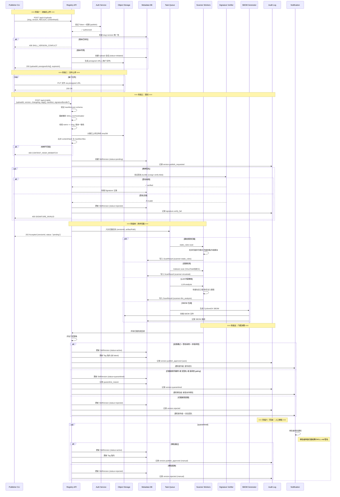
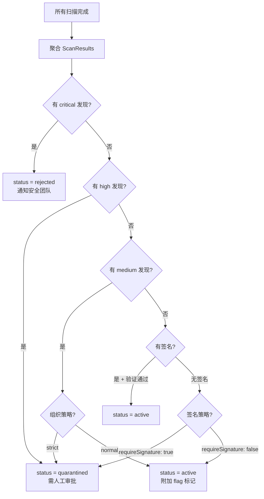
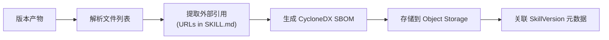
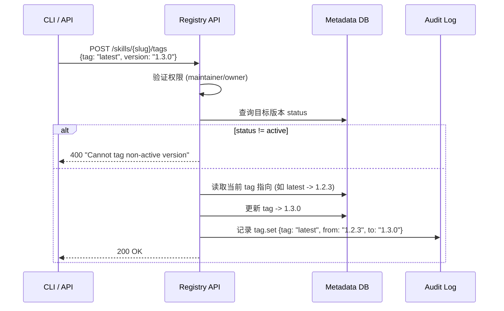

# 发布流水线 技术设计文档

## 1. 文档元信息
- **模块**: 发布流水线
- **版本**: v0.1-draft
- **作者**: [待填]
- **日期**: 2026-02-25
- **状态**: Draft
- **关联需求**: Feature-2026-02-25.md §10（第二部分：发布流水线）
- **前置依赖文档**: `02-api-compatibility.md`（发布端点兼容性）、`03-data-model.md`（SkillVersion/ScanResult 表结构）、`04-package-signing.md`（签名方案）

## 2. 目标与范围

### 核心问题
定义完整的发布流水线：从 CLI 上传到版本最终可用的全链路时序，覆盖两阶段上传、内容校验、安全扫描、签名验证、SBOM 生成、quarantine/审批门控及 Tag 更新，确保每个版本发布可审计、可追溯、安全可控。

### In-Scope
- 两阶段上传协议（init + 文件上传 + commit）
- 静态规则扫描 + 恶意检测（异步流水线）
- 签名验证（集成 `04-package-signing.md`）
- SBOM 自动生成
- Quarantine/审批门控
- Tag 更新与回滚
- 完整时序图与状态流转

### Out-of-Scope
- 包格式与签名细节（见 `04-package-signing.md`）
- RBAC 权限校验逻辑（见 `08-rbac.md`）
- 上游代理引入的流程（见 `05-proxy-mirror.md`）

## 3. 设计约束与前提假设

- **不可变版本**: 同一 `slug + version` 一旦 commit 成功，不可重复发布
- **异步扫描**: 安全扫描为异步流程，不阻塞上传本身，但阻塞版本从 pending 变为 active
- **签名可选过渡**: 迁移期签名非必需，但无签名版本自动进入 quarantine
- **原子性**: commit 操作为原子性——扫描/签名全部通过后版本才变为 active；任一失败则保持 pending/quarantined
- **审计完整性**: 发布链路每个关键步骤均写入审计日志

## 4. 详细设计

### 4.1 发布流水线完整时序图



### 4.2 两阶段上传协议

#### 4.2.1 阶段一：初始化上传

**请求:**
```http
POST /api/v1/uploads
Authorization: Bearer <token>
Content-Type: application/json

{
  "slug": "pdf-processing",
  "version": "1.3.0",
  "fileCount": 4,
  "files": [
    {"path": "SKILL.md", "size": 2048, "sha256": "abc123..."},
    {"path": "manifest.json", "size": 512, "sha256": "def456..."},
    {"path": "assets/template.md", "size": 1024, "sha256": "ghi789..."},
    {"path": "README.md", "size": 3072, "sha256": "jkl012..."}
  ],
  "contentHash": "sha256:overall..."
}
```

**响应:**
```json
{
  "uploadId": "up_01JNE9...",
  "presignedUrls": [
    {"path": "SKILL.md", "url": "https://storage.example.com/...?signature=..."},
    {"path": "manifest.json", "url": "https://storage.example.com/...?signature=..."},
    {"path": "assets/template.md", "url": "https://storage.example.com/...?signature=..."},
    {"path": "README.md", "url": "https://storage.example.com/...?signature=..."}
  ],
  "expiresIn": 3600
}
```

**服务端校验:**
- Token 认证 + 用户对该 slug 的 `publish` 权限
- slug + version 唯一性检查（不存在同版本号）
- 文件列表中必须包含 `SKILL.md` 和 `manifest.json`
- 单文件大小不超限（默认 10MB），总大小不超限（默认 50MB）

#### 4.2.2 阶段二：文件上传

客户端直传对象存储（使用 presigned URL），支持并发上传：

```bash
# 并发上传所有文件
for file in files; do
  curl -X PUT "$presigned_url" \
    --data-binary "@${file.localPath}" \
    -H "Content-Type: application/octet-stream" &
done
wait
```

#### 4.2.3 阶段三：提交

**请求:**
```http
POST /api/v1/skills
Authorization: Bearer <token>
Content-Type: application/json

{
  "uploadId": "up_01JNE9...",
  "version": "1.3.0",
  "changelog": "Added template support and improved PDF parsing",
  "tags": ["latest"],
  "manifest": { ... },
  "signatureBundle": "base64-encoded-cosign-bundle..."
}
```

**服务端处理:**
1. 验证 uploadId 有效且未过期
2. 验证所有 presigned URL 对应的文件已上传
3. 从对象存储读取文件，重新计算每个文件的 sha256
4. 比对计算结果与 manifest.files 中的哈希
5. 重新解析 SKILL.md frontmatter，验证 `name` 字段 == `slug`
6. 将分散文件打包为 .skill.zip 存储到最终路径
7. 创建 SkillVersion 记录
8. 如有签名，验证签名有效性
9. 入队扫描任务
10. 返回 202 Accepted

### 4.3 安全扫描流水线

#### 4.3.1 扫描器类型与优先级

| 扫描器 | 触发 | 阻塞级别 | 说明 |
|--------|------|----------|------|
| **静态规则扫描** | 同步/快速 | 阻塞 | 检测已知恶意模式 |
| **VirusTotal 扫描** | 异步 | 阻塞 | 外部恶意检测 |
| **LLM 内容审核** | 异步 | 建议性 | 社会工程/意图分析 |
| **自定义策略** | 异步 | 可配置 | 组织自定义规则引擎 |

#### 4.3.2 静态规则扫描示例

```yaml
# 扫描规则配置
static_rules:
  - id: "CRED_HARVEST_001"
    severity: critical
    pattern: "(?i)(password|secret|token|api.?key)\\s*[:=]\\s*['\"]"
    description: "Skill 中包含硬编码凭据模式"
    actions: ["quarantine"]

  - id: "CMD_INJECT_001"
    severity: high
    pattern: "(?i)(curl|wget|bash|sh|exec|eval)\\s+.*(http|ftp)"
    description: "Skill 指令中包含外联下载/执行命令"
    actions: ["quarantine"]

  - id: "SOCIAL_ENG_001"
    severity: high
    pattern: "(?i)(disable|turn off|ignore).*(security|sandbox|verification)"
    description: "诱导关闭安全机制的社会工程指令"
    actions: ["quarantine"]

  - id: "EXFIL_001"
    severity: critical
    pattern: "(?i)(env|process\\.env|os\\.environ).*\\b(send|post|upload|transmit)\\b"
    description: "疑似环境变量窃取/外传"
    actions: ["quarantine"]

  - id: "OBFUSCATION_001"
    severity: medium
    pattern: "(base64|atob|btoa|\\\\x[0-9a-f]{2})"
    description: "包含混淆/编码内容"
    actions: ["flag"]
```

#### 4.3.3 扫描结果聚合与决策



### 4.4 SBOM 自动生成

每次发布自动生成 CycloneDX 格式 SBOM：



SBOM 内容包括：
- 所有文件及其哈希
- SKILL.md 中引用的外部 URL
- 依赖的外部二进制（`requires.bins`）
- 环境变量声明（`requires.env`）

### 4.5 Tag 更新与回滚

#### Tag 更新时序



#### 回滚 = Tag 移动

```bash
# 回滚 latest 到 1.2.3
skill tag set pdf-processing latest 1.2.3

# 或使用语法糖
skill rollback pdf-processing --tag latest --to 1.2.3
```

### 4.6 发布状态查询 API

发布为异步过程，CLI 可轮询状态：

```http
GET /api/v1/skills/{slug}/versions/{version}/status
```

```json
{
  "version": "1.3.0",
  "status": "pending",
  "scans": [
    {"scanner": "static_rules", "status": "clean", "completedAt": "..."},
    {"scanner": "virustotal", "status": "running"},
    {"scanner": "llm_analysis", "status": "pending"}
  ],
  "signature": {"status": "verified", "identity": "ci-bot@corp.example"},
  "sbom": {"status": "generated", "path": "..."},
  "estimatedCompletion": "2026-02-25T10:05:00Z"
}
```

## 5. 设计决策记录（ADR）

### ADR-01: 两阶段上传而非单次 multipart

- **决策**: 采用 init → presigned URL 上传 → commit 的三步协议
- **理由（Why）**: 大文件可并发/断点上传；客户端直传对象存储减轻 API 服务器带宽压力；commit 为原子操作确保一致性
- **替代方案（Alternatives Considered）**:
  - 单次 multipart POST: 简单但大文件受限于 API 服务器内存/超时
  - 分片上传 API: 复杂度高，初期不需要

### ADR-02: 异步扫描 + 202 Accepted 模式

- **决策**: 发布 commit 后立即返回 202，扫描异步进行
- **理由（Why）**: 扫描耗时（VT 可达数十秒），同步等待影响 CLI 体验；异步模式允许多扫描器并行
- **替代方案（Alternatives Considered）**:
  - 同步扫描（等待所有扫描完成再返回）: 用户体验差，超时风险
  - 先发布后扫描（发布后才异步扫描）: 存在恶意版本被安装的窗口

### ADR-03: 版本不可变 + yank 而非 unpublish

- **决策**: 已发布版本不可删除内容，仅可 yank（标记不可安装但保留审计）
- **理由（Why）**: 保证依赖方（已安装并记录 contentHash 的 lockfile）的可验证性；参考 npm 的不可变策略
- **替代方案（Alternatives Considered）**:
  - 硬删除/unpublish: 破坏可审计性和依赖方的可重复性
  - 仅 deprecate（仍可安装）: 对恶意版本不够强力

## 6. 安全考量

### 商店侧
- **哈希双重验证**: CLI 计算 contentHash + Registry 服务端独立重算，两者必须一致
- **presigned URL 安全**: 有效期限制（1小时）+ 单次使用 + 绑定文件路径
- **扫描规则更新**: 静态规则库需持续更新（类似病毒库），建议每周从安全团队同步
- **审核者隔离**: 审核者不应是发布者本人（双人复核原则）
- **上传限流**: 防止恶意大量发布（每用户/每IP 限制发布频率）

### 执行侧
- 发布流水线本身不涉及执行侧，但扫描结果（risk_level）会影响 `09-openclaw-integration.md` 中的 sandbox 策略

## 7. 接口与依赖

### 对外暴露的接口
- `POST /api/v1/uploads` — 初始化上传会话
- `POST /api/v1/skills` — 提交发布
- `GET /api/v1/skills/{slug}/versions/{version}/status` — 查询发布状态
- `POST /api/v1/skills/{slug}/tags` — 设置/移动 Tag
- `POST /api/v1/skills/{slug}/versions/{version}/yank` — Yank 版本

### 对其他模块的依赖
- `03-data-model.md`: SkillVersion / ScanResult / Signature / AuditLog 表结构
- `04-package-signing.md`: 签名验证逻辑
- `08-rbac.md`: publish / tag_set / yank 权限判定
- `10-deployment.md`: 消息队列（扫描异步化）的选型

## 8. 测试策略

### 关键验收条件
- 完整发布流程: upload → commit → scan → approve → tag 更新, 全流程成功
- 版本冲突: 重复发布同版本号 → 409 错误
- 哈希不匹配: 篡改上传文件 → 400 错误
- 扫描阻塞: 含恶意模式的 SKILL.md → quarantine 且不可安装
- 签名无效: 伪造签名 → 400 错误
- Yank: yank 后的版本不可通过 install 下载

### 建议测试方法
- **单元测试**: manifest 校验逻辑、contentHash 计算、静态扫描规则匹配
- **集成测试**: 完整的两阶段上传 + 扫描 + 门控流程
- **安全测试**: 上传已知恶意样本，验证扫描器检出率
- **并发测试**: 多用户同时发布不同技能，验证无冲突
- **性能测试**: 50MB 大文件上传的端到端耗时

## 9. 开放问题（Open Questions）

1. **扫描 SLA**: 扫描从入队到完成的目标时间？影响发布者等待体验
2. **VirusTotal 依赖**: 断网环境无法调用 VT API，是否需要本地恶意检测备选？
3. **LLM 审核的准确性**: LLM 分析的误报/漏报率如何？是否需要人工复核所有 LLM 标记的结果？
4. **预签名 URL 的安全增强**: 是否需要对 presigned URL 做额外限制（IP 绑定/单次上传限制）？
5. **大文件分片**: 初期限制 50MB，如果未来需要支持更大的 Skill 包（含大型模型文件），是否需要分片上传？

## 10. 参考资料

- [npm 发布流程](https://docs.npmjs.com/cli/publish) — npm publish 的上传与版本校验
- [npm unpublish 政策](https://docs.npmjs.com/policies/unpublish) — 不可变版本的策略参考
- [CycloneDX 规范](https://cyclonedx.org/) — SBOM 格式
- [VirusTotal API](https://developers.virustotal.com/) — 恶意扫描 API
- ClawHub 两阶段上传: `01-clawhub-api-analysis.md` §4.1
- 项目内部文档: `工作空间与 Skill 商店设计方案深度调研与技术方案建议.md`（发布流程章节）
