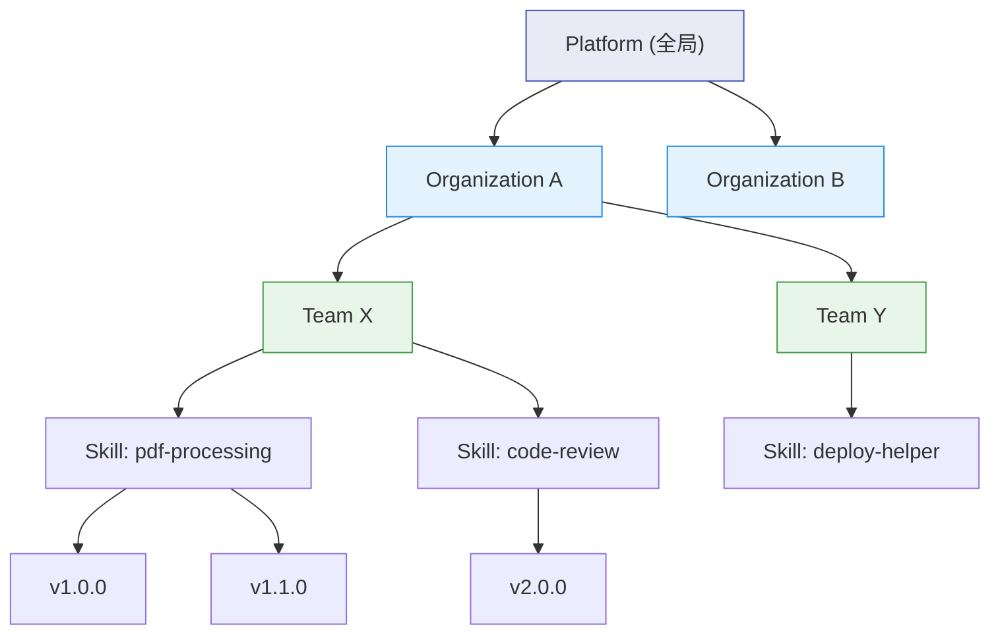
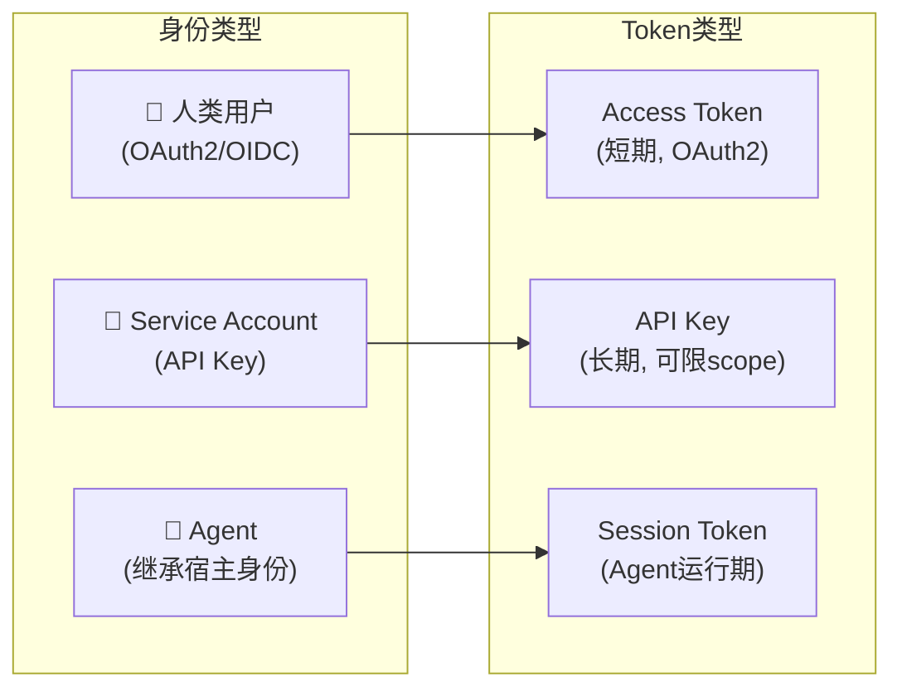
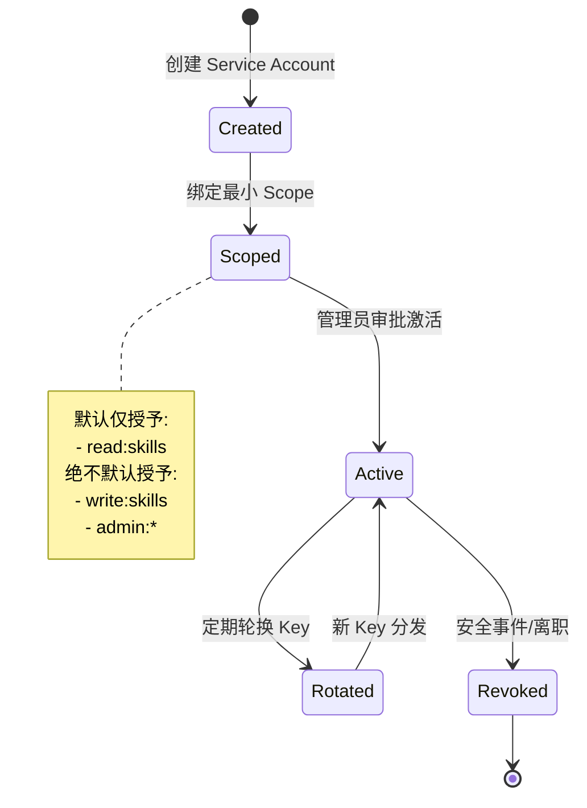
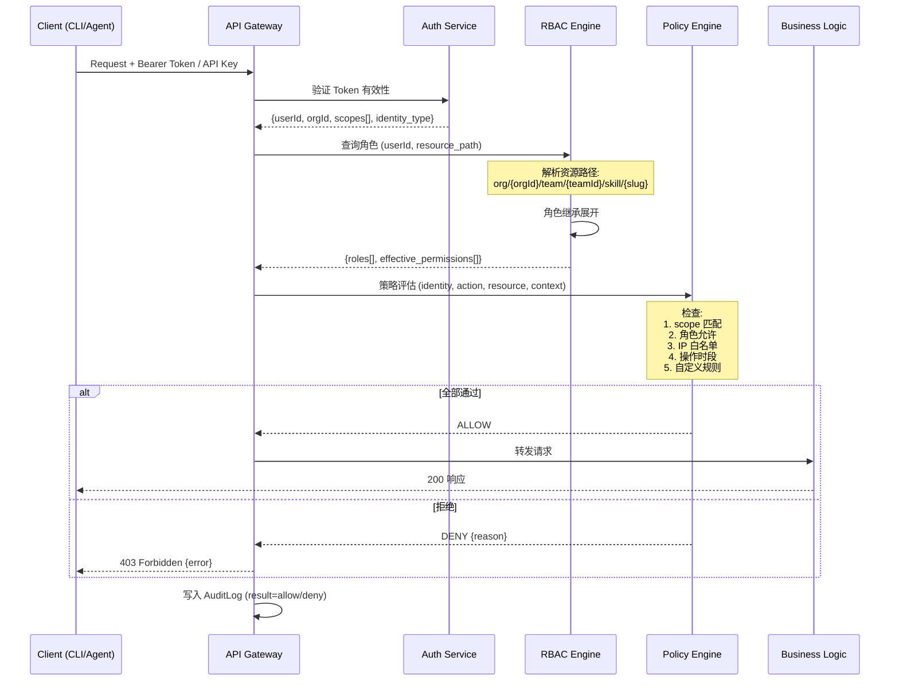
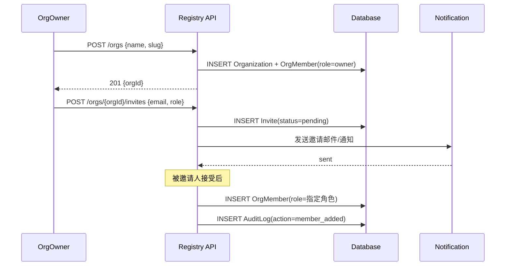
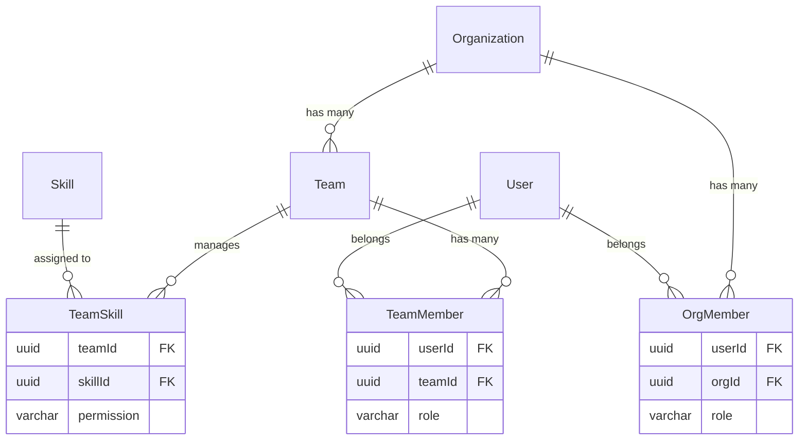

# 08 — RBAC 权限模型设计

> **Design Doc** · 私有 Skill Registry  
> **状态**：Draft  
> **作者**：Platform Arch Team  
> **关联 Feature**：§11 权限模型  
> **依赖文档**：[03-data-model](03-data-model.md) · [07-publish-pipeline](07-publish-pipeline.md) · [01-clawhub-api-analysis](01-clawhub-api-analysis.md)

---

## 1. 目标与范围

### 1.1 目标

| # | 目标 | 验收标准 |
|---|------|----------|
| G1 | 建立 Org→Team→Skill→Version 四层资源权限模型 | 任意 API 请求可在 <5ms 内完成鉴权 |
| G2 | 提供 6 种角色覆盖全生命周期操作 | 角色矩阵通过安全评审 |
| G3 | Agent / Service Account 遵循最小权限原则 | 默认权限为只读安装已审批版本 |
| G4 | 所有权限变更全量审计 | 审计日志 append-only，不可篡改 |
| G5 | 支持动态策略（信任策略、IP 白名单、操作时段限制） | 策略引擎可热更新 |

### 1.2 范围

- **In Scope**：RBAC 角色定义、资源层级、权限矩阵、Token 作用域、策略引擎、审计联动
- **Out of Scope**：ABAC（基于属性的访问控制，作为 v2 演进方向）、UI 管理界面细节

---

## 2. 设计约束与前提假设

| 约束/假设 | 来源 | 说明 |
|-----------|------|------|
| 认证层已完成 | 02-api-compatibility | OAuth2/OIDC + API Key 双模式 |
| 数据模型已定义 | 03-data-model | User/Org/Team/OrgMember/TeamMember/TeamSkill/APIToken 表 |
| ClawHub 无 RBAC | 01-clawhub-api-analysis | ClawHub 仅有 owner/member 二级权限，本设计为私有扩展 |
| Agent 不直接发布 | Feature §11 | Agent 只读/安装；发布由 CI 或人类操作 |
| 审计不可篡改 | Feature §11 | AuditLog 表 append-only |

---

## 3. 详细设计

### 3.1 资源层级模型



**权限继承规则**：

- 上层角色在下层**自动继承**：OrgOwner 对 Org 下所有 Team/Skill 具有完整权限
- Team 级别权限通过 `TeamSkill` 关联表绑定到具体 Skill
- Version 级别操作（yank/undelete）权限跟随 Skill 级别角色
- 未关联到任何 Team 的 Skill 仅对 Org 级别角色可见

### 3.2 角色定义

| 角色 | 代码标识 | 作用域 | 说明 |
|------|---------|--------|------|
| **PlatformAdmin** | `platform:admin` | 全局 | 超级管理员，可管理所有组织、全局策略、信任根 |
| **OrgOwner** | `org:owner` | 组织 | 组织创建者/所有者，可管理成员、团队、全部 Skill |
| **OrgAdmin** | `org:admin` | 组织 | 组织管理员，可管理团队/成员/Skill，不可删除组织 |
| **Maintainer** | `team:maintainer` | 团队 | 团队维护者，可发布/yank/tag/管理团队 Skill |
| **Publisher** | `team:publisher` | 团队 | 可发布新版本，不可 yank/删除/移动 tag |
| **Viewer** | `org:viewer` | 组织 | 只读浏览/下载/安装已审批版本 |
| **Auditor** | `org:auditor` | 组织 | 只读 + 审计日志查询权限 |

### 3.3 权限矩阵

| 操作 | PlatformAdmin | OrgOwner | OrgAdmin | Maintainer | Publisher | Viewer | Auditor |
|------|:---:|:---:|:---:|:---:|:---:|:---:|:---:|
| **组织管理** |||||||
| 创建组织 | ✅ | — | — | — | — | — | — |
| 删除组织 | ✅ | ✅ | — | — | — | — | — |
| 管理组织设置 | ✅ | ✅ | ✅ | — | — | — | — |
| **成员管理** |||||||
| 邀请/移除成员 | ✅ | ✅ | ✅ | — | — | — | — |
| 变更成员角色 | ✅ | ✅ | ✅¹ | — | — | — | — |
| **团队管理** |||||||
| 创建/删除团队 | ✅ | ✅ | ✅ | — | — | — | — |
| 管理团队成员 | ✅ | ✅ | ✅ | ✅² | — | — | — |
| **Skill 操作** |||||||
| 创建 Skill | ✅ | ✅ | ✅ | ✅ | — | — | — |
| 发布新版本 | ✅ | ✅ | ✅ | ✅ | ✅ | — | — |
| Yank 版本 | ✅ | ✅ | ✅ | ✅ | — | — | — |
| Soft-delete Skill | ✅ | ✅ | ✅ | ✅ | — | — | — |
| Undelete Skill | ✅ | ✅ | ✅ | — | — | — | — |
| 移动 Tag（回滚） | ✅ | ✅ | ✅ | ✅ | — | — | — |
| **读取操作** |||||||
| 搜索/浏览 | ✅ | ✅ | ✅ | ✅ | ✅ | ✅ | ✅ |
| 下载/安装 | ✅ | ✅ | ✅ | ✅ | ✅ | ✅ | ✅ |
| 查看版本历史 | ✅ | ✅ | ✅ | ✅ | ✅ | ✅ | ✅ |
| **审计与策略** |||||||
| 查询审计日志 | ✅ | ✅ | ✅ | — | — | — | ✅ |
| 管理安全策略 | ✅ | ✅ | — | — | — | — | — |
| 管理信任根 | ✅ | ✅ | — | — | — | — | — |
| Quarantine 审批 | ✅ | ✅ | ✅ | ✅³ | — | — | — |

> ¹ OrgAdmin 不可将他人提升为 OrgOwner  
> ² Maintainer 仅能管理自己所在团队的成员（不可变更角色为 Maintainer 及以上）  
> ³ Maintainer 仅可审批自己团队关联的 Skill

### 3.4 身份类型与 Token 模型



#### API Token 作用域（Scope）定义

| Scope | 含义 | 典型使用者 |
|-------|------|-----------|
| `read:skills` | 搜索、浏览、下载、安装 | Agent、Viewer |
| `write:skills` | 发布、创建 Skill | CI/CD pipeline (Publisher) |
| `admin:skills` | yank、delete、undelete、tag 移动 | Maintainer、OrgAdmin |
| `read:audit` | 查询审计日志 | Auditor |
| `admin:org` | 组织/团队/成员管理 | OrgOwner、OrgAdmin |
| `admin:policy` | 安全策略、信任根管理 | OrgOwner、PlatformAdmin |

#### API Token 表结构（引用 03-data-model）

| 字段 | 类型 | 约束 | 说明 |
|------|------|------|------|
| `id` | UUID | PK | Token ID |
| `userId` | UUID | FK → User | 所属用户 |
| `orgId` | UUID | FK → Organization, NULLABLE | 限定到某组织（NULL = 用户所有组织） |
| `name` | VARCHAR(128) | NOT NULL | 显示名 |
| `hashedKey` | VARCHAR(256) | NOT NULL, UNIQUE | SHA-256(token_value) |
| `scopes` | TEXT[] | NOT NULL | 权限 scope 列表 |
| `expiresAt` | TIMESTAMPTZ | NULLABLE | 过期时间（NULL = 不过期，but 强烈建议设置） |
| `lastUsedAt` | TIMESTAMPTZ | NULLABLE | 最后使用时间 |
| `ipAllowList` | CIDR[] | NULLABLE | IP 白名单 |
| `isActive` | BOOLEAN | DEFAULT true | 启/停状态 |
| `createdAt` | TIMESTAMPTZ | DEFAULT now() | 创建时间 |

### 3.5 Agent / Service Account 最小权限策略



**Agent 身份约束**：

| 约束规则 | 说明 |
|---------|------|
| 默认只读 | Agent 默认仅具备 `read:skills` scope |
| 不可发布 | Agent 身份不可绑定 `write:skills` scope（需 CI 或人类操作） |
| 短期 Token | Agent Session Token 有效期 ≤ 24h，不支持永不过期 |
| IP 绑定 | 可配置 `ipAllowList` 限制 Agent 访问来源 |
| 仅安装已审批版本 | 策略引擎可限制 Agent 只能安装 `status = published` 的版本 |
| 审计关联 | 所有 Agent 下载/安装操作记录到 AuditLog，关联 SA 身份 |

### 3.6 鉴权流程



### 3.7 策略引擎

策略引擎在 RBAC 之上提供动态、细粒度的访问控制。

#### 策略类型

| 策略类型 | 示例 | 评估时机 |
|---------|------|---------|
| **Scope Policy** | Token 必须包含匹配的 scope | Token 解析后 |
| **Role Policy** | 操作需要 Maintainer 及以上角色 | RBAC 查询后 |
| **IP Policy** | 仅允许内网 CIDR 发布 | 请求入口 |
| **Time Policy** | 禁止工作时间外发布（紧急通道除外） | 请求入口 |
| **Approval Policy** | 高风险操作需双人审批 | 业务逻辑前 |
| **Trust Policy** | 仅允许安装签名版本 | 下载/安装时 |
| **Version Policy** | Agent 只能安装 published 状态版本 | 下载/安装时 |

#### 策略配置示例（YAML）

```yaml
# policy.yaml
policies:
  - name: "require-signature-for-install"
    description: "所有安装必须通过签名验证"
    effect: DENY
    conditions:
      - action: "skill:install"
        unless:
          signatureStatus: "verified"

  - name: "restrict-publish-to-ci"
    description: "发布仅允许 CI service account"
    effect: DENY
    conditions:
      - action: "skill:publish"
        unless:
          identityType: "service_account"
          scopeIncludes: "write:skills"
          ipInCidr: ["10.0.0.0/8", "172.16.0.0/12"]

  - name: "dual-approval-for-yank"
    description: "Yank 操作需要双人审批"
    effect: REQUIRE_APPROVAL
    conditions:
      - action: "skill:yank"
        approvalCount: 2
        approverRoles: ["org:owner", "org:admin"]

  - name: "agent-readonly"
    description: "Agent 身份仅限只读"
    effect: DENY
    conditions:
      - identityType: "agent"
        actionNotIn: ["skill:search", "skill:list", "skill:download", "skill:inspect"]
```

### 3.8 组织与团队管理流程

#### 组织创建与成员邀请



#### 团队-Skill 关联



---

## 4. 设计决策记录（ADR）

### ADR-RBAC-001：RBAC 而非 ABAC

- **决策**：v1 采用角色型访问控制（RBAC），不实现属性型（ABAC）
- **理由**：
  - RBAC 模型成熟且实现简单，团队内审批/审计链路清晰
  - 6 种角色 + scope + 策略引擎组合已能满足 90%+ 场景
  - ABAC 引入复杂的属性评估逻辑，增加鉴权延迟和调试难度
- **替代方案**：ReBAC（基于关系）、ABAC、ACL
- **演进方向**：v2 可在策略引擎中引入属性条件（半 ABAC），逐步扩展

### ADR-RBAC-002：角色继承 vs 扁平权限

- **决策**：采用层级继承（OrgOwner 自动拥有所有子级权限）
- **理由**：
  - 层级继承减少权限分配的管理负担
  - 与组织架构自然对应（Org→Team→Skill）
  - ClawHub 的 owner/member 模型也是隐式继承
- **替代方案**：扁平权限列表（每个角色独立枚举所有允许的操作）
- **风险**：继承可能导致过度授权，通过 scope 约束 + 策略引擎缓解

### ADR-RBAC-003：Agent 身份独立建模

- **决策**：Agent 不复用人类用户身份，使用独立 Service Account + Session Token
- **理由**：
  - Agent 的权限需求与人类有本质区别（只读、短期、受限来源）
  - 独立身份便于审计追踪（区分人类操作与 Agent 操作）
  - 安全事件时可快速 revoke Agent 而不影响人类登录
- **替代方案**：Agent 继承操作者 Token（降低了隔离性）

### ADR-RBAC-004：Token Scope 作为第二道防线

- **决策**：即使角色允许某操作，Token 也必须包含对应 scope 才能执行
- **理由**：
  - 双重验证：角色确定"你是谁"，scope 确定"这个 Token 被授权做什么"
  - 支持创建受限 Token（如：CI Token 只有 `write:skills`，无 `admin:org`）
  - 降低 Token 泄露的影响范围
- **替代方案**：仅依赖角色（Token 泄露等同于身份被盗）

---

## 5. 安全考量

### 5.1 商店侧

| 威胁 | 攻击向量 | 缓解措施 |
|------|---------|---------|
| 越权发布 | 低权限用户绕过角色检查 | 双重验证（role + scope）+ 策略引擎 + 全量审计 |
| Token 泄露 | API Key 被意外提交到代码仓库 | Key 自动过期 + IP 白名单 + scope 最小化 + 泄露检测集成 |
| 权限提升 | 用户自行修改角色 | 角色变更需 OrgAdmin+ 操作 + 审计日志 |
| 内部人威胁 | 恶意管理员篡改版本 | 双人审批策略 + 不可变审计日志 + 签名校验 |
| Tag 劫持 | 恶意移动 latest 到后门版本 | Tag 变更需 Maintainer+ + 审计 + 可选双人审批 |
| Session 劫持 | 窃取 Agent Session Token | 短期 Token + IP 绑定 + 单 Session 单 Token |

### 5.2 执行侧

| 威胁 | 缓解措施 |
|------|---------|
| Agent 被诱导安装恶意 Skill | Agent 默认只读 + 只能安装 published 状态 + 签名强制 |
| Agent 使用泄露的高权限 Token | Agent 身份独立建模，不继承人类全部权限 |
| 高风险 Skill 执行造成损害 | RBAC 配合 09-openclaw-integration 的 sandbox 联动 |

---

## 6. 接口与依赖

### 6.1 RBAC 相关 API

| Method | Path | 说明 | 所需最低角色 |
|--------|------|------|-------------|
| GET | `/orgs` | 列出用户所属组织 | Viewer |
| POST | `/orgs` | 创建组织 | PlatformAdmin |
| GET | `/orgs/{orgId}/members` | 列出组织成员 | Viewer |
| POST | `/orgs/{orgId}/invites` | 邀请成员 | OrgAdmin |
| PUT | `/orgs/{orgId}/members/{userId}` | 变更成员角色 | OrgAdmin |
| DELETE | `/orgs/{orgId}/members/{userId}` | 移除成员 | OrgAdmin |
| POST | `/orgs/{orgId}/teams` | 创建团队 | OrgAdmin |
| PUT | `/orgs/{orgId}/teams/{teamId}/members` | 管理团队成员 | Maintainer |
| POST | `/orgs/{orgId}/teams/{teamId}/skills` | 关联 Skill 到团队 | OrgAdmin |
| GET | `/tokens` | 列出用户的 API Token | Viewer |
| POST | `/tokens` | 创建 API Token | Viewer（scope 受限于自身角色） |
| DELETE | `/tokens/{tokenId}` | 撤销 Token | Token 所有者 / OrgAdmin |

### 6.2 依赖关系

| 依赖组件 | 用途 |
|---------|------|
| Auth Service（OAuth2/OIDC） | 身份验证，获取 userId / identity_type |
| Database（03-data-model） | User/Org/Team/OrgMember/TeamMember/TeamSkill/APIToken 表 |
| AuditLog | 所有鉴权结果（allow/deny）写入审计 |
| Policy Engine | 动态策略评估 |
| 07-publish-pipeline | 发布流程中的权限检查 checkpoint |
| 04-package-signing | 签名验证结果作为策略引擎输入 |

---

## 7. 测试策略

| 层次 | 覆盖内容 | 方法 |
|------|---------|------|
| **单元测试** | 角色继承展开逻辑 | 给定角色+资源路径→断言 effective_permissions |
| **单元测试** | Scope 匹配逻辑 | 给定 Token scopes + required scope→断言 allow/deny |
| **单元测试** | 策略引擎评估 | 给定 policy YAML + request context→断言结果 |
| **集成测试** | 完整鉴权链路 | Token→Auth→RBAC→Policy→API→AuditLog 全链路 |
| **集成测试** | 角色变更生效 | 变更角色后立即鉴权→新角色生效 |
| **安全测试** | 越权尝试 | 以低权限 Token 调用高权限 API→断言 403 |
| **安全测试** | Token 过期/撤销 | 使用过期或已撤销 Token→断言 401 |
| **安全测试** | IP 白名单绕过 | 从非白名单 IP 调用→断言 403 |
| **性能测试** | 鉴权延迟 | 1000 并发请求，p99 鉴权时间 < 10ms |
| **渗透测试** | IDOR（不安全的直接对象引用） | 尝试访问其他组织/团队的资源→断言 403 |

---

## 8. 开放问题

| # | 问题 | 建议方向 | 优先级 |
|---|------|---------|--------|
| Q1 | 是否支持自定义角色？ | v1 不支持，v2 评估；6 种内置角色覆盖主要场景 | P2 |
| Q2 | 跨组织 Skill 可见性如何处理？ | v1 Skill 仅对所属 Org 可见；v2 支持 scope=public | P2 |
| Q3 | 策略引擎是否需要支持 OPA/Rego？ | v1 用内置 YAML 规则；v2 评估 OPA 集成 | P3 |
| Q4 | Token rotation 是否强制执行？ | 建议 90 天 max lifetime + 提前 30 天告警 | P1 |
| Q5 | 如何处理"紧急通道"（break glass）操作？ | 提供 break-glass Token 类型，自动触发高优先级审计告警 | P2 |

---

## 9. 参考资料

| 来源 | 说明 |
|------|------|
| Feature §11 | 权限模型需求定义 |
| 深度调研报告 §权限模型 | RBAC 层级、角色示例、Agent 最小权限 |
| 03-data-model | User/Org/Team/OrgMember/TeamMember/APIToken 表定义 |
| ClawHub 公开 Schema | apiTokens/rateLimits 表结构参考 |
| OAuth2 RFC 6749 | Token 授权模型基础 |
| NIST RBAC 模型 | 角色层级与权限继承理论基础 |
