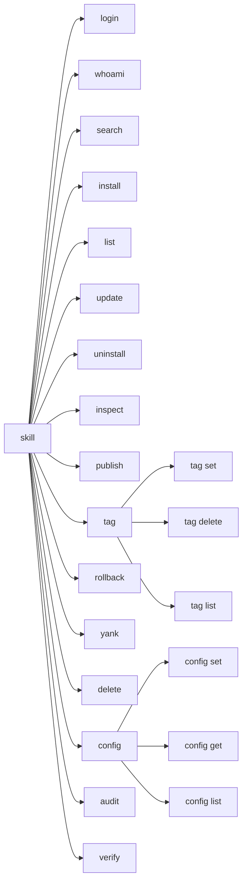
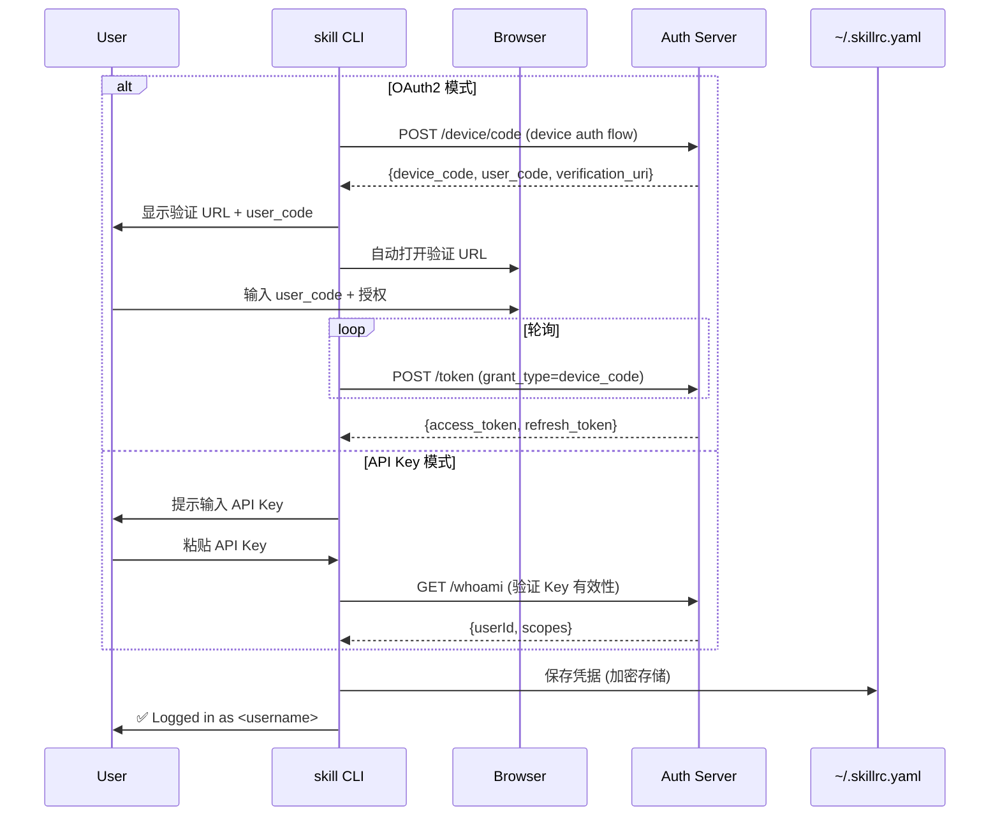
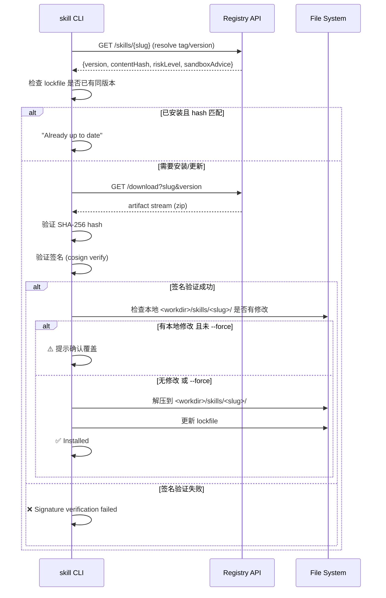
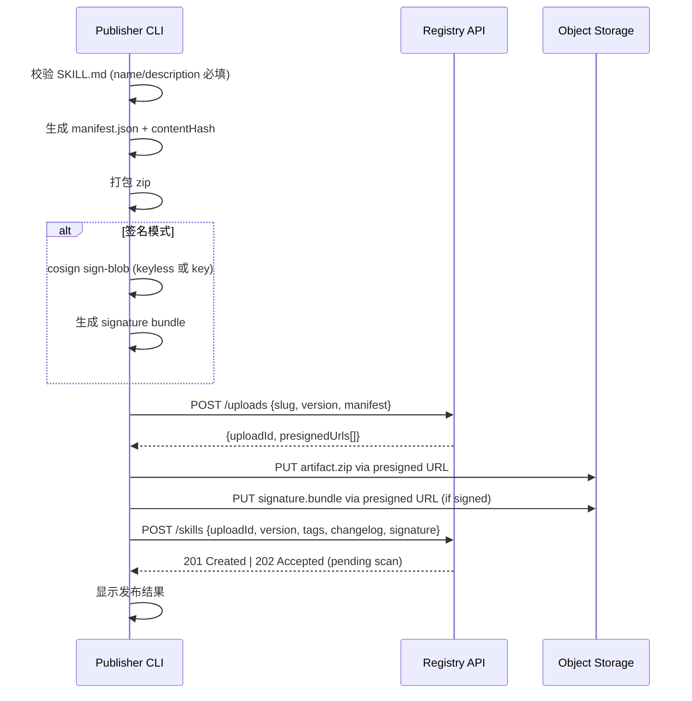
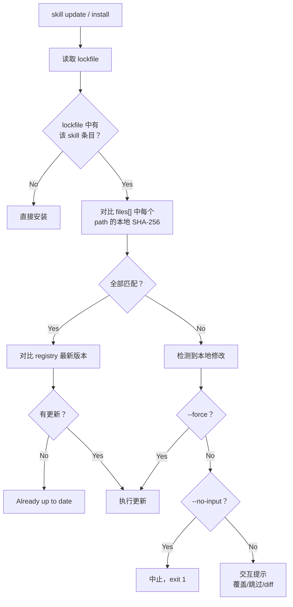

# 11 — CLI 完整规范

> **Design Doc** · 私有 Skill Registry  
> **状态**：Draft  
> **作者**：Platform Arch Team  
> **关联 Feature**：§15 CLI 完整规范  
> **依赖文档**：[01-clawhub-api-analysis](01-clawhub-api-analysis.md) · [02-api-compatibility](02-api-compatibility.md) · [04-package-signing](04-package-signing.md) · [08-rbac](08-rbac.md)

---

## 1. 目标与范围

### 1.1 目标

| # | 目标 | 验收标准 |
|---|------|----------|
| G1 | CLI 命令集覆盖 Skill 全生命周期 | login → search → install → list → update → uninstall → publish → rollback |
| G2 | 兼容 ClawHub CLI 交互模型 | `--registry` 透明切换，lockfile 格式兼容 |
| G3 | 多 Registry 配置（`.skillrc.yaml`） | 支持同时使用 ClawHub + 私有 Registry |
| G4 | 完整错误码体系 | 所有错误有唯一 code + 人类可读 message |
| G5 | 签名验证内置 | 安装时默认校验签名；可配置信任策略 |

### 1.2 范围

- **In Scope**：命令表、全局参数、子命令详细定义、配置文件格式、lockfile 格式、错误码体系、输出格式
- **Out of Scope**：CLI 内部实现细节、GUI/TUI 界面

---

## 2. 设计约束与前提假设

| 约束/假设 | 来源 | 说明 |
|-----------|------|------|
| 兼容 ClawHub CLI 交互模型 | Feature §15 | `--workdir/--dir/--registry/--no-input` 全局选项 |
| 命令命名可为 `skill` 或 `clawhub` | 深度调研 | 建议使用 `skill` 作为主命令名 |
| lockfile 路径 `.clawhub/lock.json` | ClawHub 文档 | 兼容现有 lockfile 位置 |
| 安装落盘到 `<workdir>/skills/<name>/` | OpenClaw 规范 | 不引入多级命名空间目录 |
| OAuth2 + API Key 双模式认证 | 02-api-compatibility | 浏览器/设备授权 + CI 用 API Key |

---

## 3. 详细设计

### 3.1 全局参数

| 参数 | 短名 | 类型 | 默认值 | 说明 |
|------|------|------|--------|------|
| `--workdir` | `-w` | path | `.` (当前目录) | 工作目录（Skill 安装到 `<workdir>/<dir>/`） |
| `--dir` | `-d` | string | `skills` | 技能安装子目录名 |
| `--registry` | `-r` | string | 配置文件 `defaults.registry` | 目标 Registry 别名或 URL |
| `--no-input` | | boolean | `false` | 非交互模式（CI 适用） |
| `--json` | | boolean | `false` | JSON 格式输出 |
| `--verbose` | `-v` | boolean | `false` | 详细日志输出 |
| `--config` | | path | `~/.skillrc.yaml` | 配置文件路径 |
| `--timeout` | | duration | `30s` | 请求超时 |

**Registry 解析优先级**（三级）：

1. 命令行 `--registry` 参数
2. 环境变量 `SKILL_REGISTRY`
3. 配置文件 `defaults.registry`

### 3.2 命令表



### 3.3 子命令详细定义

#### `skill login`

认证并保存凭据到本地配置。

```
skill login [--registry <name>] [--method <oauth2|apikey>]
```

| 参数 | 类型 | 必填 | 说明 |
|------|------|------|------|
| `--registry` | string | 否 | 目标 Registry |
| `--method` | enum | 否 | 认证方式：`oauth2`（默认，浏览器授权）/ `apikey` |

**流程**：



**输出示例**：
```
$ skill login --registry private
Opening browser for authentication...
Waiting for authorization... ✅
Logged in as alice@mycorp.example to registry 'private'
```

---

#### `skill whoami`

验证 Token 有效性并显示身份。

```
skill whoami [--registry <name>]
```

**输出示例**：
```
$ skill whoami --registry private
Username: alice
Email: alice@mycorp.example
Org: mycorp
Roles: org:admin, team:maintainer(backend)
Token expires: 2026-04-15T00:00:00Z
```

---

#### `skill search`

搜索 Skill。

```
skill search <query> [--registry <name>] [--limit <n>] [--tag <tag>] [--sort <field>]
```

| 参数 | 类型 | 必填 | 说明 |
|------|------|------|------|
| `<query>` | string | 是 | 搜索关键词 |
| `--limit` | int | 否 | 返回数量（默认 20，最大 100） |
| `--tag` | string | 否 | 按 tag 过滤 |
| `--sort` | enum | 否 | `relevance`(默认) / `downloads` / `updated` / `name` |

**输出示例**：
```
$ skill search "database migration" --registry private
NAME                  VERSION  DOWNLOADS  UPDATED     DESCRIPTION
database-migration    1.2.0    342        2d ago      自动化数据库迁移工具
pg-backup             2.0.1    128        1w ago      PostgreSQL 备份与恢复
data-sync             0.9.0    56         3w ago      多源数据同步

3 results found
```

---

#### `skill install`

下载并安装 Skill。

```
skill install <slug> [--version <ver>] [--tag <tag>] [--force] [--workdir <path>] [--dir <name>]
```

| 参数 | 类型 | 必填 | 说明 |
|------|------|------|------|
| `<slug>` | string | 是 | Skill 名称 |
| `--version` | semver | 否 | 指定版本（与 `--tag` 互斥） |
| `--tag` | string | 否 | 指定 tag（默认 `latest`） |
| `--force` | boolean | 否 | 本地有修改时强制覆盖 |

**安装流程**：



**输出示例**：
```
$ skill install database-migration --registry private
Resolving database-migration@latest... v1.2.0
Downloading... ████████████████████████ 100% (245KB)
Verifying signature... ✅ signed by build-bot@mycorp.example
Verifying hash... ✅ sha256:abc123...
Extracting to ./skills/database-migration/
Updating lockfile...
✅ Installed database-migration@1.2.0 (risk: high, sandbox: required)
```

---

#### `skill list`

列出已安装的 Skill。

```
skill list [--workdir <path>] [--json]
```

**输出示例**：
```
$ skill list
NAME                  VERSION  REGISTRY   RISK     STATUS
database-migration    1.2.0    private    high     ✅ verified
code-review           2.0.0    private    low      ✅ verified
pdf-processing        1.0.3    clawhub    medium   ⚠️ unsigned

3 skills installed
```

---

#### `skill update`

更新已安装的 Skill。

```
skill update [<slug>] [--all] [--force] [--dry-run]
```

| 参数 | 类型 | 必填 | 说明 |
|------|------|------|------|
| `<slug>` | string | 否 | 指定更新的 Skill（不指定则需 `--all`） |
| `--all` | boolean | 否 | 更新全部已安装 Skill |
| `--force` | boolean | 否 | 忽略本地修改强制更新 |
| `--dry-run` | boolean | 否 | 仅显示可更新项，不实际操作 |

**输出示例**：
```
$ skill update --all --dry-run
NAME                  CURRENT  LATEST  REGISTRY
database-migration    1.2.0    1.3.0   private
code-review           2.0.0    2.0.0   private  (up to date)

1 update available. Run without --dry-run to apply.
```

---

#### `skill uninstall`

卸载 Skill。

```
skill uninstall <slug> [--yes]
```

**行为**：删除 `<workdir>/skills/<slug>/` 目录并从 lockfile 中移除条目。

---

#### `skill inspect`

查看 Skill 详情（不安装）。

```
skill inspect <slug> [--versions] [--files] [--version <ver>]
```

**输出示例**：
```
$ skill inspect database-migration --versions --registry private
database-migration — 自动化数据库迁移工具
  Owner: backend-team @ mycorp
  Risk Level: high
  Capabilities: exec, network, fileWrite
  Sandbox: required (network=restricted, workspace=rw)

Versions:
  v1.3.0  latest  2026-03-20  published
  v1.2.0          2026-03-01  published
  v1.1.0          2026-02-15  published
  v1.0.0          2026-02-01  yanked
```

---

#### `skill publish`

发布 Skill 新版本。

```
skill publish <path> --version <ver> [--tags <tag,...>] [--changelog <text>]
  [--sign] [--sign-key <path>] [--registry <name>]
```

| 参数 | 类型 | 必填 | 说明 |
|------|------|------|------|
| `<path>` | path | 是 | Skill 目录路径 |
| `--version` | semver | 是 | 版本号 |
| `--tags` | string | 否 | 设置的 tag 列表（默认 `latest`） |
| `--changelog` | string | 否 | 变更日志 |
| `--sign` | boolean | 否 | 启用签名（keyless OIDC 模式） |
| `--sign-key` | path | 否 | 使用指定私钥签名（离线模式） |

**发布流程**：



**输出示例**：
```
$ skill publish ./database-migration --version 1.3.0 --sign --registry private
Validating SKILL.md... ✅
Generating manifest... ✅ contentHash: sha256:def456...
Packaging... ✅ database-migration-1.3.0.zip (245KB)
Signing (keyless OIDC)... ✅ identity: build-bot@mycorp.example
Uploading artifact... ████████████████████████ 100%
Uploading signature... ████████████████████████ 100%
Committing version... ✅

Published database-migration@1.3.0 (status: pending scan)
Tags: latest → 1.3.0
```

---

#### `skill tag set`

移动 tag 到指定版本（用于回滚）。

```
skill tag set <slug> <tag> <version> [--registry <name>]
```

**输出示例**：
```
$ skill tag set database-migration latest 1.2.0 --registry private
Moved tag 'latest' on database-migration: 1.3.0 → 1.2.0
```

---

#### `skill rollback`

tag 移动的语法糖。

```
skill rollback <slug> [--tag <tag>] --to <version>
```

等同于 `skill tag set <slug> <tag> <version>`。

---

#### `skill yank`

禁止安装指定版本。

```
skill yank <slug>@<version> [--registry <name>]
```

---

#### `skill verify`

独立验证已安装 Skill 的完整性和签名。

```
skill verify [<slug>] [--all] [--workdir <path>]
```

**输出示例**：
```
$ skill verify --all
NAME                  VERSION  HASH     SIGNATURE  STATUS
database-migration    1.2.0    ✅ match  ✅ valid    OK
code-review           2.0.0    ✅ match  ✅ valid    OK
pdf-processing        1.0.3    ❌ mismatch  —       MODIFIED

⚠️ 1 skill has been modified since installation
```

---

#### `skill audit`

查询审计日志（需 Auditor+ 权限）。

```
skill audit [--from <date>] [--to <date>] [--actor <user>] [--action <type>]
  [--skill <slug>] [--limit <n>] [--registry <name>]
```

---

#### `skill config set / get / list`

管理本地配置。

```
skill config set <key> <value>
skill config get <key>
skill config list
```

### 3.4 配置文件格式（`.skillrc.yaml`）

```yaml
# ~/.skillrc.yaml
# 多 Registry 配置文件

registries:
  clawhub:
    type: clawhub-v1          # 协议类型
    url: "https://clawhub.com"
    description: "Official ClawHub public registry"
  
  private:
    type: clawhub-v1
    url: "https://skills.mycorp.internal"
    description: "Internal private registry"

# 认证凭据（自动由 skill login 写入，建议加密存储）
auth:
  clawhub:
    mode: oauth2
    accessToken: "encrypted:..."
    refreshToken: "encrypted:..."
    expiresAt: "2026-04-15T00:00:00Z"
  
  private:
    mode: oauth2
    accessToken: "encrypted:..."
    refreshToken: "encrypted:..."
    expiresAt: "2026-04-15T00:00:00Z"
  
  # CI 专用 API Key 凭据
  private-ci:
    registry: private
    mode: apikey
    apiKey: "encrypted:..."

# 全局默认配置
defaults:
  workdir: "."           # 默认工作目录
  dir: "skills"          # 默认技能子目录名
  registry: "private"    # 默认 Registry

# 信任策略
trust:
  requireSignature: true          # 安装时强制签名验证
  trustedIssuers:                # 可信的 OIDC Issuer
    - "https://auth.mycorp.internal"
    - "https://accounts.google.com"
  trustedIdentities:             # 可信的签名身份
    - "build-bot@mycorp.example"
    - "ci-pipeline@mycorp.example"
  
  # 迁移期例外策略
  exceptions:
    allowUnsignedForRegistries:
      - "clawhub"                 # ClawHub 暂不要求签名

# 代理与网络
network:
  proxy: "http://proxy.mycorp.internal:8080"   # HTTP 代理
  noProxy: ["skills.mycorp.internal"]          # 不走代理的地址
  timeout: "30s"
  retries: 3
```

### 3.5 Lockfile 格式（`.clawhub/lock.json`）

Lockfile 用于固定已安装版本、支持可重复安装和本地修改检测。

```json
{
  "lockVersion": "2",
  "generatedAt": "2026-03-15T10:30:00Z",
  "generatedBy": "skill-cli/1.0.0",
  "skills": {
    "database-migration": {
      "version": "1.2.0",
      "registry": "private",
      "registryUrl": "https://skills.mycorp.internal",
      "resolvedTag": "latest",
      "contentHash": "sha256:abc123def456...",
      "signatureBundle": "sha256:789xyz...",
      "signedBy": "build-bot@mycorp.example",
      "signatureVerified": true,
      "riskLevel": "high",
      "capabilities": ["exec", "network", "fileWrite"],
      "sandboxAdvice": {
        "required": true,
        "network": "restricted",
        "workspaceAccess": "rw"
      },
      "installedAt": "2026-03-15T10:30:00Z",
      "files": [
        {"path": "SKILL.md", "sha256": "aaa..."},
        {"path": "scripts/migrate.sh", "sha256": "bbb..."}
      ]
    },
    "code-review": {
      "version": "2.0.0",
      "registry": "private",
      "registryUrl": "https://skills.mycorp.internal",
      "resolvedTag": "latest",
      "contentHash": "sha256:ghi789...",
      "signatureBundle": null,
      "signedBy": null,
      "signatureVerified": false,
      "riskLevel": "low",
      "capabilities": [],
      "sandboxAdvice": {
        "required": false
      },
      "installedAt": "2026-03-10T08:00:00Z",
      "files": [
        {"path": "SKILL.md", "sha256": "ccc..."}
      ]
    }
  }
}
```

#### Lockfile 字段说明

| 字段 | 类型 | 说明 |
|------|------|------|
| `lockVersion` | string | Lockfile 格式版本（`"1"` = ClawHub 兼容，`"2"` = 扩展版） |
| `generatedAt` | ISO 8601 | 最后更新时间 |
| `generatedBy` | string | 生成工具及版本 |
| `skills.{name}.version` | semver | 已安装版本 |
| `skills.{name}.registry` | string | 来源 Registry 别名 |
| `skills.{name}.contentHash` | string | 整包内容哈希 |
| `skills.{name}.signatureBundle` | string | 签名 bundle 的哈希 |
| `skills.{name}.signedBy` | string | 签名者身份 |
| `skills.{name}.riskLevel` | enum | Registry 评估的风险等级 |
| `skills.{name}.capabilities` | string[] | 能力声明 |
| `skills.{name}.sandboxAdvice` | object | sandbox 建议配置 |
| `skills.{name}.files` | object[] | 文件清单及各文件哈希（用于修改检测） |

#### 本地修改检测逻辑



### 3.6 错误码体系

| 错误码 | HTTP Status | 说明 | CLI 退出码 |
|--------|-------------|------|-----------|
| `AUTH_REQUIRED` | 401 | 未认证 | 1 |
| `AUTH_EXPIRED` | 401 | Token 过期 | 1 |
| `AUTH_INSUFFICIENT_SCOPE` | 403 | Token scope 不足 | 1 |
| `FORBIDDEN` | 403 | 无权限操作该资源 | 1 |
| `SKILL_NOT_FOUND` | 404 | Skill 不存在 | 1 |
| `VERSION_NOT_FOUND` | 404 | 指定版本不存在 | 1 |
| `SKILL_VERSION_CONFLICT` | 409 | 版本已存在 | 1 |
| `SKILL_DELETED` | 410 | Skill 已被删除 | 1 |
| `VERSION_YANKED` | 410 | 版本已被 yank | 1 |
| `VALIDATION_ERROR` | 422 | 请求参数校验失败 | 1 |
| `SKILL_MD_INVALID` | 422 | SKILL.md 格式错误 | 1 |
| `MANIFEST_INVALID` | 422 | manifest.json 校验失败 | 1 |
| `SIGNATURE_INVALID` | 422 | 签名验证失败 | 2 |
| `SIGNATURE_REQUIRED` | 422 | 策略要求签名但未签名 | 2 |
| `HASH_MISMATCH` | 422 | 内容哈希不匹配 | 2 |
| `QUARANTINED` | 423 | 版本处于隔离状态 | 1 |
| `RATE_LIMITED` | 429 | 请求被限流 | 3 |
| `UPLOAD_FAILED` | 500 | 上传过程失败 | 4 |
| `SCAN_FAILED` | 500 | 安全扫描失败 | 4 |
| `INTERNAL_ERROR` | 500 | 内部服务错误 | 4 |
| `UPSTREAM_UNAVAILABLE` | 502 | 上游 Registry 不可用 | 3 |
| `NETWORK_ERROR` | — | 网络连接失败（客户端） | 3 |
| `LOCAL_MODIFIED` | — | 本地文件已修改（客户端） | 5 |

**错误输出格式**：

```
# 标准模式
$ skill install nonexistent
Error: Skill 'nonexistent' not found (SKILL_NOT_FOUND)
  registry: private (https://skills.mycorp.internal)
  requestId: req_01JNE9...

# JSON 模式
$ skill install nonexistent --json
{
  "error": {
    "code": "SKILL_NOT_FOUND",
    "message": "Skill 'nonexistent' not found",
    "requestId": "req_01JNE9...",
    "details": {
      "slug": "nonexistent",
      "registry": "private"
    }
  }
}
```

### 3.7 输出格式约定

| 场景 | 默认输出 | `--json` 输出 |
|------|---------|--------------|
| 成功操作 | 人类可读的彩色文本 + 进度条 | `{ "success": true, "data": {...} }` |
| 列表 | 对齐的表格 | `{ "items": [...], "total": N }` |
| 错误 | `Error: <message> (<code>)` | `{ "error": { "code": "...", "message": "..." } }` |
| 进度 | `████████████ 100%` (stderr) | JSON 行流到 stderr |
| 确认提示 | `Continue? [y/N]` | 不提示（`--no-input` 隐含） |

---

## 4. 设计决策记录（ADR）

### ADR-CLI-001：`skill` 而非 `clawhub` 作为主命令名

- **决策**：主命令名为 `skill`，可别名 `clawhub` 保持兼容
- **理由**：
  - `skill` 更通用，不绑定单一 Registry
  - 支持多 Registry（ClawHub + private）的统一入口
  - `clawhub` 可作为 shell alias 保持向后兼容
- **替代方案**：`clawhub`（锁定品牌）、`openclaw skill`（命令过长）

### ADR-CLI-002：Lockfile 向后兼容

- **决策**：支持读取 `lockVersion: "1"`（ClawHub 格式），写入 `lockVersion: "2"`（扩展格式）
- **理由**：
  - 从 ClawHub 迁移时无需手动转换 lockfile
  - v2 格式增加的字段（riskLevel, capabilities, sandboxAdvice）为可选
  - 工具自动升级 lockVersion 为 "2"（添加扩展字段后）
- **替代方案**：完全新格式（破坏兼容性）

### ADR-CLI-003：签名验证默认开启

- **决策**：安装时默认验证签名；未签名版本在信任策略允许时可安装但给出警告
- **理由**：
  - 安全基线要求（04-package-signing）
  - 迁移期允许例外（`trust.exceptions.allowUnsignedForRegistries`）
  - 警告输出提醒用户潜在风险
- **替代方案**：签名可选（降低安全性）、签名强制无例外（阻碍迁移）

---

## 5. 安全考量

### 5.1 商店侧

| 威胁 | 缓解措施 |
|------|---------|
| 凭据存储泄露 | `.skillrc.yaml` 中凭据加密存储（使用系统 keychain 或 AES-256） |
| 中间人攻击 | 强制 HTTPS 通信 + 签名验证 |
| 恶意 Registry 伪造 | trust 配置限制 trustedIssuers + trustedIdentities |

### 5.2 执行侧

| 威胁 | 缓解措施 |
|------|---------|
| 安装时执行恶意脚本 | Skill 安装仅解压文件，不执行任何 hook/脚本 |
| 本地文件覆盖攻击 | 安装路径限制在 `<workdir>/<dir>/` 内；路径遍历检查 |
| 环境变量泄露 | CLI 不在终端输出中显示 API Key / Token 值 |

---

## 6. 接口与依赖

| 依赖组件 | 用途 |
|---------|------|
| Registry API（02-api-compatibility） | 所有 API 调用的后端 |
| cosign（04-package-signing） | 签名/验签 |
| 08-rbac | Token scope 决定可用命令 |
| 09-openclaw-integration | lockfile 中的 riskLevel/sandboxAdvice 供 OpenClaw 使用 |

---

## 7. 测试策略

| 层次 | 覆盖内容 | 方法 |
|------|---------|------|
| **单元测试** | lockfile 读写/升级 | lockfile fixtures v1/v2 → 断言解析和写出正确 |
| **单元测试** | 本地修改检测 | 模拟文件变更 → 断言检测结果 |
| **单元测试** | 错误码映射 | API 错误响应 → 断言 CLI 退出码和输出 |
| **集成测试** | 完整生命周期 | login → publish → install → list → update → uninstall |
| **集成测试** | 多 Registry 切换 | 配置 2 个 registry → 分别操作 → 验证数据隔离 |
| **兼容测试** | ClawHub lockfile | 使用 ClawHub 生成的 lockfile → skill 可读取 |
| **安全测试** | 路径遍历 | 恶意 zip 中含 `../../etc/passwd` → 断言被拒绝 |
| **安全测试** | 签名验证 | 篡改 artifact → 安装失败 |

---

## 8. 开放问题

| # | 问题 | 建议方向 | 优先级 |
|---|------|---------|--------|
| Q1 | CLI 用什么语言实现？ | Node.js（与 ClawHub CLI 一致）或 Go（单二进制分发） | P1 |
| Q2 | `.skillrc.yaml` 凭据加密方案？ | 优先系统 keychain（macOS Keychain / Linux Secret Service）；降级为 AES-256 | P1 |
| Q3 | 是否支持 npm-style semver range（`^1.2.0`）？ | v1 仅支持精确版本 + tag；v2 评估 range 语法 | P2 |
| Q4 | lockfile 路径是否可配置？ | 保持 `.clawhub/lock.json` 兼容；v2 可支持 `.skill/lock.json` | P2 |
| Q5 | 是否支持离线模式（`--offline`）？ | 建议支持：仅使用本地缓存安装 | P2 |

---

## 9. 参考资料

| 来源 | 说明 |
|------|------|
| Feature §15 | CLI 完整规范需求 |
| ClawHub CLI 文档 | 命令集、全局参数、lockfile 行为 |
| 深度调研报告 §CLI 规范草案 | 命令表、配置文件示例、安装/发布时序图 |
| npm CLI 文档 | 错误码体系、lockfile 设计参考 |
| cosign 文档 | blob 签名/验签集成 |
