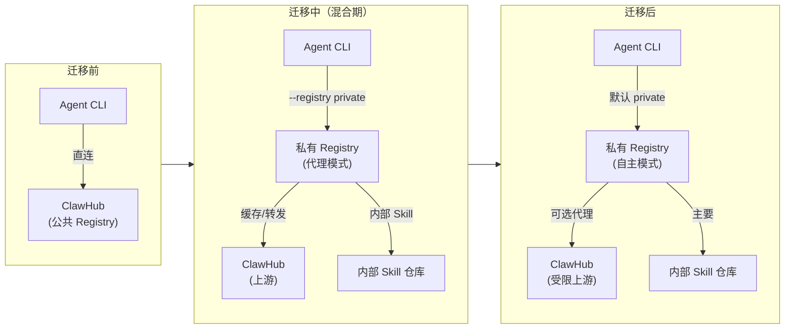
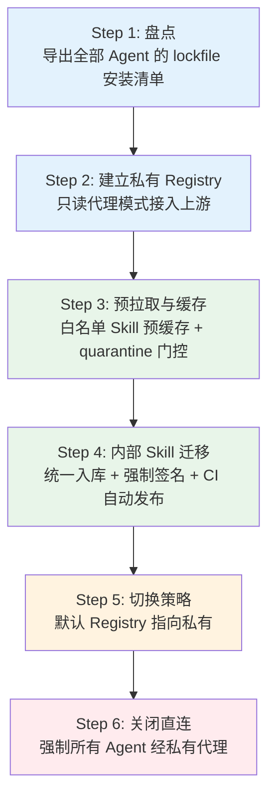
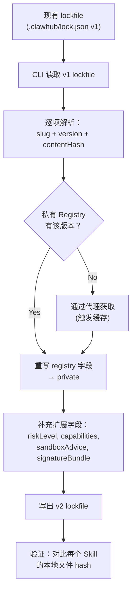
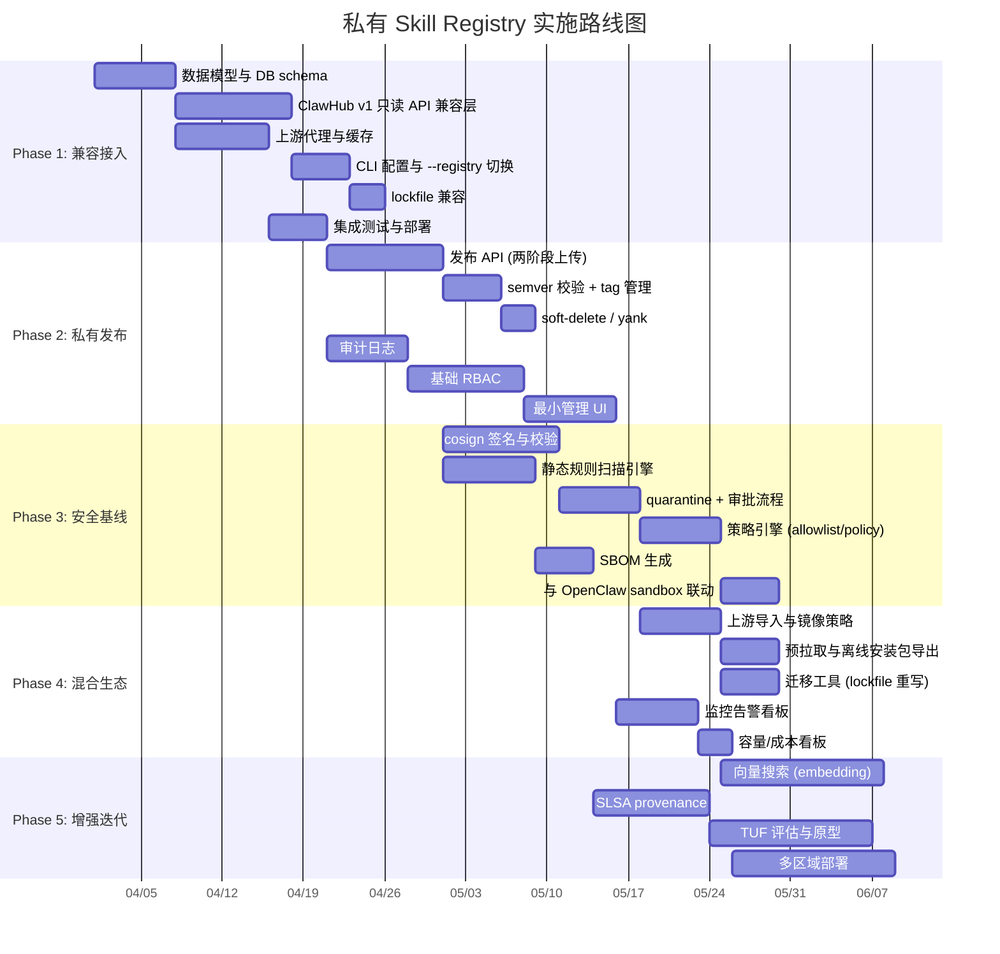
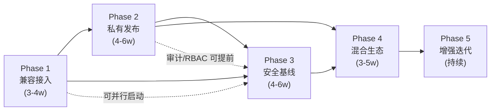

# 12 — 迁移方案与分阶段路线图

> **Design Doc** · 私有 Skill Registry  
> **状态**：Draft  
> **作者**：Platform Arch Team  
> **关联 Feature**：§16-§17 迁移方案与路线图  
> **依赖文档**：全部 01-11 设计文档

---

## 1. 目标与范围

### 1.1 目标

| # | 目标 | 验收标准 |
|---|------|----------|
| G1 | 从 ClawHub 直连平滑迁移到私有代理 | Agent 侧 CLI 使用方式变化最小（仅改 registry URL） |
| G2 | 6 步数据迁移流程可执行 | 每步有明确输入/输出/验证条件 |
| G3 | 5 阶段路线图含时间估算 | 基于 3 人团队给出工时分解 |
| G4 | 阶段间依赖明确 | 可并行的任务已标识 |
| G5 | 风险与回退策略到位 | 每阶段有 rollback 方案 |

### 1.2 范围

- **In Scope**：数据迁移 6 步流程、5 阶段路线图、任务分解、交付物、时间估算、风险评估
- **Out of Scope**：具体迁移脚本实现代码、运维 runbook 细节

---

## 2. 设计约束与前提假设

| 约束/假设 | 来源 | 说明 |
|-----------|------|------|
| 当前状态：Agent 直连 ClawHub | 项目背景 | 无中间代理层 |
| lockfile 已存在 | ClawHub CLI | `.clawhub/lock.json` 记录当前安装 |
| 命名空间不引入多级目录 | OpenClaw 规范 | 安装落盘仍为 `skills/<name>/` |
| 3 人团队 | Feature §17 | 1 后端 + 1 全栈 + 1 平台/安全 |
| 混合方案优先 | 架构决策 | 先代理/镜像，再逐步自主 |

---

## 3. 详细设计

### 3.1 迁移全景视图



### 3.2 数据迁移 6 步流程



#### Step 1：盘点现有安装清单

| 项目 | 说明 |
|------|------|
| **输入** | 所有 Agent workspace 中的 `.clawhub/lock.json` |
| **操作** | 1. 收集所有 lockfile<br>2. 提取 `{skill, version, contentHash}` 列表<br>3. 去重合并 → 形成「组织 Skill 清单」<br>4. 标记来源（clawhub / 内部 / 未知） |
| **输出** | `migration-inventory.json`：完整的 Skill 清单 |
| **验证** | 清单覆盖所有已知 Agent workspace |
| **工具** | 迁移脚本 `skill-migrate inventory --scan-dir <path>` |

**清单格式**：

```json
{
  "generatedAt": "2026-03-01T00:00:00Z",
  "totalSkills": 45,
  "totalVersions": 128,
  "skills": [
    {
      "slug": "database-migration",
      "versions": ["1.0.0", "1.1.0", "1.2.0"],
      "latestInstalled": "1.2.0",
      "source": "clawhub",
      "usedByAgents": 12,
      "priority": "high"
    },
    {
      "slug": "internal-deploy",
      "versions": ["0.5.0"],
      "latestInstalled": "0.5.0",
      "source": "internal",
      "usedByAgents": 3,
      "priority": "medium"
    }
  ]
}
```

#### Step 2：建立私有 Registry（只读代理模式）

| 项目 | 说明 |
|------|------|
| **输入** | 10-deployment 中的单机/标准部署方案 |
| **操作** | 1. 部署 Registry（API + DB + 对象存储 + 缓存）<br>2. 配置上游代理指向 ClawHub<br>3. 验证 `/health`、`/whoami`、`/search`、`/download` 全链路<br>4. 不启用发布接口 |
| **输出** | 可用的私有 Registry 实例（只读） |
| **验证** | `skill search "test" --registry private` 可返回 ClawHub 结果 |
| **回退** | Agent 恢复直连 ClawHub（仅改回 `--registry` 或 config） |

#### Step 3：预拉取与 Quarantine 门控

| 项目 | 说明 |
|------|------|
| **输入** | `migration-inventory.json` + 代理策略配置 |
| **操作** | 1. 按清单中 `priority=high` 的 Skill 执行预拉取<br>2. 缓存所有已用版本的 artifact + metadata<br>3. 启用 quarantine：新版本默认不直接放行<br>4. 配置 allowlist：清单中的已用版本自动放行 |
| **输出** | 缓存预热完成 + quarantine 策略生效 |
| **验证** | 断开上游 → `skill install <cached-skill>` 仍可成功 |
| **回退** | 禁用 quarantine + 清除缓存回到纯代理模式 |

#### Step 4：内部 Skill 迁移

| 项目 | 说明 |
|------|------|
| **输入** | 内部维护的 Skill 源码仓库 |
| **操作** | 1. 为每个内部 Skill 创建 `manifest.json`<br>2. CI Pipeline 配置 `skill publish` 自动发布<br>3. 强制签名（cosign / 内部 CA）<br>4. 发布到私有 Registry<br>5. 更新清单中 `source: internal` 项的 registry 指向 |
| **输出** | 所有内部 Skill 入库并签名 |
| **验证** | `skill install <internal-skill> --registry private` 可成功 + 签名校验通过 |
| **回退** | 保留内部 Skill 的手动分发渠道作为 fallback |

#### Step 5：切换默认 Registry

| 项目 | 说明 |
|------|------|
| **输入** | `.skillrc.yaml` 配置模板 |
| **操作** | 1. 更新所有 Agent 的 `.skillrc.yaml`，`defaults.registry: private`<br>2. 或设置环境变量 `SKILL_REGISTRY=private`<br>3. 保留 ClawHub 作为 secondary registry 配置<br>4. 灰度发布：先 10% Agent → 50% → 100% |
| **输出** | 所有 Agent 默认通过私有 Registry |
| **验证** | 监控 Registry 访问日志：Agent 请求全部经代理 |
| **回退** | 恢复 `defaults.registry: clawhub` |

#### Step 6：关闭直连

| 项目 | 说明 |
|------|------|
| **输入** | 网络策略 / 防火墙规则 |
| **操作** | 1. 网络层阻断 Agent 直连 ClawHub（DNS / 防火墙）<br>2. 仅保留 Registry 服务器到 ClawHub 的出站通道<br>3. 审计日志确认无绕行流量<br>4. 更新迁移状态为「已完成」 |
| **输出** | 所有 Agent 流量强制经私有 Registry |
| **验证** | Agent 直连 `clawhub.com` → 连接被拒 |
| **回退** | 撤销网络策略 + 恢复 DNS/防火墙规则 |

### 3.3 Lockfile 迁移策略



**迁移命令**：

```bash
# 自动将现有 v1 lockfile 迁移为 v2，并重写 registry 指向
skill-migrate lockfile \
  --workdir /path/to/agent/workspace \
  --target-registry private \
  --verify
```

### 3.4 五阶段路线图



### 3.5 各阶段详细任务分解

#### Phase 1：兼容接入与只读安装（3-4 周）

| 任务 | 负责人 | 工时 | 依赖 | 交付物 |
|------|--------|------|------|--------|
| 数据模型设计与 DB migration | 后端 | 5d | — | PostgreSQL schema + migration 脚本 |
| ClawHub v1 只读 API 实现 | 后端 | 8d | DB schema | `/search`、`/skills`、`/download`、`/whoami` |
| 上游代理层实现 | 后端 | 6d | DB schema | on-demand 缓存 + TTL 策略 |
| 对象存储集成 | 平台 | 3d | — | S3/R2/MinIO 适配层 |
| CLI `--registry` 切换 | 全栈 | 4d | API | config 解析 + registry 路由 |
| lockfile v1 兼容读取 | 全栈 | 2d | CLI | lockfile parser |
| 部署脚本（Docker Compose） | 平台 | 3d | 全部 | `docker-compose.yml` + 部署文档 |
| 集成测试 | 全员 | 3d | 全部 | 测试用例 + CI 配置 |

**阶段验收条件**：
- `skill search "test" --registry private` 返回 ClawHub 代理结果
- `skill install <skill> --registry private` 成功安装 + lockfile 写出
- 上游断开后缓存命中仍可安装

**风险与回退**：
- 风险：ClawHub API 变更导致代理层失效 → 缓解：API 响应适配层 + 定期兼容测试
- 回退：Agent 恢复直连 ClawHub

---

#### Phase 2：私有发布与版本/Tag（4-6 周）

| 任务 | 负责人 | 工时 | 依赖 | 交付物 |
|------|--------|------|------|--------|
| 两阶段上传 API | 后端 | 8d | Phase 1 | `POST /uploads` + `POST /skills` |
| semver 校验 + 不可变版本 | 后端 | 3d | 上传 API | 版本写入逻辑 |
| Tag 管理 API | 后端 | 4d | 版本 | `POST /tags`、`DELETE /tags` |
| Soft-delete + yank | 后端 | 3d | 版本 | `DELETE /skills`、`POST /yank` |
| 审计日志系统 | 后端 | 5d | Phase 1 | append-only AuditLog + 查询 API |
| RBAC 引擎 | 平台 | 8d | 审计 | 角色定义 + 权限矩阵 + 鉴权中间件 |
| API Token 管理 | 平台 | 4d | RBAC | Token CRUD + scope 验证 |
| CLI publish 命令 | 全栈 | 5d | 上传 API | `skill publish` 完整流程 |
| CLI tag/rollback/yank | 全栈 | 3d | Tag API | 命令实现 |
| 最小管理 UI | 全栈 | 6d | RBAC | 用户/组织/Skill 管理页面 |

**阶段验收条件**：
- `skill publish ./my-skill --version 1.0.0` 成功发布到私有 Registry
- Tag 移动（`skill rollback`）生效
- RBAC 权限阻止未授权发布

---

#### Phase 3：安全基线与治理（4-6 周）

| 任务 | 负责人 | 工时 | 依赖 | 交付物 |
|------|--------|------|------|--------|
| cosign 集成（签名） | 平台 | 7d | Phase 2 | 发布时签名 + 安装时校验 |
| Keyless OIDC 签名模式 | 平台 | 5d | cosign | OIDC 集成 + fulcio 证书 |
| 静态规则扫描引擎 | 平台 | 6d | Phase 2 | 规则 YAML + 扫描 Worker |
| Quarantine 状态机 | 后端 | 5d | 扫描 | 状态流转 + 审批 API |
| 策略引擎（allowlist/自定义规则） | 后端 | 5d | RBAC | policy.yaml 解析 + 评估 |
| SBOM 自动生成 | 平台 | 4d | 发布 | CycloneDX SBOM 生成 + 存储 |
| 信任策略配置 | 全栈 | 3d | cosign | CLI trust 配置 + 验证逻辑 |
| OpenClaw sandbox 联动配置 | 全栈 | 4d | 策略 | risk→sandbox 映射模板 |
| 安全测试与渗透测试 | 全员 | 4d | 全部 | 安全评审报告 |

**阶段验收条件**：
- 未签名版本被 quarantine + 告警
- 恶意 pattern 命中 → 拒绝发布
- 高风险 Skill → OpenClaw 自动 sandbox 执行

---

#### Phase 4：混合生态与迁移完成（3-5 周）

| 任务 | 负责人 | 工时 | 依赖 | 交付物 |
|------|--------|------|------|--------|
| 上游导入/镜像策略增强 | 后端 | 5d | Phase 3 | prefetch 配置 + 导入网关 |
| 预拉取调度 | 后端 | 3d | 导入策略 | cron job + 增量同步 |
| 离线安装包导出/导入 | 全栈 | 4d | 导入策略 | `skill-migrate export/import` |
| Lockfile 迁移工具 | 全栈 | 4d | CLI | `skill-migrate lockfile` |
| 监控告警（Prometheus + Grafana） | 平台 | 5d | Phase 2 | dashboard JSON + 告警规则 |
| 容量/成本看板 | 平台 | 2d | 监控 | 存储/请求/egress 看板 |
| 迁移执行（Step 1-6） | 全员 | 5d | 全部 | 迁移完成确认 |
| 文档与 runbook | 全员 | 3d | 全部 | 运维手册 + 迁移指南 |

**阶段验收条件**：
- 所有 Agent 通过私有 Registry → 审计日志确认
- 离线环境可成功导入/安装
- 监控看板覆盖全部核心指标

---

#### Phase 5：增强与规模化（持续迭代）

| 任务 | 负责人 | 预估工时 | 依赖 | 交付物 |
|------|--------|---------|------|--------|
| Embedding 向量搜索 | 后端 | 10d | Phase 1 搜索 | pgvector 索引 + hybrid search |
| SLSA provenance 集成 | 平台 | 8d | 签名 | provenance 生成 + 存储 + 验证 |
| TUF 评估与原型 | 平台 | 10d | SLSA | TUF 元数据结构 + 客户端验证 |
| 多区域只读副本 | 平台 | 10d | Phase 4 | 跨区域 DB replica + 对象存储复制 |
| 自定义角色（RBAC v2） | 后端 | 7d | Phase 2 RBAC | 自定义角色 CRUD |
| Web UI 增强 | 全栈 | 持续 | Phase 2 UI | 搜索体验、版本对比、审计可视化 |

### 3.6 阶段间依赖图



**关键路径**：Phase 1 → Phase 2 → Phase 4（迁移执行）

**可并行**：
- Phase 3 的签名/扫描可在 Phase 2 上传 API 完成后立即启动
- Phase 4 的监控可在 Phase 2 部署后启动
- Phase 5 完全独立迭代

### 3.7 团队分工建议

| 角色 | Phase 1 | Phase 2 | Phase 3 | Phase 4 | Phase 5 |
|------|---------|---------|---------|---------|---------|
| **后端** | DB schema + API + 代理 | 上传/版本/Tag/审计 | 扫描引擎 + quarantine + 策略 | 导入/预拉取 | 向量搜索 + 自定义角色 |
| **全栈** | CLI + lockfile | CLI publish/tag + 管理 UI | 信任策略 + sandbox 联动 | 迁移工具 + 离线导出 + 文档 | Web UI 增强 |
| **平台/安全** | 部署 + 对象存储 | RBAC + Token | cosign + OIDC + SBOM + 安全测试 | 监控 + 看板 | SLSA + TUF |

### 3.8 时间总览

| 阶段 | 预计工时 | 累计 | 可并行度 |
|------|---------|------|---------|
| Phase 1 | 3-4 周 | 3-4 周 | 低（基础设施） |
| Phase 2 | 4-6 周 | 7-10 周 | 中（审计/RBAC 可提前） |
| Phase 3 | 4-6 周 | 11-16 周 | 高（与 Phase 2 后期并行） |
| Phase 4 | 3-5 周 | 14-21 周 | 中（监控可提前） |
| Phase 5 | 持续 | — | 高（独立迭代） |

**乐观估计**：Phase 1-4 完成约 **14 周（3.5 月）**  
**保守估计**：Phase 1-4 完成约 **21 周（5.25 月）**

---

## 4. 设计决策记录（ADR）

### ADR-MIG-001：代理先行而非直接自建

- **决策**：Phase 1 以只读代理接入上游，而非直接构建完整自建 Registry
- **理由**：
  - 最小化对现有 Agent 工作流的影响
  - 快速验证私有 Registry 可行性
  - 代理模式下 Agent 体验几乎无变化
  - 降低初期风险（不影响发布流程）
- **替代方案**：直接全功能上线（风险高、交付慢）
- **回退成本**：极低（Agent 恢复直连 ClawHub）

### ADR-MIG-002：灰度切换而非一刀切

- **决策**：Step 5 切换默认 Registry 采用灰度方式（10% → 50% → 100%）
- **理由**：
  - 观察私有 Registry 在真实负载下的稳定性
  - 发现兼容性问题时影响范围可控
  - 灰度期间可对比两路径的下载成功率/延迟
- **替代方案**：全量切换（风险不可控）

### ADR-MIG-003：Lockfile 自动升级

- **决策**：CLI 读取 v1 lockfile 后，首次写出自动升级为 v2（补充扩展字段）
- **理由**：
  - 无需手动迁移 lockfile
  - v2 字段（riskLevel 等）为可选，向后兼容
  - ClawHub CLI 读取 v2 lockfile 时忽略未知字段
- **替代方案**：维护两个版本的 lockfile 并行（复杂度高）

---

## 5. 安全考量

### 5.1 迁移期安全

| 威胁 | 阶段 | 缓解措施 |
|------|------|---------|
| 迁移期上游 Skill 投毒 | Step 3 | 预拉取 + quarantine 门控；新版本默认不放行 |
| 内部 Skill 未签名 | Step 4 | 迁移期允许例外（trust exception）+ 提醒签名 |
| 旧 lockfile 被篡改 | Step 5 | lockfile 迁移时校验 contentHash |
| 灰度期流量泄露 | Step 5 | 灰度仅改 default registry，不做网络层切换 |
| 切换后上游不可用 | Step 6 | 确认缓存预热完成 + 离线安装能力就绪 |

### 5.2 长期安全

| 威胁 | 缓解措施 |
|------|---------|
| 上游 Registry 永久不可用 | 离线导出工具 + 定期备份全量 artifact |
| 签名密钥泄露 | 密钥轮换流程 + HSM（高安全档） |
| 迁移工具被植入后门 | 迁移工具开源审计 + 签名分发 |

---

## 6. 接口与依赖

| 依赖文档 | 用途 |
|---------|------|
| 01-clawhub-api-analysis | 理解当前 ClawHub API 行为（迁移源） |
| 02-api-compatibility | 兼容层设计（代理目标） |
| 03-data-model | DB schema migration 脚本 |
| 04-package-signing | 内部 Skill 签名方案 |
| 05-proxy-mirror | 代理/镜像层实现 |
| 06-search | 搜索引擎配置 |
| 07-publish-pipeline | 发布流水线（Phase 2） |
| 08-rbac | 权限模型（Phase 2） |
| 09-openclaw-integration | sandbox 联动（Phase 3） |
| 10-deployment | 部署架构选择 |
| 11-cli-spec | CLI 命令/lockfile 规范 |

---

## 7. 测试策略

| 层次 | 覆盖内容 | 方法 |
|------|---------|------|
| **迁移脚本测试** | inventory 扫描逻辑 | mock lockfile fixtures → 断言清单正确 |
| **迁移脚本测试** | lockfile v1→v2 升级 | v1 lockfile → 迁移 → 断言 v2 字段补充正确 |
| **灰度测试** | A/B 路径对比 | 同一 Skill 分别从 ClawHub 和私有 Registry 安装 → 对比 artifact hash |
| **回退测试** | 每步回退操作 | 执行回退 → 验证 Agent 恢复正常工作 |
| **压测** | 迁移完成后负载 | 模拟全量 Agent 切换后的 QPS → 验证 p99 达标 |
| **断网测试** | 离线安装 | 断开上游 → 从缓存安装 → 成功 |

---

## 8. 开放问题

| # | 问题 | 建议方向 | 优先级 |
|---|------|---------|--------|
| Q1 | 迁移期是否需要双写（私有 + ClawHub）？ | 不建议双写；仅单向从 ClawHub 拉取 | P1 |
| Q2 | Agent 数量增长后 Phase 4 时间是否足够？ | 预留缓冲；灰度分批降低风险 | P2 |
| Q3 | Phase 5 的 TUF 是否值得投入？ | 取决于安全合规要求；可先做评估 | P3 |
| Q4 | 是否需要专门的迁移状态 dashboard？ | 建议提供：按 Agent 维度展示迁移进度 | P2 |
| Q5 | 多团队并行迁移如何协调？ | 按团队分批；每团队指定迁移 champion | P1 |

---

## 9. 参考资料

| 来源 | 说明 |
|------|------|
| Feature §16 | 迁移方案需求（6 步流程） |
| Feature §17 | 分阶段路线图需求（5 阶段 + 时间估算） |
| 深度调研报告 §迁移兼容 | 命名空间策略、数据迁移步骤 |
| 深度调研报告 §实施路线图 | 5 阶段任务分解、交付物、时间估算 |
| 深度调研报告 §风险评估 | 风险矩阵与缓解措施 |
| npm 迁移最佳实践 | Registry 迁移参考 |
