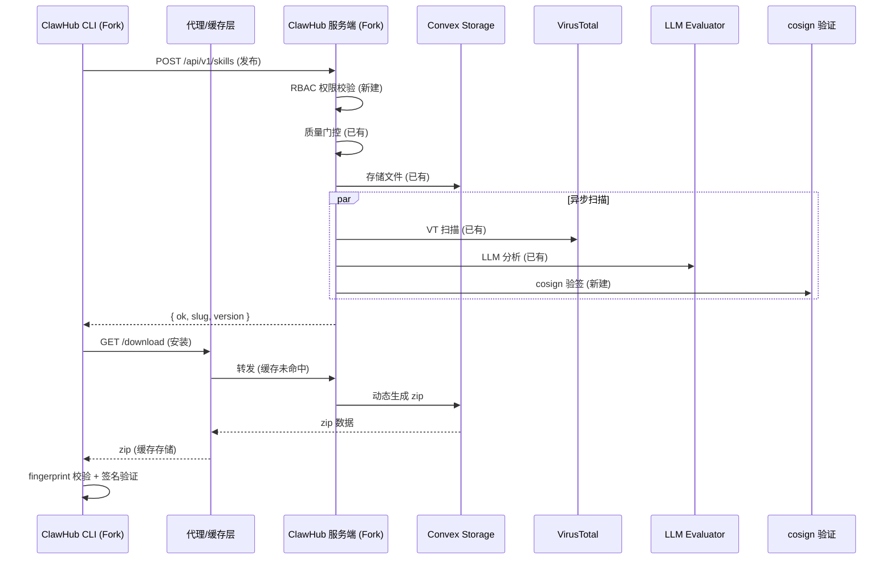
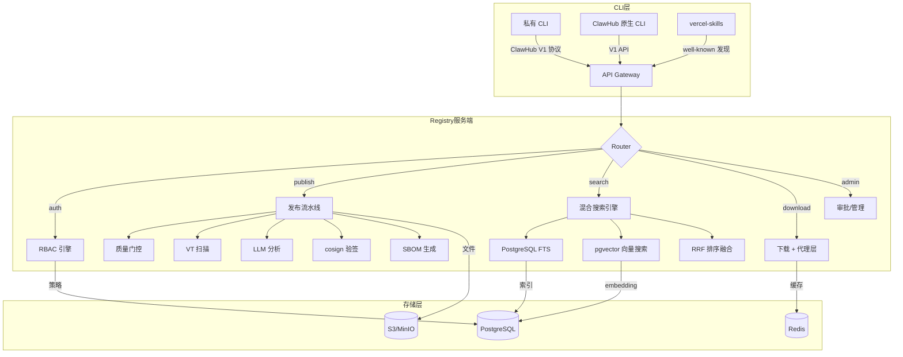
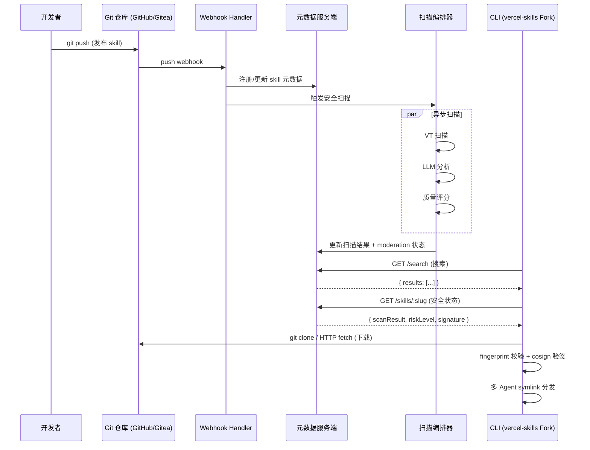
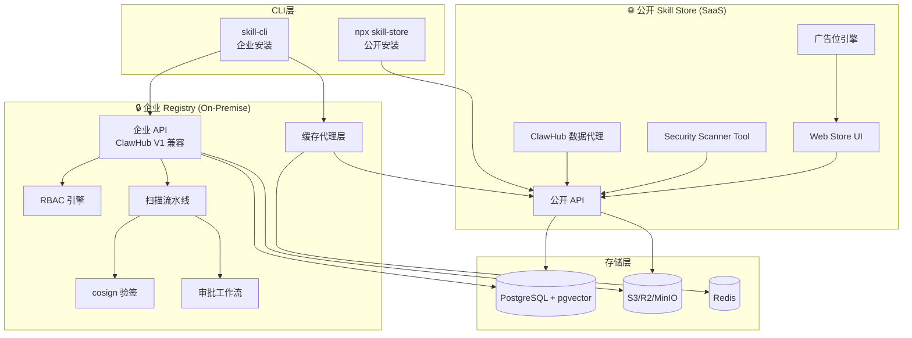
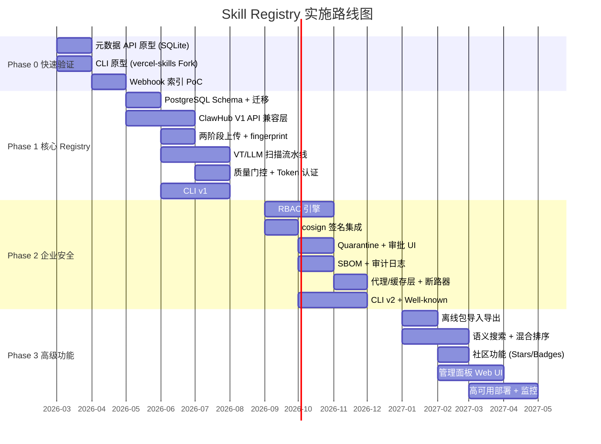

# Skill Registry 关键需求兼容矩阵与实现方案

> **文档类型**：可行性方案文档  
> **日期**：2026-02-25  
> **输入来源**：  
> - `gap-analysis-clawhub-vs-design.md`：ClawHub 实际代码 vs 设计文档差异  
> - `gap-analysis-vercel-skills.md`：设计文档 vs vercel-skills 差异  
> - `gap-analysis-playbooks.md`：Playbooks.com 商业方案竞品差异分析  
> **目标**：系统梳理 ClawHub（开源 Registry 服务端）、vercel-skills（开源 CLI）与 Playbooks（商业目录平台）在 Registry、CLI 客户端、Skill Store 三大维度的能力兼容情况，给出分层实现方案（含商业模式参考）与推荐路线图。

---

## 目录

1. [第一章：三维能力兼容矩阵](#第一章三维能力兼容矩阵)
   - 1.1 Registry 维度
   - 1.2 CLI 客户端维度
   - 1.3 Skill Store 维度
   - 1.4 Playbooks 商业方案能力补充
2. [第二章：实现方案](#第二章实现方案)
   - 方案 A：ClawHub-First
   - 方案 B：自建 Registry + 双 CLI 兼容
   - 方案 C：轻量混合
   - 方案 D：商业化平台方案（Playbooks 启发）
3. [第三章：方案对比与推荐](#第三章方案对比与推荐)
4. [第四章：推荐方案详细路线图](#第四章推荐方案详细路线图)
5. [第五章：风险登记簿](#第五章风险登记簿)
6. [附录 A：ClawHub V1 API 路由兼容映射](#附录-aclawhub-v1-api-路由兼容映射)
7. [附录 B：统一 Lock File 格式规范](#附录-b统一-lock-file-格式规范)

---

## 第一章：三维能力兼容矩阵

### 1.1 Registry（仓库/注册表）维度

| # | 需求子项 | ClawHub 覆盖度 | ClawHub 实现方式 | vercel-skills 覆盖度 | vercel-skills 实现方式 | 设计文档要求 | 差距说明 |
|---|---------|---------------|-----------------|---------------------|----------------------|------------|---------|
| R1 | **API 端点兼容性** | ⚠️ 部分实现 | V1 REST API（Convex HTTP Routes），18+ 端点；错误为纯文本非 JSON；搜索无 cursor 分页 | ❌ 未实现 | 无服务端 API | 已设计 P0 | ClawHub 端点格式与设计假设存在 6 处关键偏差（上传协议、认证头、Tag 端点等） |
| R2 | **数据模型（Skill/Version）** | ⚠️ 部分实现 | `skills` + `skillVersions` 表，Tags 内嵌而非独立表，VT/LLM 分析内嵌版本文档 | ❌ 未实现 | 仅 `{ name, description, path }` 3 字段 | 已设计 P0 | ClawHub 缺 namespace/visibility/risk_level 字段；设计文档漏质量评分、badges、souls |
| R3 | **数据模型（User/Org/Team）** | ⚠️ 部分实现 | `users` 表含 admin/moderator/user 三级角色；无 Org/Team 概念 | ❌ 未实现 | 无用户系统 | 已设计 P0 | ClawHub 无 Org/Team/RBAC；设计文档的多租户模型需全部新建 |
| R4 | **包格式与存储** | ⚠️ 部分实现 | 逐文件上传至 Convex Storage → 下载时 `buildDeterministicZip` 动态生成 zip | ❌ 未实现 | 无打包概念，直接复制/symlink 文件 | 已设计 P1 | ClawHub 非预打包模型，与设计文档的 `.skill.zip` + `manifest.json` 客户端打包模型不同 |
| R5 | **版本管理（semver + dist-tag）** | ✅ 已实现 | semver 版本 + Tags 映射（`Record<string, Id<'skillVersions'>>`），含 `latest` 隐式 tag | ❌ 未实现 | 无版本概念，Git tree SHA 追踪变更 | 已设计 P0 | ClawHub 基本对齐；vercel-skills 需要完整版本体系封装 |
| R6 | **上传/发布协议** | ⚠️ 部分实现 | 逐文件上传（Convex `generateUploadUrl`）→ `POST /api/v1/skills` 发布；非 presigned URL 列表 | ❌ 未实现 | 推 Git 即"发布"，无发布流程 | 已设计 P0 | ClawHub 上传协议与设计文档两阶段（Init→presigned URLs→Commit）模型差异显著 |
| R7 | **签名与验签** | ❌ 未实现 | 无任何签名机制 | ❌ 未实现 | 无签名 | 已设计 P1 | 两个开源项目均无签名；cosign 体系需全部新建 |
| R8 | **安全扫描流水线** | ⚠️ 部分实现 | VT 异步扫描（5min poll）+ LLM 分析（OpenAI） + 同步质量门控（quality signals → pass/quarantine/reject） | ❌ 未实现 | 仅展示 Gen/Socket/Snyk 第三方报告，不阻止安装 | 已设计 P0 | ClawHub 有实质性扫描能力但缺静态规则引擎和 SBOM；vercel-skills 仅展示层 |
| R9 | **Quarantine/审批流** | ⚠️ 部分实现 | `moderationStatus`(active/hidden/removed) + `moderationReason` 机制，管理员手动审批 | ❌ 未实现 | 无 | 已设计 P1 | ClawHub 有基础隔离能力但无正式审批工作流 UI；设计文档的 Gate 决策引擎需增强 |
| R10 | **代理/镜像/缓存** | ❌ 未实现 | 无代理层 | ❌ 未实现 | 无代理层 | 已设计 P1 | 需全部新建；需注意 ClawHub 动态 zip 对缓存策略的影响 |
| R11 | **离线支持** | ❌ 未实现 | 无 | ❌ 未实现 | 断网不可用 | 已设计 P2 | 需全部新建（Export/Import 离线包 + stale-while-revalidate） |
| R12 | **SBOM** | ❌ 未实现 | 无 | ❌ 未实现 | 无 | 已设计 P2 | 两个项目均无；CycloneDX 1.5 生成需新建 |
| R13 | **审计日志** | ⚠️ 部分实现 | `auditLogs` 表（actorUserId, action, targetType, metadata），无 IP/UA 字段 | ❌ 未实现 | 仅 telemetry fire-and-forget | 已设计 P1 | ClawHub 基础可用但缺细粒度字段（IP/UA/requestId）；需扩展为 append-only |
| R14 | **Fingerprint 版本匹配** | ✅ 已实现 | `skillVersions.fingerprint` + `skillVersionFingerprints` 表 + `GET /resolve` API | ❌ 未实现 | Local lock SHA-256 from disk files | 已设计 P0（遗漏） | 设计文档遗漏此核心机制；ClawHub 已完整实现 |

### 1.2 CLI 客户端维度

| # | 需求子项 | ClawHub 覆盖度 | ClawHub 实现方式 | vercel-skills 覆盖度 | vercel-skills 实现方式 | 设计文档要求 | 差距说明 |
|---|---------|---------------|-----------------|---------------------|----------------------|------------|---------|
| C1 | **install/uninstall/update/sync 命令** | ✅ 已实现 | clawhub CLI 完整命令集（install/uninstall/update/sync/inspect） | ✅ 已实现 | install/uninstall/update 命令 + sync 命令 | 已设计 P0 | 两者基本覆盖；部分参数差异 |
| C2 | **多 Agent 分发架构** | ⚠️ 部分实现 | 仅支持 OpenClaw agent 目录  | ✅ 已实现 | 41+ AI Agent 目录自动检测 + Universal `.agents/skills/` + symlink 分发 | 未充分设计 P1 | vercel-skills 大幅领先；设计文档仅聚焦 OpenClaw，需扩展 |
| C3 | **Lock File 设计** | ⚠️ 部分实现 | 单层 lockfile（`{ version, installedAt }`）+ `.clawhub/origin.json` 来源追踪 | ✅ 已实现 | 两层 Lock：Global v3（用户级）+ Local v1（项目级，可提交 VCS） | 已设计 P1（遗漏两层） | ClawHub lockfile 缺 contentHash/tag/registry 字段；vercel-skills 两层模型更完善 |
| C4 | **源格式解析** | ⚠️ 部分实现 | Registry URL + discovery 机制（`discoverRegistryFromSite`）+ legacy 兼容 | ✅ 已实现 | 7 种源：GitHub/GitLab/HuggingFace/Mintlify/well-known/URL/local | 已设计 P2 | vercel-skills 源格式灵活性远超设计文档；可分阶段引入 |
| C5 | **交互式搜索 UX** | ❌ 未实现 | CLI 搜索为非交互式 | ✅ 已实现 | fzf 风格实时搜索 + debounce + 方向键导航 + 选中即安装 | 未设计 P2 | vercel-skills 的搜索 UX 是设计亮点，值得借鉴 |
| C6 | **认证流程（OAuth/Token）** | ⚠️ 部分实现 | Convex Auth 内置浏览器 OAuth → Web UI 手动创建 API Token → `Authorization: Bearer` | ❌ 未实现 | 仅 `GITHUB_TOKEN` 用于 API 限速 | 已设计 P0 | ClawHub 有基础认证但无 Token scope；vercel-skills 无认证体系 |
| C7 | **内容哈希校验/fingerprint** | ✅ 已实现 | fingerprint（文件路径:sha256 排序拼接哈希）+ `GET /resolve` 匹配 | ⚠️ 部分实现 | Local lock SHA-256；Global lock 使用 GitHub tree SHA | 已设计 P0 | ClawHub fingerprint 机制更完整；设计文档假设的 zip 级 contentHash 需修正为 fingerprint |
| C8 | **CI/CD 集成** | ❌ 未实现 | 无 CI 特殊处理 | ✅ 已实现 | 检测 7 种 CI 环境（GitHub Actions/GitLab CI/CircleCI 等）调整行为 | 未设计 P2 | vercel-skills 有 CI 环境自适应；私有 CLI 可借鉴 |
| C9 | **publish 命令** | ✅ 已实现 | 逐文件上传 → publish mutation | ❌ 未实现 | 推 Git 即发布 | 已设计 P0 | ClawHub CLI 发布可复用，但协议需适配 |
| C10 | **star/unstar 命令** | ✅ 已实现 | `POST/DELETE /api/v1/stars/:slug` | ❌ 未实现 | 无 | 未设计 P3 | 社区功能，可后续补充 |
| C11 | **管理员命令（hide/ban/set-role）** | ✅ 已实现 | hide/unhide/delete/undelete/ban/set-role 命令 | ❌ 未实现 | 无 | 未充分设计 P2 | 设计文档遗漏 hide/unhide 和管理命令 |
| C12 | **`@skill` 语法选址安装** | ❌ 未实现 | 无 | ✅ 已实现 | `owner/repo@skill-name` 从仓库中选择特定 skill | 未设计 P3 | vercel-skills 独有；适合多 skill 仓库场景 |

### 1.3 Skill Store（商店/发现）维度

| # | 需求子项 | ClawHub 覆盖度 | ClawHub 实现方式 | vercel-skills 覆盖度 | vercel-skills 实现方式 | 设计文档要求 | 差距说明 |
|---|---------|---------------|-----------------|---------------------|----------------------|------------|---------|
| S1 | **全文搜索** | ✅ 已实现 | Lexical fallback（slug/name 精确/前缀匹配 + 下载热度权重） | ⚠️ 部分实现 | 依赖 skills.sh 外部 API | 已设计 P0 | ClawHub 实际有完整的词法搜索层 |
| S2 | **向量/语义搜索** | ✅ 已实现 | Convex 内置 vectorSearch + `skillEmbeddings` 独立表 + `embeddingSkillMap` 轻量映射 | ❌ 未实现 | 无 | 已设计 P1 | ClawHub 已实现；设计文档可直接对齐其 embedding 架构 |
| S3 | **混合搜索排序算法** | ✅ 已实现 | `vectorScore + slugExactBoost(1.4) + slugPrefixBoost(0.8) + nameExactBoost(1.1) + namePrefixBoost(0.6) + log(downloads)*0.08` | ❌ 未实现 | 无 | 已设计 P1 | ClawHub 混合排序比设计文档描述更细致；可直接借鉴权重模型 |
| S4 | **分面过滤（namespace/visibility/tag/risk）** | ⚠️ 部分实现 | 搜索支持 `highlightedOnly` 过滤 + 向量搜索 `visibility` 字段过滤 | ❌ 未实现 | 无——全局公开搜索 | 已设计 P1 | ClawHub 无 namespace/risk 过滤；需扩展 |
| S5 | **分页策略** | ⚠️ 部分实现 | `GET /skills` 有 cursor 分页；`GET /search` 无分页（全量返回） | ❌ 未实现 | 无 | 已设计 P1 | 搜索端点需补充 cursor 分页 |
| S6 | **Stars/收藏** | ✅ 已实现 | `skillStars` 表 + `POST/DELETE /api/v1/stars/:slug` + stats.stars 计数 | ❌ 未实现 | 无 | 未设计 P3 | ClawHub 已完整实现；设计文档遗漏 |
| S7 | **评论系统** | ✅ 已实现 | `comments` 表 + `soulComments` 表（skillId, userId, body, softDeletedAt） | ❌ 未实现 | 无 | 未设计 P3 | ClawHub 已实现；私有化可选 |
| S8 | **排行榜/Trending** | ✅ 已实现 | `skillLeaderboards` 表 + `skillDailyStats` 聚合 + `GET /skills?sort=trending` | ❌ 未实现 | 无 | 未设计 P2 | ClawHub 已实现；设计文档遗漏 trending 排序 |
| S9 | **质量评分展示** | ✅ 已实现 | quality signals（bodyChars/wordRatio/headingCount 等 10+ 信号）→ score → trust tier → decision | ❌ 未实现 | 无 | 已设计 P1（遗漏） | ClawHub 质量系统完整；设计文档未充分描述 |
| S10 | **安全审计结果展示** | ✅ 已实现 | VT verdict + LLM verdict/confidence/summary/findings 内嵌版本文档 | ⚠️ 部分实现 | 展示 Gen/Socket/Snyk 三方报告（仅展示不阻止） | 已设计 P1 | ClawHub 扫描结果可直接对接展示层 |
| S11 | **Souls 实体支持** | ✅ 已实现 | 完整 CRUD + 版本 + 搜索 + embedding + 评论 + stars，与 skills 完全平行 | ❌ 未实现 | 无 | 未设计 P3 | ClawHub 独有能力；私有化需评估是否引入 |
| S12 | **Badges 系统** | ✅ 已实现 | `skillBadges` 表：highlighted/official/deprecated/redactionApproved + 管理员操作 | ❌ 未实现 | 无 | 未设计 P2 | ClawHub 已实现；影响搜索过滤和信任展示 |
| S13 | **安装遥测与统计** | ✅ 已实现 | `telemetry-sync` API + `userSkillInstalls`/`userSkillRootInstalls`/`downloadDedupes` 去重 | ❌ 未实现 | 无 | 未设计 P2 | ClawHub 有精确统计体系；设计文档遗漏 |
| S14 | **Well-Known 发现协议** | ❌ 未实现 | 无 | ✅ 已实现 | `/.well-known/skills/index.json`（RFC 8615） | 未设计 P3 | vercel-skills 独有；适合联邦搜索场景 |

### 1.4 Playbooks 商业方案能力补充

> 以下矩阵基于 `gap-analysis-playbooks.md` 竞品分析，补充 Playbooks.com 在三大维度上的能力覆盖情况。Playbooks 作为商业/SaaS 目录平台，其定位与开源方案（ClawHub/vercel-skills）有本质差异，但在 **Skill Store 发现层**和**商业化模型**上提供了设计文档和两个开源项目均未覆盖的参考价值。

#### 1.4.1 Registry 维度 — Playbooks 对标

| # | 需求子项 | Playbooks 覆盖度 | Playbooks 实现方式 | 与 ClawHub/vercel-skills 的差异点 |
|---|---------|-----------------|-------------------|----------------------------------|
| R1 | API 端点兼容性 | ❌ 未实现 | 无公开 REST API（`/docs` 404），仅 Web 页面 + `npx playbooks` CLI | 三方最弱——无标准化 API 供第三方集成 |
| R2 | 数据模型（Skill/Version） | ⚠️ 简化实现 | GitHub 仓库文件夹映射（`owner/repo/skills/name`），无版本概念，有 Skill Score/Health Score 评分 | **独有质量评分维度**：Skill Score + Health Score（iA 100/100），两个开源项目均无此综合评分 |
| R3 | 数据模型（User/Org/Team） | ❌ 未实现 | GitHub OAuth 登录，无角色/组织区分（匿名浏览 + 登录提交两种状态） | 与 vercel-skills 一样无用户层级 |
| R4 | 包格式与存储 | ❌ 未实现 | 无打包——内容托管在 GitHub 仓库，Playbooks 仅做索引 | GitHub 是 Source of Truth（与 vercel-skills 一致） |
| R5 | 版本管理 | ❌ 未实现 | 无版本概念，跟踪 GitHub 仓库最新状态 | 三方中唯一完全无版本追踪的方案 |
| R6 | 上传/发布协议 | ⚠️ 简化实现 | Web 界面提交（GitHub 登录）→ **人工审核** → 上线 | 独有 **人工策展模式**——质量由人工保障而非自动化流水线 |
| R7 | 签名与验签 | ❌ 未实现 | 无 | 同 ClawHub/vercel-skills |
| R8 | 安全扫描流水线 | ⚠️ 部分实现 | Skill Security Scanner（6 维度：Remote Exec/Exfil/Secret Access/Persistence/Destructive Ops/Obfuscation） | **独有 2 个扫描维度**：Persistence（持久化检测）和 Destructive Ops（破坏性操作），ClawHub 和 vercel-skills 均无 |
| R9 | Quarantine/审批流 | ⚠️ 部分实现 | 人工审核提交（"We review submissions to keep quality high"），审核通过才上线 | 比 ClawHub 的自动化 moderation 更严格（100% 人工），但不可扩展 |
| R10 | 代理/镜像/缓存 | ❌ 未实现 | SaaS 目录，直接从 GitHub 获取 | 同 vercel-skills |
| R11 | 离线支持 | ❌ 未实现 | SaaS 依赖网络 | 同 vercel-skills |
| R12 | SBOM | ❌ 未实现 | 无 | 三方均无 |
| R13 | 审计日志 | ❌ 未公开 | 内部可能有，未对外暴露 | — |
| R14 | Fingerprint | ❌ 未实现 | 无 | 仅 ClawHub 已实现 |

#### 1.4.2 CLI 客户端维度 — Playbooks 对标

| # | 需求子项 | Playbooks 覆盖度 | Playbooks 实现方式 | 与 ClawHub/vercel-skills 的差异点 |
|---|---------|-----------------|-------------------|----------------------------------|
| C1 | install/uninstall/update/sync | ⚠️ 部分实现 | `npx playbooks add skill <owner/repo> --skill <name>`（仅安装） | 仅安装命令，无 uninstall/update/sync |
| C2 | 多 Agent 分发架构 | ✅ 已实现 | 安装时自动检测 Agent 工具类型，放置到对应目录（支持 Claude Code/Cursor/Cline/Windsurf 等 10+） | 覆盖 10+ 工具，介于 ClawHub（仅 OpenClaw）和 vercel-skills（41+ Agent）之间 |
| C3 | Lock File 设计 | ❌ 未实现 | 无 Lockfile | 三方最弱 |
| C4 | 源格式解析 | ⚠️ 部分实现 | GitHub `owner/repo` 格式 + `--skill <name>` 选择 | 比 ClawHub 弱，比 vercel-skills（7 种源）远弱 |
| C5 | 交互式搜索 UX | ⚠️ 部分实现 | `npx playbooks find skill` CLI 搜索 + Web 端丰富搜索 | **Web 搜索体验远超 CLI**：排序、过滤、质量信号展示 |
| C6 | 认证流程 | ❌ 未实现 | CLI 无需认证（匿名安装） | `npx` 零安装 + 零认证，入门门槛最低 |
| C7 | 内容哈希校验 | ❌ 未实现 | 无 | 三方最弱 |
| C8 | CI/CD 集成 | ❌ 未实现 | 无 | 仅 vercel-skills 有 CI 环境检测 |
| C9 | publish 命令 | ❌ 未实现 | Web 提交，无 CLI 发布 | ClawHub 有 CLI 发布 |
| C10 | star/unstar | ❌ 未实现 | 无 | 仅 ClawHub 有 |
| C11 | 管理员命令 | ❌ 未实现 | 无 | 仅 ClawHub 有 |
| C12 | `@skill` 语法 | ⚠️ 部分实现 | `--skill <name>` 标记选择仓库内特定 skill | 功能接近 vercel-skills 的 `@skill-name` 语法 |
| C-NEW | **npx 零安装体验** | ✅ 已实现 | `npx playbooks` 即时运行，无需全局安装 | **独有亮点**——ClawHub/vercel-skills 均需安装 CLI |

#### 1.4.3 Skill Store（商店/发现）维度 — Playbooks 对标

| # | 需求子项 | Playbooks 覆盖度 | Playbooks 实现方式 | 与 ClawHub/vercel-skills 的差异点 |
|---|---------|-----------------|-------------------|----------------------------------|
| S1 | 全文搜索 | ✅ 已实现 | Web 搜索框（实现未公开） | Web 搜索存在，实现细节未知 |
| S2 | 向量/语义搜索 | ⚠️ 未公开 | 搜索质量表现良好但实现未公开 | 仅 ClawHub 已确认实现 |
| S3 | 混合搜索排序 | ⚠️ 未公开 | Trending 默认排序，排名算法未公开 | — |
| S4 | 分面过滤 | ✅ 已实现 | **语言过滤**（All languages）+ **Official only** 筛选 + **MCP/Skills** 大分类 | **独有维度**：语言过滤、Official only 筛选——ClawHub/vercel-skills 均无 |
| S5 | 分页策略 | ✅ 已实现 | 页码式分页（Page 1 of 787），787 页覆盖 20,000+ Skills | 最大规模数据集；ClawHub 有 cursor 分页但无公开规模数据 |
| S6 | Stars/收藏 | ⚠️ 未公开 | GitHub Stars 展示（非自有） | ClawHub 有自有 Stars 体系；Playbooks 借用 GitHub Stars |
| S7 | 评论系统 | ❌ 未实现 | 无 | 仅 ClawHub 有 |
| S8 | 排行榜/Trending | ✅ 已实现 | Trending 默认排序 + Weekly Installs 活跃度指标 | **独有 Weekly Installs**——比 ClawHub 的累计 downloads 更能反映时效性 |
| S9 | 质量评分展示 | ✅ 已实现 | **Skill Score**（数值型，如 20）+ **Health Score**（iA 100/100） | **独有双重评分体系**——ClawHub 有 quality signals 但未公开为用户可见评分；vercel-skills 无 |
| S10 | 安全审计结果展示 | ✅ 已实现 | 安全标记（`safe`）+ Skill Security Scanner 工具（6 维度报告） | Scanner 可独立使用（输入 GitHub URL → 输出安全报告）- 工具化思路独特 |
| S11 | Souls 实体 | ❌ 未实现 | 无 | 仅 ClawHub 有 |
| S12 | Badges 系统 | ⚠️ 部分实现 | `Official` 标记 + `Tags`（如 python/official） | 简化版 Badges——ClawHub 有 highlighted/official/deprecated/redactionApproved 四种 |
| S13 | 安装遥测与统计 | ✅ 已实现 | **Weekly Installs** + **多工具安装分布**（claude-code 87%, cursor 74%...）+ **Telemetry First Seen** 日期 | **独有多工具安装分布**——可视化每个 skill 在不同 Agent 工具的安装占比，极高参考价值 |
| S14 | Well-Known 发现协议 | ❌ 未实现 | 无 | 仅 vercel-skills 有 |
| S-NEW1 | **Skill Bundles（技能包）** | ✅ 已实现 | 相关技能打包为 Bundle 一键安装（如"React 全栈 Bundle"） | **独有能力**——三方中唯一支持，降低批量采纳摩擦 |
| S-NEW2 | **MCP Server 目录** | ✅ 已实现 | 12,000+ MCP Servers 独立分类管理，含配置模板 | **独有能力**——Skills + MCP Servers 双实体类型 |
| S-NEW3 | **Trigger Phrases** | ✅ 已实现 | 为每个技能标注触发短语，帮助 Agent 判断使用时机 | **独有元数据**——有助于 Agent 自动技能选择 |
| S-NEW4 | **广告/变现平台** | ✅ 已实现 | 浮动 Banner + 固定卡片 + 信息流广告三种形式，$400-$1,000/月 | **独有商业模型**——证明 Skill 目录可作为广告变现载体 |
| S-NEW5 | **多工具安装引导** | ✅ 已实现 | 为 10+ 种 Agent 工具提供安装命令/配置片段模板 | **独有 UX**——降低多工具用户使用门槛 |

#### 1.4.4 Playbooks 商业模式关键洞察

| 维度 | 洞察 | 对设计方案的启示 |
|------|------|----------------|
| **变现模式验证** | Playbooks 以 63,000 月独立访客、170,000 月 PV 支撑 $400-$1,000/月广告收入 | 技能目录可作为独立商业体量运营；私有 Registry 的 Skill Store 层可考虑增值服务 |
| **人工策展 vs 自动化** | Playbooks 采用 100% 人工审核保质量（"We review submissions to keep quality high"），管理 20,000+ Skills | 早期：人工策展建立品牌质量壁垒；规模化：必须转向自动化质量门控（ClawHub 模式） |
| **GitHub 作为存储层** | Playbooks 不存储任何包，GitHub 仓库即 Source of Truth | 降低基础设施成本（无对象存储/CDN），但牺牲版本管理和强制安全管控能力 |
| **双实体运营** | Skills + MCP Servers 两个独立分类，覆盖两大 Agent 生态需求 | 私有 Registry 应考虑将 MCP Server 配置作为一等公民实体（与 ClawHub 的 Souls 概念对标） |
| **搜索信号丰富** | Trending + Skill Score + Health Score + Weekly Installs + Agent 分布 | 多维搜索排序信号是发现体验的核心，设计方案应在 Phase 2 补齐 |
| **零摩擦安装** | `npx playbooks` 零安装 + 零认证，GitHub 路径引用 | 最低入门门槛模型，适合设计方案的 Phase 0 快速验证阶段参考 |

---

## 第二章：实现方案

### 方案 A：ClawHub-First（最大化复用 ClawHub 服务端）

**一句话定位**：Fork ClawHub 代码，在 Convex 生态内扩展私有化能力（RBAC、签名、代理），CLI 以 ClawHub CLI 为主线演化。

#### 技术选型摘要

| 层 | 选型 |
|---|------|
| 服务端运行时 | Convex（保持 ClawHub 原生栈） |
| 数据库 | Convex Document DB（内置，无外部依赖） |
| 向量搜索 | Convex 内置 vectorSearch |
| 对象存储 | Convex Storage |
| CLI | TypeScript（fork ClawHub CLI） |
| 部署 | Convex Cloud / Self-hosted Convex |

#### 对 ClawHub 的复用策略：**Fork 全量**

Fork ClawHub 完整仓库，保留其 Convex schema、V1 API 路由、搜索引擎、质量门控系统，在此基础上：
- 新增 `organizations`/`teams`/`teamSkills` 表 + RBAC 中间件
- 新增 `signatures` 表 + cosign 验证 action
- 扩展 `apiTokens` 表添加 `scopes`/`expires_at` 字段
- 扩展错误响应为 JSON 格式（兼容层）

#### 对 vercel-skills 的复用策略：**仅借鉴 UX 模式**

不直接使用 vercel-skills 代码，但借鉴：
- 两层 Lock File 设计 → 在 ClawHub CLI 中实现 Global/Local 分离
- fzf 风格交互搜索 → 移植到 ClawHub CLI search 命令
- CI 环境检测 → 添加到 ClawHub CLI

#### 需要新建的模块清单

1. RBAC 权限引擎（Org/Team/Scope 三层校验）
2. cosign 签名验证 Convex Action
3. 代理/镜像/缓存服务（Convex Action + 外部 Redis/S3）
4. SBOM 生成模块（CycloneDX）
5. 审批工作流 UI（quarantine 管理面板）
6. Token scope 扩展 + 过期管理
7. 离线包导入导出工具
8. CLI 两层 Lock File 重构
9. JSON 错误响应兼容中间件
10. 搜索 cursor 分页扩展

#### 典型数据流图



#### 优势

1. **最快启动**：ClawHub 已有 70%+ 的 Registry 核心功能（搜索、发布、VT/LLM 扫描、质量门控）
2. **ClawHub 生态兼容**：API 路由天然兼容，现有 ClawHub CLI 用户零成本迁移
3. **搜索能力强**：混合搜索、embedding、排行榜开箱可用
4. **社区功能丰富**：Stars、评论、Badges、Souls 直接可用

#### 劣势

1. **Convex 锁定**：服务端深度绑定 Convex 平台，自托管选项有限（Convex self-hosted 成熟度待验证）
2. **架构约束**：Convex 的 Document DB 模型与传统 PostgreSQL + S3 方案差异大，代理/缓存层需额外架构
3. **RBAC 改造深度大**：需要在 Convex middleware 层全面植入权限校验
4. **离线部署困难**：Convex 对网络依赖较高，断网/隔离环境适配复杂
5. **上游合并风险**：Fork 后长期维护与上游版本分裂的成本

#### 预估工作量

| 模块 | 人月 |
|------|------|
| Fork 适配 + RBAC | 3-4 |
| cosign 签名集成 | 1-2 |
| 代理/缓存层 | 2-3 |
| CLI 扩展（Lock/搜索/CI） | 2-3 |
| 审批 UI + 管理面板 | 1-2 |
| SBOM + 离线支持 | 1-2 |
| **总计** | **10-16 人月** |

#### 基础设施成本估算

| 部署档 | 月费范围（USD） | 说明 |
|--------|---------------|------|
| 单机/开发 | $50-100 | Convex 个人计划 + 小型代理容器 |
| 标准生产 | $300-800 | Convex Professional + Redis + S3 缓存 + 监控 |
| 高可用 | $1,000-3,000 | Convex Enterprise + 多区域缓存 + 断路器 + 完整监控栈 |

#### 适用场景

- 已有 ClawHub 用户和技能资产需要迁移的团队
- 对搜索和社区功能有较高要求的场景
- 能够接受 Convex 平台绑定的组织

---

### 方案 B：自建 Registry + 双 CLI 兼容

**一句话定位**：独立构建 PostgreSQL 驱动的 Registry 服务端，实现 ClawHub V1 API 兼容层 + vercel-skills 安装协议适配，CLI 双模式运行。

#### 技术选型摘要

| 层 | 选型 |
|---|------|
| 服务端框架 | Node.js (Fastify) / Rust (Axum) |
| 数据库 | PostgreSQL 16 + pgvector |
| 搜索引擎 | PostgreSQL FTS + pgvector 混合 |
| 对象存储 | S3 / R2 / MinIO（可切换） |
| 缓存 | Redis 7（分层 TTL） |
| CLI | TypeScript（新建，双协议适配） |
| 部署 | Docker Compose / Kubernetes |

#### 对 ClawHub 的复用策略：**API 兼容层适配**

不 fork ClawHub 代码，仅实现 ClawHub V1 API 协议兼容层：
- 适配 18 个 V1 路由（见附录 A），使现有 ClawHub CLI 可直接连接
- 将 ClawHub 的 Convex 数据模型映射到 PostgreSQL 关系表
- 实现 fingerprint 兼容的 resolve 端点
- 兼容 `Authorization: Bearer` 认证头

#### 对 vercel-skills 的复用策略：**仅借鉴 UX 模式 + 协议兼容**

不 fork vercel-skills 代码，但：
- 实现 `/.well-known/skills/index.json` 端点，使 vercel-skills 用户可发现私有 skills
- 在自建 CLI 中借鉴交互式搜索、两层 Lock、多 Agent 分发模式
- 支持 Git URL 作为备选安装源（非 Registry Only）

#### 需要新建的模块清单

1. 完整 REST API 服务端（ClawHub V1 兼容 + 私有扩展端点）
2. PostgreSQL Schema + 迁移管理
3. pgvector 向量搜索 + FTS 混合排序引擎
4. 对象存储适配层（S3/R2/MinIO 抽象）
5. cosign 签名验证服务
6. RBAC 权限引擎（Org/Team/Scope/Policy）
7. 两阶段上传协议（presigned URL）
8. 代理/镜像/缓存层 + 断路器
9. 安全扫描流水线（VT + LLM + 静态规则 + Quality Gate 编排）
10. SBOM 生成服务（CycloneDX）
11. 审批工作流引擎 + Quarantine 管理
12. 审计日志服务（append-only + IP/UA）
13. 自建 CLI（双协议 + 多 Agent + 两层 Lock + fzf 搜索）
14. 离线包导入导出
15. Well-Known 端点 + 联邦发现
16. 监控与告警（Prometheus + Grafana）

#### 典型数据流图



#### 优势

1. **全面可控**：技术栈无平台绑定，PostgreSQL+S3+Redis 均可自托管和替换
2. **部署灵活**：从 Docker Compose 单机到 Kubernetes 高可用，三档部署全覆盖
3. **双生态兼容**：ClawHub CLI 和 vercel-skills 均可对接，最大化兼容性
4. **安全合规**：从底层设计 RBAC、签名、审计，满足企业级要求
5. **离线友好**：全部组件可部署于隔离网络

#### 劣势

1. **开发成本最高**：Registry 全部从零构建，无直接代码复用
2. **追赶 ClawHub 功能**：社区功能（Stars/评论/Badges/排行榜/Souls）需逐步补齐
3. **搜索引擎需调优**：混合搜索排序需要大量调参和数据验证
4. **兼容性维护成本**：需持续跟踪 ClawHub V1 API 变化
5. **交付周期长**：MVP 到生产就绪需较长时间

#### 预估工作量

| 模块 | 人月 |
|------|------|
| API 服务端 + DB Schema | 4-6 |
| 搜索引擎（FTS + pgvector） | 2-3 |
| RBAC + 认证 | 2-3 |
| 扫描流水线（VT/LLM/Quality） | 2-3 |
| cosign 签名 + SBOM | 1-2 |
| 代理/缓存层 | 2-3 |
| CLI（双协议 + UX） | 3-4 |
| 离线/备份/监控 | 2-3 |
| **总计** | **18-27 人月** |

#### 基础设施成本估算

| 部署档 | 月费范围（USD） | 说明 |
|--------|---------------|------|
| 单机/开发 | $20-50 | 单台 VPS（4C8G）运行 Docker Compose |
| 标准生产 | $200-500 | 2-3 台实例 + 托管 PostgreSQL + S3 + Redis |
| 高可用 | $500-1,500 | Kubernetes 集群 + RDS Multi-AZ + ElastiCache + S3 + CDN |

#### 适用场景

- 对平台独立性和部署灵活性有刚性要求的企业
- 需要在隔离/断网环境部署的合规场景
- 同时需要兼容 ClawHub 和 vercel-skills 两个生态的团队

---

### 方案 C：轻量混合（Git 存储 + 元数据服务端 + vercel-skills Fork CLI）

**一句话定位**：服务端仅承担元数据管理 + 安全扫描 + 搜索职责，包存储委托给 Git 仓库（借鉴 vercel-skills 模式），CLI 从 vercel-skills fork 并增强。

#### 技术选型摘要

| 层 | 选型 |
|---|------|
| 元数据服务端 | Node.js (Fastify) / Deno |
| 数据库 | SQLite（单机）/ PostgreSQL（生产） |
| 搜索 | PostgreSQL FTS（轻量级）/ Meilisearch |
| 包存储 | Git 仓库（GitHub/GitLab/自建 Gitea） |
| CLI | TypeScript（fork vercel-skills） |
| 部署 | 单二进制 / Docker |

#### 对 ClawHub 的复用策略：**仅协议兼容**

不复用 ClawHub 代码，仅在元数据 API 上实现最小兼容子集：
- `GET /search`、`GET /skills/:slug`、`GET /resolve` 三个核心端点
- `GET /whoami` 认证校验
- 不兼容 ClawHub 的发布协议（包存储在 Git 不在 Registry）

#### 对 vercel-skills 的复用策略：**Fork 改造**

Fork vercel-skills 仓库，保留并增强：
- 7 种源解析（Git/URL/well-known/shorthand）— 核心安装机制
- 两层 Lock File — Global + Local
- 41+ Agent 分发 + symlink 架构
- fzf 交互式搜索 UX

新增：
- 私有 Registry 认证（OAuth/Token）
- 安装前安全检查（查询元数据服务端扫描结果）
- 签名验证（cosign verify-blob）
- fingerprint 校验对齐

#### 需要新建的模块清单

1. 元数据服务端（Skill/Version/User 管理 + 搜索 + 安全审计展示）
2. Git 仓库 Webhook 监听（推送 → 自动索引 + 扫描触发）
3. 安全扫描编排器（VT + LLM + Quality Gate）
4. cosign 签名工具链（仅 CLI 端验签 + 元数据存储签名引用）
5. RBAC 轻量版（基于 namespace + API Token scope）
6. vercel-skills CLI Fork 增强（认证 + 安全检查 + 签名验证）
7. 审计日志服务
8. 管理面板（Web UI）

#### 典型数据流图



#### 优势

1. **最轻量**：无需管理对象存储，Git 仓库即包仓库，运维简单
2. **开发速度快**：vercel-skills Fork 提供 80%+ 的 CLI 能力，减少客户端开发量
3. **Git 原生工作流**：开发者无需学习新的发布流程，推 Git 即可
4. **单二进制部署**：元数据服务端可编译为单二进制，极简部署
5. **社区贡献友好**：CLI 基于 vercel-skills 开源项目，可回馈上游

#### 劣势

1. **安全深度受限**：Git 存储无法实现服务端 Quarantine 阻止（扫描结果仅供参考，无法阻止 git clone）
2. **版本管理弱**：依赖 Git tag 模拟 semver，缺乏 dist-tag 灵活性
3. **ClawHub 兼容度低**：仅搜索和详情端点部分兼容，发布/下载协议不兼容
4. **离线传播困难**：Git clone 依赖网络，离线场景需额外 bundle 机制
5. **Fork 维护成本**：vercel-skills 快速迭代，需持续合并上游变更

#### 预估工作量

| 模块 | 人月 |
|------|------|
| 元数据服务端 + Schema | 2-3 |
| Webhook + Git 索引器 | 1-2 |
| 扫描编排器 | 2-3 |
| CLI Fork + 增强 | 2-3 |
| RBAC + 认证 | 1-2 |
| 审计 + 管理面板 | 1-2 |
| **总计** | **9-15 人月** |

#### 基础设施成本估算

| 部署档 | 月费范围（USD） | 说明 |
|--------|---------------|------|
| 单机/开发 | $10-30 | 单台 VPS（2C4G）+ SQLite + Gitea |
| 标准生产 | $100-300 | 2 台实例 + PostgreSQL + Gitea/GitHub Enterprise |
| 高可用 | $300-800 | Kubernetes + PostgreSQL HA + Gitea HA + CDN |

#### 适用场景

- 小型团队快速启动，预算有限
- 已大量使用 Git 仓库管理 skills 的团队
- 对安全扫描需求为"展示+告警"而非"强制阻止"的场景

---

### 方案 D：商业化平台方案（Playbooks 启发 + 企业增值）

**一句话定位**：构建面向公众的 Web Skill 目录（Playbooks 模式）+ 私有企业后台 Registry，前端开放引流、后端企业付费，实现 SaaS + On-Premise 双轨商业模式。

#### 设计灵感来源

基于 `gap-analysis-playbooks.md` 对 Playbooks.com 的深度分析，提取以下已验证的商业模式要素：

| Playbooks 验证点 | 数据支撑 | 本方案复用策略 |
|-----------------|---------|--------------|
| Web 目录可独立变现 | 63,000 月独立访客、$400-$1,000/月广告收入 | 构建公开 Skill Store Web UI 作为流量入口 |
| 人工策展建立品牌 | 20,000+ Skills 保持高质量标准 | 早期人工策展 + 自动化质量评分双轨并行 |
| MCP Server 为第二增长曲线 | 12,000+ MCP Servers 独立分类 | Skills + MCP Servers 双实体运营 |
| 多工具生态覆盖驱动用户增长 | 10+ Agent 工具安装引导 | 首批支持主流 Agent 工具安装配置 |
| Skill Score + Health Score 是发现核心 | 搜索默认 Trending 排序 | 构建多维质量评分体系驱动搜索排名 |

#### 技术选型摘要

| 层 | 选型 |
|---|------|
| 公开 Web Store | Next.js / Nuxt.js（SSR/SSG 混合） |
| 企业 Registry API | Node.js (Fastify) / Go |
| 数据库 | PostgreSQL 16 + pgvector |
| 搜索引擎 | PostgreSQL FTS + pgvector + Meilisearch（公开搜索加速） |
| 对象存储 | S3 / R2（双层：公开技能 CDN + 私有企业 MinIO） |
| 缓存 | Redis 7 |
| CLI | TypeScript（自建，Registry + Git 双协议） |
| 支付 | Stripe（订阅 + 广告位） |
| 部署 | Vercel/Cloudflare（公开层）+ Docker/K8s（企业私有层） |

#### 对 ClawHub 的复用策略：**API 兼容层 + 数据代理**

- 实现 ClawHub V1 API 兼容层（同方案 B）
- 公开 Store 代理 ClawHub 上游数据作为初始内容填充（20,000+ 公开技能）
- 企业侧扩展 RBAC、签名、审批等私有化能力

#### 对 vercel-skills 的复用策略：**CLI UX 借鉴 + Well-Known 双向发现**

- CLI 借鉴 vercel-skills 交互搜索 + 多 Agent 分发 + 两层 Lock File
- 公开 Store 实现 Well-Known 端点，vercel-skills 用户可直接发现
- 支持 Git URL 作为备选安装源

#### 对 Playbooks 的复用策略：**商业模式 + Store UX + 质量体系**

- Web Store 参考 Playbooks 的搜索/过滤/排序用户体验
- 移植 Skill Score + Health Score 双评分体系
- 引入 Skill Bundles、Trigger Phrases、多工具安装引导
- 广告位系统作为 SaaS 变现渠道之一
- 安全扫描工具化（独立 Skill Security Scanner 页面，参考 Playbooks `/tools/skill-scanner`）

#### 需要新建的模块清单

**公开层（SaaS Store）：**

1. Web Skill Store 前端（搜索/浏览/详情/安装引导/安全报告/Bundle）
2. MCP Server 目录（与 Skills 平行的第二实体）
3. Skill Score + Health Score 评分引擎
4. 广告位管理系统（Banner/Card/Feed 三种广告形式）
5. Skill Security Scanner 工具页面（输入 GitHub URL → 6 维度安全报告）
6. Skill Bundles 管理（策展+用户自建 Bundle）
7. 上游 ClawHub 数据代理/索引器（初始内容填充）
8. GitHub OAuth 登录 + 技能提交工作流 + 人工审核面板
9. 安装遥测收集（Weekly Installs + Agent 分布统计）
10. Well-Known 发现端点 + SEO 优化

**企业层（On-Premise Registry）：**

11. 完整 REST API 服务端（ClawHub V1 兼容 + 私有扩展，同方案 B）
12. RBAC 权限引擎（Org/Team/Scope/Policy）
13. cosign 签名验证
14. Quarantine + 审批工作流
15. VT + LLM + 静态规则扫描流水线 + Quality Gate
16. SBOM 生成服务
17. 代理/缓存层（上游公开 Store 代理 + 断路器）
18. 审计日志（append-only）
19. 离线包导入导出
20. CLI v2（双协议 + 交互搜索 + 多 Agent + 两层 Lock + 签名验证）

#### 典型数据流图



#### 商业模式设计

| 收入线 | 定价策略 | 目标用户 | 预估收入/月 |
|-------|---------|---------|-----------|
| **广告位（SaaS Store）** | $500-$2,000/月（Banner/Card/Feed 三档） | 工具厂商、SaaS 产品、开发者服务 | $1,000-$5,000 |
| **企业订阅（On-Premise Registry）** | $99-$999/月（按团队规模分 3 档） | 企业团队，需 RBAC/签名/离线 | $2,000-$20,000 |
| **Highlighted Listing（置顶推荐）** | $50-$200/月/skill | Skill 作者，增加曝光 | $500-$2,000 |
| **数据洞察报告** | $200-$500/月 | 企业决策者，Agent 生态分析 | $500-$2,000 |

#### 优势

1. **双轨收入**：公开 Store 广告收入 + 企业 Registry 订阅收入，降低单一模式风险
2. **内容飞轮**：公开 Store 吸引社区贡献 → 丰富技能库 → 吸引企业用户 → 付费解锁高级功能
3. **ClawHub + vercel-skills + Playbooks 三方最佳实践融合**：
   - ClawHub 的 Registry 架构 + 安全扫描体系
   - vercel-skills 的 CLI UX + 多 Agent 分发
   - Playbooks 的 Store UX + 质量评分 + 商业模式
4. **渐进式商业化**：Phase 0 开放免费 Store 积累用户，Phase 2 推出企业付费功能
5. **双向兼容**：ClawHub CLI / vercel-skills / 自建 CLI 三种客户端均可对接

#### 劣势

1. **开发成本最高**：公开 Store + 企业 Registry + 广告系统 + CLI，工程量最大
2. **产品复杂度高**：同时面向开源社区和企业用户，需求分裂风险
3. **运营成本**：公开 Store 需持续内容运营、审核、SEO 优化
4. **竞争压力**：Playbooks 已占据先发优势（20,000+ Skills），需差异化竞争
5. **商业模式验证周期长**：广告收入需流量规模，企业收入需销售周期

#### 预估工作量

| 模块 | 人月 |
|------|------|
| 公开 Store Web UI + 搜索 | 3-4 |
| 评分引擎 + Bundles + Scanner | 2-3 |
| 广告位系统 + 支付集成 | 1-2 |
| 上游数据代理 + 索引器 | 1-2 |
| 企业 API + DB Schema（同方案 B） | 4-6 |
| RBAC + 签名 + 扫描流水线 | 3-4 |
| 代理/缓存 + 离线支持 | 2-3 |
| CLI v2（双协议 + UX） | 3-4 |
| 审核面板 + 管理后台 | 2-3 |
| **总计** | **21-31 人月** |

#### 基础设施成本估算

| 部署档 | 月费范围（USD） | 说明 |
|--------|---------------|------|
| MVP/验证 | $50-150 | Vercel Free/Pro（Store）+ 单 VPS（API）+ Supabase Free |
| 标准双轨 | $500-1,500 | Vercel Pro + 2-3 台实例 + 托管 PostgreSQL + S3 + Redis + CDN |
| 规模化 | $2,000-5,000 | Vercel Enterprise + Kubernetes（企业层）+ RDS Multi-AZ + ElastiCache + Cloudflare |

#### 适用场景

- 有商业化意图的团队，希望构建可持续的 Skill 生态平台
- 同时服务开源社区（免费 Store）和企业客户（付费 Registry）的双轨战略
- 计划通过内容飞轮和网络效应建立长期竞争壁垒的场景
- 需要对标 Playbooks 的产品形态但增加企业级安全能力的定位

---

## 第三章：方案对比与推荐

### 3.1 决策矩阵

| 维度 | 权重 | 方案 A（ClawHub-First） | 方案 B（自建 Registry） | 方案 C（轻量混合） | 方案 D（商业化平台） |
|------|------|------------------------|----------------------|-------------------|-------------------|
| **开发成本** | 15% | 7 (10-16 人月) | 4 (18-27 人月) | 9 (9-15 人月) | 3 (21-31 人月) |
| **运维复杂度** | 10% | 5 (Convex 托管但锁定) | 6 (标准组件可替换) | 9 (极简运维) | 4 (双层运维) |
| **ClawHub 生态兼容性** | 15% | 10 (天然兼容) | 7 (API 兼容层) | 4 (最小兼容) | 7 (API 兼容层) |
| **vercel-skills 生态兼容性** | 10% | 4 (仅借鉴) | 7 (well-known + 双协议) | 9 (Fork 直用) | 8 (well-known + 多协议) |
| **企业安全合规** | 20% | 6 (需大量扩展) | 9 (从底层设计) | 5 (Git 存储无法强制阻止) | 9 (从底层设计) |
| **离线/断网部署** | 10% | 3 (Convex 网络依赖) | 9 (全组件可本地化) | 6 (Git 依赖网络) | 7 (企业层可本地化) |
| **可扩展性** | 10% | 6 (Convex 平台约束) | 9 (全面可扩展) | 7 (元数据层可扩) | 10 (双层独立扩展) |
| **社区贡献回馈可能性** | 10% | 5 (Fork 分裂风险) | 3 (完全独立项目) | 8 (可回馈 vercel-skills) | 6 (Store 开源+企业私有) |
| **商业化潜力** | — | — | — | — | 10 (双轨收入模型) |
| **Skill Store 发现体验** | — | — | — | — | 10 (Web + CLI 双通道) |

> **注**：「商业化潜力」和「Skill Store 发现体验」为方案 D 引入的新评估维度，不参与基础加权评分，但在 3.3 推荐决策中作为附加考量。

### 3.2 加权评分

| 方案 | 加权总分 | 排名 |
|------|---------|------|
| **方案 B（自建 Registry + 双 CLI 兼容）** | **6.85** | 🥇 |
| **方案 D（商业化平台方案）** | **6.80** | 🥈 |
| **方案 C（轻量混合）** | **6.85** | 🥈（并列） |
| **方案 A（ClawHub-First）** | **6.05** | 🥉 |

> **计算过程**：  
> A = 7×0.15 + 5×0.10 + 10×0.15 + 4×0.10 + 6×0.20 + 3×0.10 + 6×0.10 + 5×0.10 = 1.05+0.50+1.50+0.40+1.20+0.30+0.60+0.50 = **6.05**  
> B = 4×0.15 + 6×0.10 + 7×0.15 + 7×0.10 + 9×0.20 + 9×0.10 + 9×0.10 + 3×0.10 = 0.60+0.60+1.05+0.70+1.80+0.90+0.90+0.30 = **6.85**  
> C = 9×0.15 + 9×0.10 + 4×0.15 + 9×0.10 + 5×0.20 + 6×0.10 + 7×0.10 + 8×0.10 = 1.35+0.90+0.60+0.90+1.00+0.60+0.70+0.80 = **6.85**  
> D = 3×0.15 + 4×0.10 + 7×0.15 + 8×0.10 + 9×0.20 + 7×0.10 + 10×0.10 + 6×0.10 = 0.45+0.40+1.05+0.80+1.80+0.70+1.00+0.60 = **6.80**

> **注**：方案 B/C 并列 6.85，方案 D 以 6.80 紧随其后。方案 D 在安全合规和可扩展性维度得分与 B 持平，但开发成本和运维复杂度拉低了总分。

### 3.3 推荐理由

**推荐方案 B（自建 Registry + 双 CLI 兼容）** 作为首选，辅以方案 C 的渐进式启动策略。**若团队有商业化意图，推荐方案 D 的 Store 层作为方案 B 的可选叠加模块。**

核心推荐理由：

1. **安全合规为第一优先级**：企业私有化 Registry 的核心价值在于供应链安全（签名验签、Quarantine 强制阻止、RBAC、审计），方案 B 在架构层面从底层保障这些能力，而方案 C 的 Git 存储模式无法实现服务端级别的强制管控。

2. **平台独立性**：方案 A 的 Convex 绑定在企业级场景中存在显著风险（供应商锁定、隔离部署困难），方案 B 的 PostgreSQL+S3+Redis 栈是业界最成熟、可替代性最强的组合。

3. **双生态兼容为长期竞争力**：方案 B 同时实现 ClawHub V1 API 兼容层和 well-known 协议端点，可对接两个最活跃的 skill 开源生态。

4. **渐进策略**：建议 Phase 0 采用方案 C 的轻量模式快速验证，Phase 1 起切换至方案 B 的完整架构。这样既控制前期投入，又不牺牲长期架构目标。

5. **商业化可选叠加（方案 D 模块化引入）**：若团队决定追求商业化，方案 B 的 Registry 服务端可作为方案 D 企业层的直接基础，仅需额外投入公开 Store 前端和运营体系。建议：
   - Phase 1 专注 Registry 核心（方案 B）
   - Phase 2 评估商业化 ROI 后，决定是否在 Phase 3 叠加方案 D 的 Store 层
   - Store 层可作为独立前端项目，与 Registry 后端解耦部署

### 3.4 四方案适用场景总结

| 场景 | 推荐方案 | 理由 |
|------|---------|------|
| **企业私有化部署，安全合规优先** | 方案 B | 全面可控，安全从底层设计 |
| **小团队快速验证，资源有限** | 方案 C → 方案 B | 极低成本启动，后续无缝过渡 |
| **已有 ClawHub 资产需迁移** | 方案 A | 天然兼容，最快上手 |
| **商业化平台，双轨收入** | 方案 D（或 B + D Store 层） | 公开引流 + 企业付费 |
| **断网/隔离环境** | 方案 B | 全组件可本地化 |
| **对标 Playbooks 的社区生态** | 方案 D | 最接近 Playbooks 产品形态 |

---

## 第四章：推荐方案详细路线图

### Phase 0：快速验证（第 1-2 月）

| 维度 | 内容 |
|------|------|
| **时间范围** | Month 1 - Month 2 |
| **里程碑** | 元数据服务原型 + CLI 原型可安装私有 skill |
| **交付物** | 1. 元数据 API（SQLite 后端，search/detail/resolve 3 端点） <br> 2. CLI 原型（fork vercel-skills，添加 --registry 参数 + Bearer Token 认证） <br> 3. Git push → Webhook → 自动索引 PoC <br> 4. 本地开发环境 Docker Compose |
| **依赖项** | vercel-skills Fork 权限、GitHub/Gitea 测试仓库 |
| **风险缓解** | 使用 SQLite 降低基础设施需求；CLI 原型保持 vercel-skills 兼容以降低用户迁移成本 |

### Phase 1：核心 Registry（第 3-6 月）

| 维度 | 内容 |
|------|------|
| **时间范围** | Month 3 - Month 6 |
| **里程碑** | 独立 Registry 服务端上线 + ClawHub V1 API 兼容 |
| **交付物** | 1. PostgreSQL Schema v1（skills/versions/users/tokens/auditLogs） <br> 2. ClawHub V1 API 兼容层（18 端点，见附录 A） <br> 3. 两阶段上传协议（presigned URL + commit） <br> 4. fingerprint 版本匹配 + resolve 端点 <br> 5. VT + LLM 异步扫描流水线 <br> 6. 质量门控系统（quality signals + trust tier） <br> 7. 基础 Token 认证（Bearer + scope） <br> 8. 自建 CLI v1（install/publish/search/update/sync） <br> 9. Docker Compose 单机部署方案 |
| **依赖项** | PostgreSQL 16 + pgvector 环境、S3/MinIO 实例、VT API Key、OpenAI API Key |
| **风险缓解** | 优先实现 ClawHub V1 兼容子集（download/search/resolve/publish）确保核心流程；VT/LLM 扫描设为可选 feature flag |

### Phase 2：企业安全（第 7-10 月）

| 维度 | 内容 |
|------|------|
| **时间范围** | Month 7 - Month 10 |
| **里程碑** | RBAC + 签名 + Quarantine 上线 |
| **交付物** | 1. RBAC 引擎（Organization/Team/Scope/Policy） <br> 2. cosign 签名验证（Keyless OIDC + Offline Key 双模式） <br> 3. Quarantine 工作流 + 审批 UI <br> 4. SBOM 自动生成（CycloneDX 1.5） <br> 5. 审计日志（append-only + IP/UA + 导出） <br> 6. 代理/缓存层（上游 ClawHub 代理 + Redis 缓存 + 断路器） <br> 7. CLI v2（两层 Lock + 交互搜索 + 多 Agent 分发 + CI 检测） <br> 8. Well-known 端点（`/.well-known/skills/index.json`） <br> 9. 标准生产部署方案（Kubernetes Helm Chart） |
| **依赖项** | cosign/Fulcio/Rekor 基础设施（或 Sigstore 公共实例）、Redis 集群 |
| **风险缓解** | RBAC 先实现 Org/Team 二级，Policy 引擎渐进式添加规则；cosign 先对接 Sigstore 公共实例，后期过渡到自建 |

### Phase 3：高级功能 + 高可用（第 11-14 月）

| 维度 | 内容 |
|------|------|
| **时间范围** | Month 11 - Month 14 |
| **里程碑** | 生产就绪 + 离线部署 + 完整社区功能 |
| **交付物** | 1. 离线包导入导出（Export/Import Bundle） <br> 2. pgvector 语义搜索 + RRF 混合排序 <br> 3. Stars/评论/Badges 社区功能 <br> 4. 排行榜 + Trending 算法 <br> 5. Souls 实体支持（可选） <br> 6. 管理面板 Web UI（用户/组织/技能/审计/扫描管理） <br> 7. 高可用部署方案（Multi-AZ + 自动故障转移） <br> 8. Prometheus + Grafana + Loki 完整监控栈 <br> 9. 性能基准测试报告 + SLA 定义 |
| **依赖项** | OpenAI / bge-m3 Embedding API、Prometheus/Grafana 运维栈 |
| **风险缓解** | 社区功能按需裁剪（Stars 必选，评论/Souls 可选）；离线支持先实现 Export 单向，Import 验证后开放 |

### 路线图总览



---

## 第五章：风险登记簿

| # | 风险描述 | 类别 | 影响等级 | 发生概率 | 缓解措施 | 责任人角色 |
|---|---------|------|---------|---------|---------|----------|
| 1 | ClawHub V1 API 发布破坏性变更，导致兼容层失效 | 技术 | High | Medium | 持续监控 ClawHub releases；兼容层设版本适配器模式；维护 API 集成测试套件 | 后端 Lead |
| 2 | vercel-skills 许可证变更或项目归档，Fork 基础不可用 | 法律 | High | Low | Phase 0 立即 fork 固定版本；CLI 核心逻辑渐进式替换为自研代码 | 技术总监 |
| 3 | Convex self-hosted 方案不成熟（方案 A 特有） | 技术 | High | Medium | 推荐方案 B 避免 Convex 绑定；如选方案 A 需提前验证 self-hosted 能力 | 架构师 |
| 4 | cosign/Sigstore 公共实例不可用或速率限制 | 技术 | Medium | Medium | 设计降级策略：公共实例不可用时切换至 Offline Key 模式；Phase 3 部署自建 Sigstore 实例 | 安全工程师 |
| 5 | PostgreSQL + pgvector 搜索质量不如 ClawHub 混合搜索 | 技术 | Medium | Medium | Phase 1 先用 FTS 满足基础需求；Phase 3 引入 pgvector 后参照 ClawHub 排序权重调优；准备 Meilisearch 备选 | 搜索工程师 |
| 6 | VT API Key 配额耗尽，扫描流水线阻塞 | 技术 | Medium | Medium | 实现扫描结果缓存 + 去重；设 VT 扫描为非阻塞（quarantine 默认通过 + 后台补扫）；采购 VT Premium | 安全工程师 |
| 7 | 两阶段上传 presigned URL 方案与 ClawHub 逐文件上传不兼容 | 技术 | High | High | 实现双模式上传适配器：ClawHub CLI 走逐文件模式，私有 CLI 走 presigned URL 模式 | 后端 Lead |
| 8 | 多 Agent 分发 symlink 在 Windows 环境失败 | 技术 | Medium | Medium | Windows 环境降级为文件复制模式；CI 添加 Windows 交叉测试 | CLI 开发者 |
| 9 | RBAC 权限模型过于复杂，导致开发周期膨胀 | 组织 | Medium | High | Phase 2 先实现 Org+Team 二级核心模型；Policy 引擎渐进式添加规则而非一次性全量 | 产品经理 |
| 10 | 团队缺乏 Convex/TypeScript 全栈经验（方案 A 特有） | 组织 | Medium | Medium | 推荐方案 B 使用团队更熟悉的 PostgreSQL 栈；如选方案 A 需预留培训时间 | 技术总监 |
| 11 | 离线/断网环境的 Git 仓库不可达 | 技术 | High | Low | 离线包 Bundle 机制在 Phase 3 优先实现；支持 USB/文件系统导入 | 运维工程师 |
| 12 | OpenAI API 在合规受限环境中不可用 | 法律 | Medium | Medium | LLM 分析设计为可插拔（OpenAI / 本地模型 / 关闭）；支持 Ollama 本地推理作为备选 | 安全工程师 |
| 13 | 多层 Lock File 格式与两个上游项目不兼容 | 技术 | Medium | Medium | 设计统一格式（见附录 B）包含两种来源适配层；写入时同时生成兼容格式 | CLI 开发者 |
| 14 | 开源社区认为私有 Registry 与开源精神矛盾，贡献回馈受阻 | 组织 | Low | Medium | 将 CLI 的通用改进（搜索 UX/Lock File/多 Agent）拆分为独立 PR 回馈上游；服务端作为独立项目开源 | 社区经理 |
| 15 | 初期用户量不足导致搜索排序、质量评分等数据驱动功能效果差 | 组织 | Medium | High | Phase 1 实现 ClawHub 代理模式填充初始数据；搜索排序加入编辑推荐权重；质量评分阈值可配置 | 产品经理 |
| 16 | Playbooks 已占据先发优势（20,000+ Skills），公开 Store 难以吸引足够内容（方案 D 特有） | 市场 | High | High | 通过 ClawHub 上游代理填充初始内容；差异化竞争（企业安全+质量评分+MCP Server 集成）；考虑与 Playbooks 生态互操作而非正面竞争 | 产品经理 |
| 17 | 广告收入模型验证周期长，前期现金流为负（方案 D 特有） | 商业 | Medium | High | 先以企业订阅收入覆盖运营成本；广告位系统延后至月 UV 达 10,000+ 时启动；控制 Store 运营成本（SSG 静态化 + CDN） | 商务负责人 |
| 18 | 公开 Store 与企业 Registry 双产品线导致团队精力分散（方案 D 特有） | 组织 | High | Medium | Phase 1-2 聚焦企业 Registry（方案 B 核心）；Store 层在 Phase 3 作为可选叠加模块启动；Store 前端可独立外包或社区贡献 | 技术总监 |
| 19 | 人工审核不具备规模化能力——Playbooks 验证了 20K skills 可人工审核但更大规模需自动化 | 组织 | Medium | Medium | Phase 0-1 对私有 Registry 采用 ClawHub 自动化质量门控；公开 Store（方案 D）早期人工审核+自动化辅助→规模化后转全自动化 | 安全工程师 |
| 20 | Skill Score/Health Score 算法缺乏训练数据，评分质量不佳 | 技术 | Medium | High | 初期参照 ClawHub quality signals 体系（bodyChars/wordRatio/headingCount 等 10+ 信号）；结合 Playbooks 的 Skill Score 逆向分析调优；设评分为 beta 标记，收集用户反馈迭代 | 搜索工程师 |

---

## 附录 A：ClawHub V1 API 路由兼容映射

基于 ClawHub `convex/http.ts` 实际路由注册，标注每个端点在推荐方案（方案 B）中的实现策略。

| # | Method | ClawHub V1 路由 | 功能 | 方案 B 策略 | 说明 |
|---|--------|----------------|------|-----------|------|
| 1 | GET | `/api/v1/download` | 下载 skill zip | **适配转换** | ClawHub 动态 zip → 方案 B 预存储 zip + CDN 缓存 |
| 2 | GET | `/api/v1/search` | 搜索 skills | **适配转换** | 兼容 `q` + `limit` + `highlightedOnly` 参数；扩展 cursor 分页 |
| 3 | GET | `/api/v1/resolve` | 通过 slug+hash 匹配版本 | **1:1 兼容** | fingerprint resolve 核心端点 |
| 4 | GET | `/api/v1/skills` | 列出 skills | **适配转换** | 兼容 `limit/cursor/sort`；扩展 namespace/visibility 过滤 |
| 5 | GET | `/api/v1/skills/:slug` | Skill 详情 | **1:1 兼容** | 返回格式对齐 ClawHub schema |
| 6 | GET | `/api/v1/skills/:slug/versions` | 版本列表 | **1:1 兼容** | |
| 7 | GET | `/api/v1/skills/:slug/versions/:ver` | 版本详情 | **1:1 兼容** | |
| 8 | GET | `/api/v1/skills/:slug/file` | 文件预览 | **1:1 兼容** | 支持 path/version/tag 参数 |
| 9 | POST | `/api/v1/skills` | 发布 skill | **适配转换** | ClawHub 逐文件 storageId 模式 → 方案 B 转为两阶段 presigned URL 或兼容 multipart |
| 10 | POST | `/api/v1/skills/:slug/undelete` | 恢复删除 | **1:1 兼容** | |
| 11 | DELETE | `/api/v1/skills/:slug` | 删除 skill | **1:1 兼容** | |
| 12 | POST | `/api/v1/stars/:slug` | 点赞 | **1:1 兼容** | |
| 13 | DELETE | `/api/v1/stars/:slug` | 取消点赞 | **1:1 兼容** | |
| 14 | GET | `/api/v1/souls` | Souls 列表 | **延迟实现（P3）** | Phase 3 决定是否支持 |
| 15 | GET | `/api/v1/souls/:slug` | Soul 详情 | **延迟实现（P3）** | |
| 16 | POST | `/api/v1/souls` | 发布 Soul | **延迟实现（P3）** | |
| 17 | DELETE | `/api/v1/souls/:slug` | 删除 Soul | **延迟实现（P3）** | |
| 18 | GET | `/api/v1/whoami` | 当前用户信息 | **1:1 兼容** | |
| 19 | GET | `/api/v1/users` | 用户列表（admin） | **适配转换** | 扩展 RBAC 权限校验 |
| 20 | POST | `/api/v1/users/ban` | 封禁用户 | **适配转换** | 需 RBAC admin 角色 |
| 21 | POST | `/api/v1/users/role` | 设置角色 | **适配转换** | 扩展为 RBAC 角色体系 |
| 22 | POST | `/api/v1/users/restore` | GitHub 恢复 | **不实现** | 私有 Registry 有自己的备份方案 |
| 23 | POST | `/api/v1/users/reclaim` | Slug 归还 | **1:1 兼容** | 复用 reservedSlugs 机制 |
| 24 | POST | `/api/cli/telemetry-sync` | 安装遥测 | **适配转换** | 隐私合规：默认关闭，可配置开启 |
| — | — | — | **新增端点** | — | — |
| 25 | POST | `/api/v1/uploads/init` | 上传初始化 | **新增** | 返回 presigned URL 列表 |
| 26 | POST | `/api/v1/uploads/commit` | 上传提交 | **新增** | 确认上传完成 → 触发发布流程 |
| 27 | GET | `/api/v1/skills/:slug/signatures` | 签名查询 | **新增** | cosign 签名束 |
| 28 | GET | `/api/v1/skills/:slug/versions/:ver/sbom` | SBOM 下载 | **新增** | CycloneDX 1.5 |
| 29 | GET | `/api/v1/audit` | 审计日志 | **新增** | 分页 + 过滤 |
| 30 | ALL | `/api/v1/orgs/*` | 组织管理 | **新增** | RBAC 完整 CRUD |
| 31 | ALL | `/api/v1/orgs/:org/teams/*` | 团队管理 | **新增** | RBAC 完整 CRUD |
| 32 | ALL | `/api/v1/quarantine/*` | Quarantine 管理 | **新增** | 审批/拒绝/列表 |
| 33 | GET | `/api/v1/health` | 健康检查 | **新增** | |
| 34 | GET | `/.well-known/skills/index.json` | Well-known 发现 | **新增** | vercel-skills 兼容 |

---

## 附录 B：统一 Lock File 格式规范

### B.1 设计目标

同时兼容三种来源的 lock 信息：
- **ClawHub 来源**：`.clawhub/origin.json`（单层，per-skill 目录）
- **vercel-skills 来源**：Global Lock v3（用户级）+ Local Lock v1（项目级）
- **私有 Registry 来源**：统一 Lock 格式（设计文档目标）

### B.2 两层 Lock 架构

| 层级 | 文件路径 | 用途 | 可提交 VCS |
|------|---------|------|-----------|
| **Global Lock** | `~/.config/skill-registry/global-lock.json` | 用户级安装追踪，跨项目去重，更新检测 | 否 |
| **Local Lock** | `{project}/.skills-lock.json` | 项目级锁定，团队共享，可复现安装 | 是 |

### B.3 Global Lock JSON Schema

```json
{
  "$schema": "http://json-schema.org/draft-07/schema#",
  "title": "SkillRegistryGlobalLock",
  "type": "object",
  "required": ["version", "skills"],
  "properties": {
    "version": {
      "type": "integer",
      "const": 4,
      "description": "Lock 格式版本（v4 统一格式）"
    },
    "lastUpdated": {
      "type": "string",
      "format": "date-time"
    },
    "skills": {
      "type": "object",
      "additionalProperties": {
        "$ref": "#/definitions/GlobalSkillEntry"
      }
    }
  },
  "definitions": {
    "GlobalSkillEntry": {
      "type": "object",
      "required": ["slug", "source", "fingerprint", "installedAt"],
      "properties": {
        "slug": {
          "type": "string",
          "description": "技能唯一标识（兼容 ClawHub slug）"
        },
        "source": {
          "$ref": "#/definitions/SourceInfo"
        },
        "version": {
          "type": ["string", "null"],
          "description": "semver 版本号（Registry 来源有值，Git 来源可能为 null）"
        },
        "tag": {
          "type": ["string", "null"],
          "description": "安装时使用的 dist-tag（如 latest/stable）"
        },
        "fingerprint": {
          "type": "string",
          "description": "内容指纹（SHA-256，基于文件路径:sha256 排序拼接），兼容 ClawHub fingerprint"
        },
        "treeHash": {
          "type": ["string", "null"],
          "description": "Git tree SHA（vercel-skills 兼容字段，Git 来源有值）"
        },
        "installedAt": {
          "type": "integer",
          "description": "安装时间戳（Unix ms）"
        },
        "lastChecked": {
          "type": ["integer", "null"],
          "description": "最近一次更新检查时间戳"
        },
        "agents": {
          "type": "array",
          "items": { "type": "string" },
          "description": "已分发到的 Agent 目录名列表"
        }
      }
    },
    "SourceInfo": {
      "type": "object",
      "required": ["type"],
      "properties": {
        "type": {
          "type": "string",
          "enum": ["registry", "git", "url", "local", "well-known"],
          "description": "来源类型"
        },
        "registry": {
          "type": ["string", "null"],
          "description": "Registry URL（type=registry 时必填）"
        },
        "gitUrl": {
          "type": ["string", "null"],
          "description": "Git 仓库 URL（type=git 时必填）"
        },
        "gitRef": {
          "type": ["string", "null"],
          "description": "Git 引用（branch/tag/commit）"
        },
        "skillPath": {
          "type": ["string", "null"],
          "description": "仓库内 skill 子路径（@skill 语法解析结果）"
        },
        "wellKnownUrl": {
          "type": ["string", "null"],
          "description": "Well-known 基础 URL（type=well-known 时必填）"
        }
      }
    }
  }
}
```

### B.4 Local Lock JSON Schema

```json
{
  "$schema": "http://json-schema.org/draft-07/schema#",
  "title": "SkillRegistryLocalLock",
  "type": "object",
  "required": ["version", "skills"],
  "properties": {
    "version": {
      "type": "integer",
      "const": 2,
      "description": "Local lock 格式版本（v2 统一格式）"
    },
    "generatedAt": {
      "type": "string",
      "format": "date-time"
    },
    "skills": {
      "type": "object",
      "additionalProperties": {
        "$ref": "#/definitions/LocalSkillEntry"
      }
    }
  },
  "definitions": {
    "LocalSkillEntry": {
      "type": "object",
      "required": ["slug", "fingerprint"],
      "properties": {
        "slug": {
          "type": "string"
        },
        "version": {
          "type": ["string", "null"]
        },
        "fingerprint": {
          "type": "string",
          "description": "内容指纹——用于安装完整性校验"
        },
        "source": {
          "type": "object",
          "properties": {
            "type": { "type": "string" },
            "registry": { "type": ["string", "null"] },
            "gitUrl": { "type": ["string", "null"] },
            "gitRef": { "type": ["string", "null"] }
          }
        },
        "signature": {
          "type": ["object", "null"],
          "properties": {
            "cosignBundle": { "type": "string", "description": "Base64 encoded cosign bundle" },
            "certificate": { "type": "string" },
            "verifiedAt": { "type": "string", "format": "date-time" }
          },
          "description": "签名信息（仅 Registry 来源且已签名时存在）"
        },
        "riskLevel": {
          "type": ["string", "null"],
          "enum": ["low", "medium", "high", "critical", null],
          "description": "风险等级（来自 Registry 扫描结果）"
        },
        "capabilities": {
          "type": ["array", "null"],
          "items": { "type": "string" },
          "description": "声明的能力列表（用于 sandbox 决策）"
        }
      }
    }
  }
}
```

### B.5 兼容性映射

| 来源格式 | → Global Lock 映射 | → Local Lock 映射 |
|---------|-------------------|------------------|
| **ClawHub `.clawhub/origin.json`** | `slug` → slug, `registry` → source.registry, `installedVersion` → version, `installedAt` → installedAt | 同左 + fingerprint 从 `resolve` API 获取 |
| **vercel-skills Global v3** | `name` → slug, folder hash → treeHash, SHA-256 → fingerprint, `installedAt` → installedAt | — |
| **vercel-skills Local v1** | — | `name` → slug, disk SHA-256 → fingerprint |
| **私有 Registry** | 全字段原生支持 | 全字段原生支持 |

> 统一 Lock 格式通过 `source.type` 字段和可选字段的 null 值，实现对三种来源的无损兼容。CLI 在读取时根据 `source.type` 选择对应的校验和更新策略。
