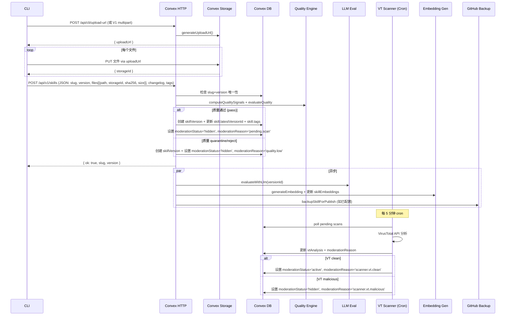

# ClawHub 实际代码 vs 设计文档差异分析

> **文档类型**：差异分析报告  
> **日期**：2026-02-25  
> **对比基线**：  
> - 设计文档：`docs/design/01~08` 系列设计文档  
> - 实际代码：`/Users/dmeck/project/clawhub` 仓库源码  
> **目标**：逐模块对比设计文档中描述（或假设）的 ClawHub 功能与实际 ClawHub 代码实现的差异，指出设计文档的错误假设、遗漏功能和需要修正的内容。

---

## 目录

1. [总体概览](#1-总体概览)
2. [01-clawhub-api-analysis 差异](#2-01-clawhub-api-analysis-差异)
   - [2.1 API 端点差异](#21-api-端点差异)
   - [2.2 技术栈与数据模型差异](#22-技术栈与数据模型差异)
   - [2.3 CLI 行为协议差异](#23-cli-行为协议差异)
   - [2.4 安全机制差异](#24-安全机制差异)
3. [02-api-compatibility 差异](#3-02-api-compatibility-差异)
4. [03-data-model 差异](#4-03-data-model-差异)
5. [04-package-signing 差异](#5-04-package-signing-差异)
6. [05-proxy-mirror 差异](#6-05-proxy-mirror-差异)
7. [06-search 差异](#7-06-search-差异)
8. [07-publish-pipeline 差异](#8-07-publish-pipeline-差异)
9. [08-rbac 差异](#9-08-rbac-差异)
10. [完全遗漏的功能](#10-完全遗漏的功能)
11. [总结与修正建议](#11-总结与修正建议)

---

## 1. 总体概览

### 1.1 评估结论

| 维度 | 评估 | 说明 |
|------|------|------|
| API 端点覆盖 | ⚠️ 部分偏差 | 设计文档遗漏了多个实际存在的端点（stars、souls、users admin、telemetry-sync、resolve），且对已有端点的请求/响应格式存在不准确描述 |
| 数据模型 | ⚠️ 部分偏差 | ClawHub 实际 schema 比设计文档逆向的更丰富（quality 系统、badges、souls、install tracking），也有部分设计文档假设的字段不存在 |
| CLI 行为 | ✅ 基本准确 | 命令集基本对齐，但 lockfile 格式与内容哈希机制有差异 |
| 安全机制 | ⚠️ 有遗漏 | 设计文档低估了 ClawHub 的质量门控系统（quality score + trust tier），忽略了 LLM eval 的实际集成度 |
| 扩展设计 | ✅ 合理 | 02~08 的私有化扩展设计（RBAC/签名/代理/搜索）本身是新增功能，不依赖逆向准确性 |

### 1.2 影响等级定义

| 等级 | 含义 |
|------|------|
| 🔴 **关键** | 直接影响兼容性实现，必须修正 |
| 🟡 **重要** | 影响设计完整性，建议修正 |
| 🟢 **轻微** | 不影响核心功能，可后续补充 |

---

## 2. 01-clawhub-api-analysis 差异

### 2.1 API 端点差异

#### 2.1.1 设计文档中记录但实际行为不同的端点

| # | 端点 | 设计文档描述 | 实际实现 | 影响等级 |
|---|------|-------------|----------|---------|
| 1 | `GET /search` | 分页参数 `cursor` | 实际 **无 cursor 参数**，搜索使用 `q` + `limit` + `highlightedOnly`，返回 `{ results: [...] }` 无分页 | 🔴 |
| 2 | `GET /skills` | `tag` 参数用于过滤 | 实际 **无 `tag` 过滤参数**。实际参数为 `limit`, `cursor`, `sort`（支持 `updated/downloads/stars/installsCurrent/installsAllTime/trending`） | 🟡 |
| 3 | `GET /skills/{slug}` | 路径参数 `{slug}` | **正确**，实际为 `/api/v1/skills/:slug` 路径段路由 | ✅ |
| 4 | `GET /download` | 参数 `slug` + `version` | 实际为 `slug` + `version` + **`tag`**（可选），可通过 tag 解析版本 | 🟡 |
| 5 | `POST /skills` | multipart: files + metadata | 实际支持 **两种 Content-Type**：`application/json`（storageId 引用模式）和 `multipart/form-data`（直接上传模式）| 🟡 |
| 6 | `POST /uploads` | 返回 `{ uploadId, presignedUrls[] }` | 实际为 `POST /api/cli/upload-url`（legacy）或 Convex `generateUploadUrl` mutation。**不返回 uploadId**，仅返回 `{ uploadUrl }` —— 单个 Convex 存储上传 URL，非 presigned URL 列表 | 🔴 |
| 7 | `POST /auth/token` | OAuth code 交换 | **不存在此端点**。认证通过 Convex Auth 内置路由（`/api/auth/*`），Token 创建通过 Convex mutation `tokens.create`，非 REST API | 🔴 |
| 8 | `POST /skills/{slug}/tags` | Tag 设置/移动 | **不存在此 HTTP 端点**。Tags 仅通过 Convex mutation `skills.updateTags` 操作，或在发布时隐式设置（`latest` + 自定义 tags）| 🔴 |
| 9 | `DELETE /skills/{slug}/tags/{tag}` | 删除 tag | **不存在此端点**。Tags 的删除能力在代码中不存在（仅 additive merge） | 🔴 |

#### 2.1.2 实际存在但设计文档完全遗漏的端点

| # | 端点 | Method | 实际功能 | 影响等级 |
|---|------|--------|---------|---------|
| 1 | `/api/v1/skills/:slug/versions/:version` | GET | 获取特定版本详情（含文件列表 + sha256） | 🔴 |
| 2 | `/api/v1/skills/:slug/file` | GET | 预览版本内文件（支持 `path`, `version`, `tag` 参数） | ✅ 已列出 |
| 3 | `/api/v1/search` 的 `resolve` | GET | `GET /api/v1/resolve?slug=X&hash=Y` — 通过 slug + 本地文件哈希匹配远端版本 | 🔴 |
| 4 | `/api/v1/stars/:slug` | POST / DELETE | 给技能点赞/取消点赞 | 🟡 |
| 5 | `/api/v1/souls` | GET | 列出 souls（人格配置） | 🟡 |
| 6 | `/api/v1/souls/:slug` | GET / POST / DELETE | Soul 的完整 CRUD（与 skills 平行的实体类型） | 🟡 |
| 7 | `/api/v1/users` | GET | 用户列表（admin 端点） | 🟡 |
| 8 | `/api/v1/users/ban` | POST | 管理员封禁用户 | 🟡 |
| 9 | `/api/v1/users/role` | POST | 管理员设置用户角色（admin/moderator/user） | 🟡 |
| 10 | `/api/v1/users/restore` | POST | 管理员从 GitHub 备份恢复技能 | 🟢 |
| 11 | `/api/v1/users/reclaim` | POST | 管理员 slug 归还（slug squatting 治理） | 🟢 |
| 12 | `/api/cli/telemetry-sync` | POST | CLI 安装遥测上报（root+skills 映射） | 🟡 |

#### 2.1.3 认证方式差异

| 特性 | 设计文档 | 实际实现 | 影响等级 |
|------|---------|---------|---------|
| API Key 头 | `Authorization: ApiKey <key>` 或 `X-API-Key: <key>` | 实际为 `Authorization: Bearer <token>` 统一模式。Token 创建后以明文形式返回一次，后续以哈希形式存储 | 🔴 |
| Token scope | 提及"Token 可限定操作范围" | 实际 **无 scope 机制**。`apiTokens` 表无 `scopes` 字段，token 等同于用户完整权限 | 🟡 |
| OAuth 流程 | 描述了标准 OAuth code → token 交换 | 实际为 Convex Auth 内置浏览器 OAuth 流，用户需通过 Web UI 完成认证后手动创建 API token | 🟡 |

#### 2.1.4 错误响应格式差异

| 特性 | 设计文档 | 实际实现 | 影响等级 |
|------|---------|---------|---------|
| 错误格式 | `{ "error": { "code": "...", "message": "...", "requestId": "..." } }` | 实际为 **纯文本** `text/plain` 响应（如 `"Skill not found"`, `"Unauthorized"`），无 JSON 包装，无错误码，无 requestId | 🔴 |
| 状态码 423 | 未提及 | 实际存在：安全扫描 pending 时返回 `423 Locked` | 🟡 |
| 状态码 410 | 未提及 | 实际存在：已删除/被移除的技能返回 `410 Gone` | 🟡 |
| 状态码 413 | 未提及 | 实际存在：文件预览超限返回 `413 Payload Too Large` | 🟢 |

### 2.2 技术栈与数据模型差异

#### 2.2.1 Schema 实体差异

| 实体 | 设计文档 | 实际代码 | 影响等级 |
|------|---------|---------|---------|
| `skills.tags` | 独立 `tags` 表（`_id`, `skillId`, `name`, `versionId`） | 实际为 skill 文档的 **内嵌字段** `tags: Record<string, Id<'skillVersions'>>`，无独立表 | 🔴 |
| `skills.status` | `active\|hidden\|deleted` | 实际通过 **多字段组合**表达：`softDeletedAt`（软删除）+ `moderationStatus`（`active\|hidden\|removed`）+ `hiddenAt`/`hiddenBy` | 🟡 |
| `skills.quality` | **未提及** | 实际存在完整的质量评分对象：`{ score, decision, trustTier, similarRecentCount, reason, signals: { bodyChars, bodyWords, uniqueWordRatio, headingCount, bulletCount, templateMarkerHits, genericSummary, cjkChars } }` | 🟡 |
| `skills.badges` | **未提及** | 实际存在徽章系统：`{ redactionApproved, highlighted, official, deprecated }` 各含 `byUserId` 和 `at` | 🟡 |
| `skills.forkOf` | **未提及** | 实际支持 fork/duplicate 关系：`{ skillId, kind, version, at }` | 🟢 |
| `skills.canonicalSkillId` | **未提及** | 存在 canonical skill 概念（用于去重/合并） | 🟢 |
| `skills.stats` | `downloadCount` 单字段 | 实际为 **丰富的 stats 对象**：`{ downloads, installsCurrent, installsAllTime, stars, versions, comments }` | 🟡 |
| `skillVersions.vtAnalysis` | 独立 `vtAnalysis` 表 | 实际为 skillVersions 的 **内嵌字段**：`vtAnalysis: { status, verdict, analysis, source, checkedAt }` | 🔴 |
| `skillVersions.llmAnalysis` | 独立 `llmAnalysis` 表 | 实际为 skillVersions 的 **内嵌字段**：`llmAnalysis: { status, verdict, confidence, summary, dimensions[], guidance, findings, model, checkedAt }` | 🔴 |
| `skillVersions.sha256hash` | 独立于 files 存在 | 正确，存在 `sha256hash` 字段（zip 级哈希） | ✅ |
| `skillVersions.fingerprint` | **未提及** | 实际存在 `fingerprint` 字段 + 独立 `skillVersionFingerprints` 表（用于跨版本去重/匹配） | 🟡 |
| `skillVersions.parsed` | **未提及** | 存在 `parsed: { frontmatter, metadata, clawdis, moltbot }` 结构化字段 | 🟡 |
| **`souls`** | **完全未提及** | 实际存在完整的 souls 实体系统：`souls`, `soulVersions`, `soulVersionFingerprints`, `soulEmbeddings`, `soulComments`, `soulStars` — 与 skills 完全平行 | 🟡 |
| **`skillBadges`** | **未提及** | 独立表存储技能徽章（`highlighted`, `official`, `deprecated`, `redactionApproved`） | 🟢 |
| **`skillDailyStats`** | **未提及** | 每日统计快照表（`skillId, day, downloads, installs`） | 🟢 |
| **`skillLeaderboards`** | **未提及** | 排行榜快照表（trending 等） | 🟢 |
| **`skillStatEvents`** | **未提及** | 统计事件流表（download, star, install 等事件） | 🟢 |
| **`comments`** | **未提及** | 评论表（`skillId, userId, body, createdAt, softDeletedAt`） | 🟡 |
| **`skillReports`** | 提及"举报阈值自动隐藏" | 实际有独立的 `skillReports` 表 + `skills.reportCount`/`lastReportedAt` 字段 | 🟡 |
| **`downloadDedupes`** | **未提及** | 下载去重表（基于 identity + 小时窗口） | 🟢 |
| **`reservedSlugs`** | **未提及** | Slug 保留机制（删除后为原 owner 保留一段时间防 squatting） | 🟡 |
| **`userSyncRoots`** | **未提及** | 用户同步根目录追踪表 | 🟢 |
| **`userSkillInstalls`** | **未提及** | 用户技能安装追踪表 | 🟢 |
| **`userSkillRootInstalls`** | **未提及** | 用户技能安装详情表（per root per skill） | 🟢 |
| **`vtScanLogs`** | **未提及** | VT 扫描批次日志表 | 🟢 |
| **`embeddingSkillMap`** | **未提及** | 轻量级 embeddingId→skillId 映射表（避免搜索时读取大向量文档） | 🟢 |
| `users.role` | `user` 单一角色 | 实际支持 `admin\|moderator\|user` 三级角色 | 🟡 |
| `users.trustedPublisher` | **未提及** | 存在可信发布者标记 | 🟡 |
| `users.banReason` | **未提及** | 存在封禁原因 | 🟢 |
| `users.deactivatedAt`/`purgedAt` | **未提及** | 存在账号停用/清除机制 | 🟢 |

#### 2.2.2 搜索实现差异

| 特性 | 设计文档描述 | 实际实现 |
|------|-------------|---------|
| 搜索类型 | "embedding 向量索引" | 正确。使用 Convex 内置 vectorSearch，结合 lexical fallback |
| 维度 | "未公开" | 实际可从 `EMBEDDING_DIMENSIONS` 常量获取 |
| 搜索策略 | 描述为纯向量搜索 | 实际为 **混合搜索**：vectorSearch → lexical fallback → 合并去重 → 综合排序（`vectorScore + lexicalBoost + popularityBoost`） |
| 排序信号 | 未详述 | 实际包含精确 slug 匹配 boost (+1.4)、slug prefix (+0.8)、name exact (+1.1)、name prefix (+0.6)、log(downloads) 权重 |
| 可见性过滤 | 未提及 | 实际在向量搜索时通过 `visibility` filter 字段过滤（`latest` / `latest-approved`） |

### 2.3 CLI 行为协议差异

| # | 特性 | 设计文档 | 实际实现 | 影响等级 |
|---|------|---------|---------|---------|
| 1 | Lockfile `contentHash` | 记录 `sha256:xxxx` 哈希 | **实际 lockfile 无 `contentHash` 字段**，仅存储 `{ version: string \| null, installedAt: number }` | 🔴 |
| 2 | Lockfile `tag` | 记录安装时使用的 tag | **实际 lockfile 无 `tag` 字段** | 🟡 |
| 3 | Lockfile `registry` | 记录安装来源 registry | **lockfile 中无 `registry` 字段**。来源信息存在于 skill 目录中的 `.clawhub/origin.json`（含 `registry`, `slug`, `installedVersion`, `installedAt`） | 🟡 |
| 4 | `sync` 命令 | 设计文档提及 | ✅ 存在，同步 lockfile 与实际目录状态 | ✅ |
| 5 | `inspect` 命令 | 设计文档提及 | ✅ 存在 | ✅ |
| 6 | `--verbose` 参数 | 列为全局参数 | 实际代码中 **未见 `--verbose` 全局参数**定义 | 🟢 |
| 7 | 内容哈希校验 | "下载 zip + 计算 sha256 + 比对 contentHash" | 实际使用 **fingerprint**（基于文件路径:sha256 排序拼接的哈希）进行版本匹配，通过 `resolve` API 端点实现 | 🟡 |
| 8 | `star` / `unstar` 命令 | **未提及** | 实际存在 `star` 和 `unstar` 命令 | 🟢 |
| 9 | `hide` / `unhide` 命令 | **未提及** | 实际存在管理员 `hide` / `unhide` 命令（除 `delete`/`undelete` 之外） | 🟡 |
| 10 | `ban` / `set-role` 命令 | **未提及** | 实际存在管理员命令 | 🟢 |
| 11 | Registry 解析 | `--registry` > env > config > default | 实际还增加了 **discovery 机制**：先通过 `site` URL 发现 registry API base（`discoverRegistryFromSite`），及 legacy registry hostname 兼容 | 🟡 |
| 12 | 默认 registry | `https://clawhub.com` | 实际为 `https://clawhub.ai` | 🔴 |

### 2.4 安全机制差异

| # | 特性 | 设计文档描述 | 实际实现 | 影响等级 |
|---|------|-------------|---------|---------|
| 1 | 发布准入 | "GitHub 账号年龄" | ✅ 存在 `githubCreatedAt` 字段，用于 trust tier 计算 | ✅ |
| 2 | 质量门控 | 仅提及"举报阈值自动隐藏" | 实际有 **完整的发布时质量评分系统**：signals 计算 → quality score → trust tier 分级 → pass/quarantine/reject 三级决策 | 🟡 |
| 3 | VirusTotal 扫描 | "发布后异步" | ✅ 正确。但更详细：pending poll 每 5 分钟、cache backfill 每 30 分钟、daily rescan 每日 3 AM UTC | ✅ |
| 4 | LLM 分析 | "发布后异步" | ✅ 正确。实际使用 OpenAI API，有详细的 security evaluator prompt，输出结构化的 verdict + dimensions + findings | ✅ |
| 5 | 审计日志覆盖 | "publish, delete, undelete, tag 更新, 举报, 隐藏" | 实际 `auditLogs` 表结构更简化：`actorUserId`, `action`, `targetType`, `targetId`, `metadata`，无 `ip`/`userAgent` 字段 | 🟡 |
| 6 | Moderation 状态 | 未详述 | 实际有丰富的 moderation 系统：`moderationStatus` (active/hidden/removed) + `moderationReason` (quality.low, scanner.vt.pending 等) + `moderationNotes` + `moderationFlags` | 🟡 |
| 7 | GitHub 备份 | **完全未提及** | 实际存在完整的 GitHub 备份/恢复系统，定时将技能文件同步到 GitHub repo | 🟡 |
| 8 | Webhook 通知 | 未详述 | 实际存在 Discord webhook 通知（发布/highlighted 事件） | 🟢 |

---

## 3. 02-api-compatibility 差异

### 3.1 设计基线偏差导致的兼容性风险

| # | 兼容性决策项 | 受影响描述 | 建议修正 |
|---|-------------|----------|---------|
| 1 | Tag 设置/删除端点标注为 "1:1 兼容" | 实际 **不存在** `/skills/{slug}/tags` HTTP 端点。Tags 在 publish 时设置或通过 Convex mutation 操作 | 不需要兼容此端点（ClawHub CLI 不调用）。从 P1 降为新增端点。 |
| 2 | `POST /uploads` 标注为 "兼容 + 扩展" | 实际上传协议完全不同（Convex storage URL vs presigned URL 列表）。CLI 使用 `POST /api/cli/upload-url` → 单 URL → 上传 → `POST /api/cli/publish` | 需重新设计两阶段上传的兼容方案，或者明确新协议。 |
| 3 | 搜索端点标注 cursor 分页为兼容 | 实际搜索 **无 cursor 分页**，仅返回全量结果 | 搜索端点的分页是私有 Registry 的新增能力，非兼容项 |
| 4 | `GET /skills` 的 `tag` 过滤参数 | 实际不存在，排序支持 `trending` 模式（设计文档未覆盖） | 需补充 `trending` 排序的兼容 |
| 5 | 错误响应格式 | 设计假设为 JSON 结构化错误 | 实际为纯文本。私有 Registry 可以扩展为 JSON，但需确保 CLI 能处理两种格式 |

### 3.2 实际 V1 API 路由完整映射

基于 `convex/http.ts` 的实际路由注册：

```
GET  /api/v1/download         → downloadZip
GET  /api/v1/search           → searchSkillsV1
GET  /api/v1/resolve          → resolveSkillVersionV1  ← 设计文档遗漏
GET  /api/v1/skills           → listSkillsV1
GET  /api/v1/skills/:slug     → skillsGetRouterV1  (detail/versions/versions/:ver/file)
POST /api/v1/skills           → publishSkillV1
POST /api/v1/skills/:slug/*   → skillsPostRouterV1  (undelete)
DEL  /api/v1/skills/:slug     → skillsDeleteRouterV1
POST /api/v1/stars/:slug      → starsPostRouterV1   ← 设计文档遗漏
DEL  /api/v1/stars/:slug      → starsDeleteRouterV1 ← 设计文档遗漏
GET  /api/v1/whoami           → whoamiV1
GET  /api/v1/users            → usersListV1         ← 设计文档遗漏
POST /api/v1/users/*          → usersPostRouterV1   ← 设计文档遗漏
GET  /api/v1/souls            → listSoulsV1         ← 设计文档遗漏
GET  /api/v1/souls/:slug      → soulsGetRouterV1    ← 设计文档遗漏
POST /api/v1/souls            → publishSoulV1       ← 设计文档遗漏
POST /api/v1/souls/:slug/*    → soulsPostRouterV1   ← 设计文档遗漏
DEL  /api/v1/souls/:slug      → soulsDeleteRouterV1 ← 设计文档遗漏
OPTIONS /api/*                → preflightHandler (CORS)
```

Legacy 路由（`/api/cli/*`, `/api/skills/*` 等）仍存在但标记为 deprecated。

---

## 4. 03-data-model 差异

### 4.1 设计文档 vs 实际 Schema 实体对照

| 设计文档实体 | 实际对应 | 差异说明 |
|-------------|---------|---------|
| `Skill` | `skills` | 基本结构对齐，但大量字段差异（见下方） |
| `SkillVersion` | `skillVersions` | 结构对齐，VT/LLM 分析为内嵌而非独立表 |
| `Tag` | **无独立表** | 内嵌于 `skills.tags` Record |
| `User` | `users` | 存在角色/信任/封禁等未在设计中覆盖的字段 |
| `Organization` | **不存在** | ClawHub 无组织概念（设计文档标注为私有扩展，正确） |
| `Team` | **不存在** | 同上 |
| `APIToken` | `apiTokens` | 结构基本对齐，但无 scope 字段 |
| `AuditLog` | `auditLogs` | 结构更简化，无 IP/User Agent |
| `ScanResult` | **无独立表** | 内嵌于 `skillVersions.vtAnalysis/llmAnalysis` |
| `Signature` | **不存在** | ClawHub 无签名机制（私有扩展，正确） |

### 4.2 `skills` 表关键字段差异

| 字段 | 设计文档 | 实际代码 | 差异类型 |
|------|---------|---------|---------|
| `status` | ENUM('active','hidden','quarantined','deleted') 单字段 | 多字段组合：`softDeletedAt` + `moderationStatus` + `hiddenAt`/`hiddenBy` | 结构不同 |
| `visibility` | ENUM('public','org','private') | **不存在**（所有技能为公开） | 设计新增 |
| `namespace` | VARCHAR(128) | **不存在** | 设计新增 |
| `risk_level` | ENUM('low','medium','high','critical') | **不存在**（quality.decision 部分覆盖） | 设计新增 |
| `metadata` | JSONB 扩展元数据 | `skillVersions.parsed.frontmatter/metadata` | 位于版本而非技能 |
| `download_count` | BIGINT 单字段 | `stats.downloads` + `statsDownloads` | 结构不同 |
| `tags` | 外键到独立 Tag 表 | `Record<string, Id<'skillVersions'>>` 内嵌 | 结构不同 |
| `quality` | 未设计 | 完整的质量评分对象 | 遗漏 |
| `badges` | 未设计 | `{ redactionApproved, highlighted, official, deprecated }` | 遗漏 |
| `forkOf` | 未设计 | Fork/duplicate 关系 | 遗漏 |
| `batch` | 未设计 | 批处理标记字段 | 遗漏 |
| `reportCount`/`lastReportedAt` | 未设计 | 举报统计字段 | 遗漏 |
| `resourceId` | 未设计 | 资源标识 | 遗漏 |

### 4.3 `skillVersions` 表关键字段差异

| 字段 | 设计文档 | 实际代码 | 差异类型 |
|------|---------|---------|---------|
| `content_hash` | SHA256 内容哈希 | `sha256hash`（可选字段） | 名称不同 |
| `artifact_path` | 对象存储路径 | **不存在**。文件通过 `files[].storageId` 直接引用 Convex Storage | 架构不同 |
| `files` | `[{path, size, sha256}]` | `[{path, size, storageId, sha256, contentType?}]` — 多了 `storageId` 和 `contentType` | 结构差异 |
| `fingerprint` | 未设计 | 存在。基于文件路径+sha256排序拼接的哈希 | 遗漏 |
| `parsed` | 未设计 | `{ frontmatter, metadata, clawdis, moltbot }` | 遗漏 |
| `vtAnalysis` | 独立表 | 内嵌字段 | 结构差异 |
| `llmAnalysis` | 独立表 | 内嵌字段 | 结构差异 |
| `status` | ENUM('pending','active','quarantined','yanked','deleted') | **不存在状态字段**。通过 `softDeletedAt` + 所属 skill 的 moderation 状态间接表达 | 架构差异 |
| `changelogSource` | 未设计 | `auto\|user` — 标记 changelog 来源 | 遗漏 |

### 4.4 `apiTokens` 表差异

| 字段 | 设计文档 | 实际代码 | 差异类型 |
|------|---------|---------|---------|
| `scopes` | JSONB `["read","publish","admin"]` | **不存在** | 设计新增（ClawHub 无 scope） |
| `allowed_skills` | JSONB 可操作技能范围 | **不存在** | 设计新增 |
| `expires_at` | TIMESTAMPTZ | **不存在** | 设计新增 |
| `token_prefix` | VARCHAR(16) | `prefix` — 存在 | ✅ |
| `token_hash` | VARCHAR(128) | `tokenHash` — 存在 | ✅ |

---

## 5. 04-package-signing 差异

### 5.1 差异总结

设计文档 04 中描述的签名方案（cosign/Fulcio/Rekor）为 **纯粹的私有化扩展设计**，ClawHub 实际代码 **不包含任何签名机制**，因此不存在"设计与实现不一致"的问题。

| 特性 | ClawHub 实际 | 设计文档 | 说明 |
|------|-------------|---------|------|
| cosign 签名 | ❌ 不存在 | ✅ 完整设计 | 正确标识为新增能力 |
| manifest.json | ❌ 不存在 | ✅ 完整规范 | ClawHub 使用 Convex schema + `parsed.frontmatter`，无独立 manifest |
| contentHash | `sha256hash` 字段存在（zip 级） | 基于文件级哈希聚合 | **不一致**：实际 ClawHub 的 `sha256hash` 是 zip 字节的哈希，非文件级聚合 |
| 包格式 | 服务端 **动态生成** zip（`buildDeterministicZip`） | 客户端打包 zip → 上传 | **差异**：ClawHub 是存储原始文件 → 下载时动态组装 zip |

### 5.2 关键发现：ClawHub 的包不是预打包的

这是一个 🔴 **关键发现**：ClawHub 的发布流程 **不涉及客户端打包 zip**。实际流程为：
1. CLI 逐个上传文件到 Convex Storage（得到 storageId）
2. CLI 调用 publish API 传入文件元数据（path, size, sha256, storageId）
3. 下载时服务端调用 `buildDeterministicZip()` **动态组装** zip

这与设计文档 04 假设的"客户端打好 zip → 上传 → 服务端存储"模型完全不同。

**影响**：
- `contentHash` 的计算方式需要重新考虑——客户端无法预计算 zip 哈希
- 签名目标应该是 **文件指纹**（fingerprint）而非 zip 产物
- 设计文档中 `manifest.json` 的 `contentHash` 定义（基于文件级哈希聚合）反而与实际的 **fingerprint** 计算方式更接近

---

## 6. 05-proxy-mirror 差异

### 6.1 差异总结

代理/镜像层为纯私有化扩展设计，无直接对标代码。但需注意以下与实际 ClawHub 行为相关的差异：

| 特性 | 设计假设 | 实际情况 | 影响 |
|------|---------|---------|------|
| 产物为 zip 文件 | 缓存 `upstream/X/1.2.3.skill.zip` | 实际下载产物为服务端 **动态生成** 的 zip，非静态文件 | 缓存策略仍然有效（缓存下载结果） |
| 版本不可变 | "同版本号的哈希永远一致" | 因为 zip 是动态生成的，不同时间下载的 zip 字节可能不同（取决于 `buildDeterministicZip` 的确定性）| 需验证动态 zip 的字节确定性 |
| 搜索代理 | 设计建议代理搜索 | ClawHub 搜索无分页，结果集有限 | 代理搜索的缓存策略需适配 |
| moderation 下载阻止 | 未提及 | ClawHub 会阻止恶意/pending scan/removed/hidden 技能的下载（403/423/410） | 代理层需透传这些状态码 |

---

## 7. 06-search 差异

### 7.1 差异总结

| 特性 | 设计文档 | 实际实现 | 影响等级 |
|------|---------|---------|---------|
| 搜索策略 | 分阶段：Phase 1 全文 → Phase 2 向量 | 实际为 **混合搜索**：向量搜索 + lexical fallback + 合并 | 设计低估了实际复杂度 |
| Lexical Fallback | Phase 1 全文搜索是独立阶段 | 实际中 lexical fallback 是向量搜索的 **补充**，并非独立搜索模式 | 🟡 |
| 排序算法 | 未详述 | 实际为 `vectorScore + slugExactBoost(1.4) + slugPrefixBoost(0.8) + nameExactBoost(1.1) + namePrefixBoost(0.6) + log(downloads)*0.08` | 🟡 |
| 搜索分页 | 设计假设有 cursor 分页 | 实际搜索 **无分页** | 🟡 |
| `highlightedOnly` | 设计文档未提及 | 实际搜索支持 `highlightedOnly` 参数过滤只返回 highlighted 技能 | 🟢 |
| embedding 表设计 | skills 表加向量列 | 实际使用独立 `skillEmbeddings` 表 + 轻量级 `embeddingSkillMap` 表（性能优化：避免搜索时读取 12KB 向量文档） | 🟡 |
| 可见性过滤 | 未设计 | 实际通过 `skillEmbeddings.visibility` 字段和 `isLatest`/`isApproved` 过滤 | 🟡 |

---

## 8. 07-publish-pipeline 差异

### 8.1 发布流程关键差异

| 步骤 | 设计文档 | 实际实现 | 影响等级 |
|------|---------|---------|---------|
| 文件上传 | 客户端打包 zip → presigned URLs 列表 → 分片上传 → commit | 客户端 **逐文件上传** 到 Convex Storage → 获得 storageId 列表 → 调用 publish（或 multipart 一步完成） | 🔴 |
| 版本唯一性检查 | 在 upload init 阶段 | 实际在 publish mutation 内部检查 | 🟡 |
| 质量门控 | 未提及（仅有异步扫描） | 发布时 **同步执行** 质量信号计算 + 评分 → pass/quarantine/reject 即时决策 | 🔴 |
| VT 扫描 | 异步扫描 → quarantine | 正确，但触发方式为：publish 后技能默认 hidden（`moderationReason: 'pending.scan'`），VT poll cron 每 5 分钟检查 → 通过后 unhide | 🟡 |
| LLM 分析 | 异步并行执行 | 发布时触发 `evaluateWithLlm` internal action（异步），结果内嵌到版本文档 | ✅ |
| 签名验证 | 发布时验证 cosign bundle | **不存在** | 正确标识为新增 |
| SBOM 生成 | 发布时自动生成 | **不存在** | 正确标识为新增 |
| 审批流程 | 人工审批 quarantine | 实际由管理员/moderator 通过 Convex mutation 手动操作，无专门审批 UI/端点 | 🟡 |
| Embedding 更新 | 未提及 | 发布成功后异步生成 skill embedding 并更新 `skillEmbeddings` 表 | 🟡 |
| GitHub 备份 | 未提及 | 发布成功后异步触发 GitHub 备份（如果配置了） | 🟢 |
| Discord 通知 | 未提及 | 发布后触发 Discord webhook 通知 | 🟢 |

### 8.2 实际发布流程还原



---

## 9. 08-rbac 差异

### 9.1 差异总结

RBAC 设计文档为纯私有化扩展，ClawHub 实际 **无 RBAC 体系**。但需修正设计文档中关于 ClawHub 现有权限体系的描述：

| 特性 | 设计文档描述 | 实际情况 |
|------|-------------|---------|
| "ClawHub 仅有 owner/member 二级权限" | 不完全准确 | 实际有 **三级角色**：`admin`, `moderator`, `user`。Admin 和 moderator 有额外管理权限（ban/role/hide/restore/reclaim） |
| Token scope | 设计假设 ClawHub 有 Token scope | **不存在**。Token 等同于用户全部权限 |
| Agent 身份 | 独立的 service account 概念 | ClawHub 无 agent/service account 概念 |

---

## 10. 完全遗漏的功能

以下是 ClawHub 实际存在但所有设计文档均未提及的功能模块：

| # | 功能 | 说明 | 私有化影响 |
|---|------|------|----------|
| 1 | **Souls 系统** | 与 skills 平行的人格/角色定义实体，完整 CRUD + 版本 + 搜索 + 评论 + stars | 需评估是否在私有 Registry 中支持 |
| 2 | **评论系统** | skills + souls 的用户评论（`comments`/`soulComments` 表） | 社区功能，私有化可选 |
| 3 | **Stars/收藏** | skills + souls 的点赞收藏 + 统计 + API | 社区功能，私有化可选 |
| 4 | **安装遥测** | CLI 上报安装数据 → `userSyncRoots`/`userSkillInstalls`/`userSkillRootInstalls` | 统计功能，影响 stats 准确性 |
| 5 | **排行榜** | `skillLeaderboards` 表 + trending 排序 + 定时重建 | 社区功能，私有化可选 |
| 6 | **每日统计** | `skillDailyStats` 表 + 定时聚合 | 影响统计/报表 |
| 7 | **下载去重** | `downloadDedupes` 表 — 基于 identity+小时窗口去重 | 影响下载统计准确性 |
| 8 | **Slug 保留** | `reservedSlugs` 表 — 删除后为原 owner 保留 slug | 防 squatting，私有化推荐有 |
| 9 | **GitHub 备份/恢复** | 定时备份技能到 GitHub repo + 管理员恢复 | 灾备方案参考 |
| 10 | **Discord Webhook** | 发布/highlighted 事件推送到 Discord | 通知集成参考 |
| 11 | **版本 fingerprint** | 基于文件路径:sha256 排序拼接的确定性哈希，用于跨版本去重和 resolve | 核心匹配机制 |
| 12 | **Resolve API** | `GET /api/v1/resolve?slug=X&hash=Y` — 本地哈希匹配远端版本 | CLI update 流程依赖 |
| 13 | **Badges 系统** | highlighted/official/deprecated/redactionApproved | 影响搜索过滤和展示 |
| 14 | **质量评分系统** | 发布时计算 quality signals + trust tier + pass/quarantine/reject | 核心安全机制 |
| 15 | **动态 Zip 生成** | 下载时服务端用 `buildDeterministicZip` 动态构建 | 影响包格式和缓存设计 |

---

## 11. 总结与修正建议

### 11.1 必须修正项（🔴 关键）

| # | 模块 | 修正内容 |
|---|------|---------|
| 1 | 01-API | Tag 管理端点（POST/DELETE `/skills/{slug}/tags`）**不存在**，需从兼容列表中移除 |
| 2 | 01-API | `POST /auth/token` **不存在**，认证流程需重新描述 |
| 3 | 01-API | 上传协议为"逐文件上传 + publish"而非"presigned URLs 列表 + commit" |
| 4 | 01-API | 错误响应为 **纯文本**，不是 JSON 结构化格式 |
| 5 | 01-API | API 认证统一为 `Authorization: Bearer <token>`，无 `ApiKey` 头 |
| 6 | 01-API | 搜索端点 **无 cursor 分页** |
| 7 | 01-API | 默认 Registry URL 为 `https://clawhub.ai`，非 `https://clawhub.com` |
| 8 | 02-Compat | Tag 端点从 "1:1 兼容" 降级为 "新增端点" |
| 9 | 03-Model | Tags 不是独立表，是 skills 的内嵌字段 |
| 10 | 03-Model | VT/LLM 分析不是独立表，是 skillVersions 的内嵌字段 |
| 11 | 04-Signing | ClawHub 动态生成 zip，非存储预打包产物 — 影响签名目标选择 |
| 12 | 07-Pipeline | 实际发布流程包含同步质量门控，非纯异步扫描 |
| 13 | 01-API | 遗漏 `GET /api/v1/resolve` 端点（CLI update 核心依赖） |
| 14 | 01-API | Lockfile **不包含** `contentHash`/`tag`/`registry` 字段 |

### 11.2 建议补充项（🟡 重要）

| # | 建议 |
|---|------|
| 1 | 新增 Souls 系统的评估章节——决定私有 Registry 是否需要支持 |
| 2 | 补充 `skillVersions.fingerprint` 机制的描述——这是 CLI update/resolve 的核心 |
| 3 | 补充质量评分系统（quality signals + trust tier）的设计文档 |
| 4 | 补充 Stars API 的兼容性决策 |
| 5 | 考虑 `reservedSlugs` 机制在私有 Registry 中的必要性 |
| 6 | 修正用户角色描述：ClawHub 有 admin/moderator/user 三级（非二级） |
| 7 | 补充安装遥测（telemetry-sync）的兼容性决策 |
| 8 | 补充 moderation 状态的完整描述（active/hidden/removed + moderationReason） |
| 9 | 修正版本状态模型：实际无显式 status 字段，通过 softDeletedAt + skill moderation 隐式表达 |
| 10 | 补充 `buildDeterministicZip` 的确定性保证评估——影响缓存层设计 |

### 11.3 设计文档整体评估

| 设计文档 | 逆向准确度 | 扩展设计合理性 | 总体评估 |
|---------|-----------|-------------|---------|
| 01-clawhub-api-analysis | 🟡 60% | N/A | 多处关键假设与实际不符，需全面修正 |
| 02-api-compatibility | 🟡 70% | ✅ 90% | 受 01 偏差影响，兼容决策需部分调整 |
| 03-data-model | 🟡 65% | ✅ 85% | 核心架构差异（tags 内嵌 vs 独立表）需修正 |
| 04-package-signing | ✅ 85% | ✅ 95% | contentHash/包格式假设需微调 |
| 05-proxy-mirror | ✅ 80% | ✅ 90% | 动态 zip 生成对缓存策略有影响 |
| 06-search | ✅ 75% | ✅ 85% | 混合搜索策略比设计更复杂 |
| 07-publish-pipeline | 🟡 55% | ✅ 85% | 上传协议和质量门控差异显著 |
| 08-rbac | ✅ 80% | ✅ 90% | ClawHub 现有角色体系描述需修正 |

---

> **后续行动**：建议根据本差异分析创建 task issue，按 🔴→🟡→🟢 优先级逐项修正设计文档。重点关注上传协议、错误格式、Tag 管理、lockfile 格式这四个兼容性直接相关的关键差异。
