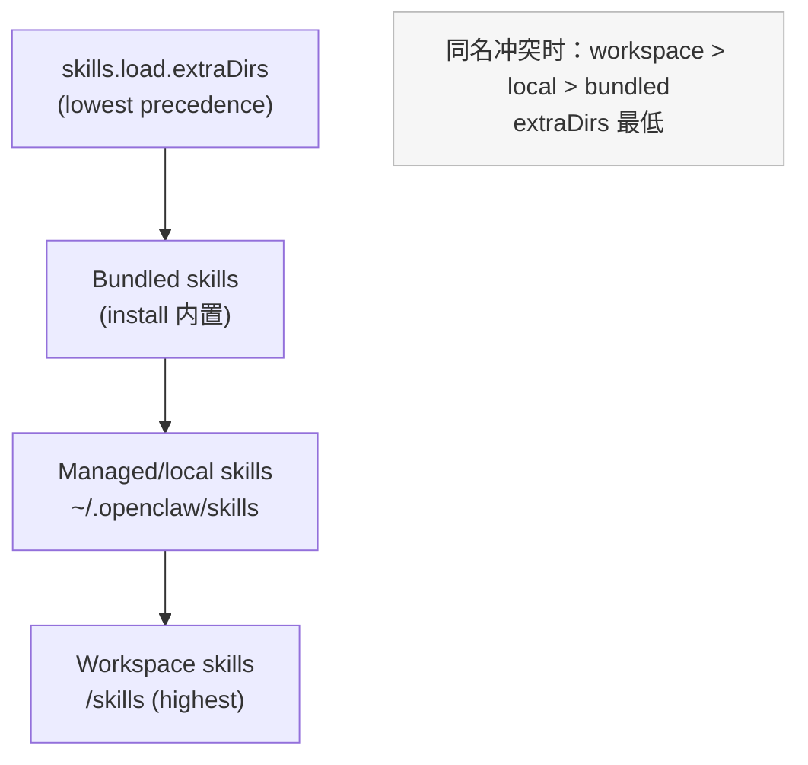
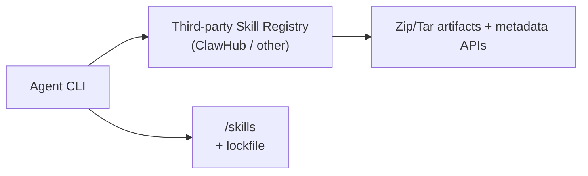
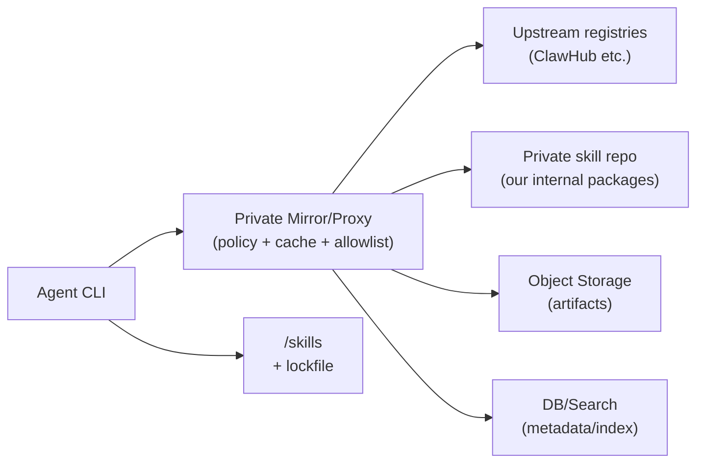
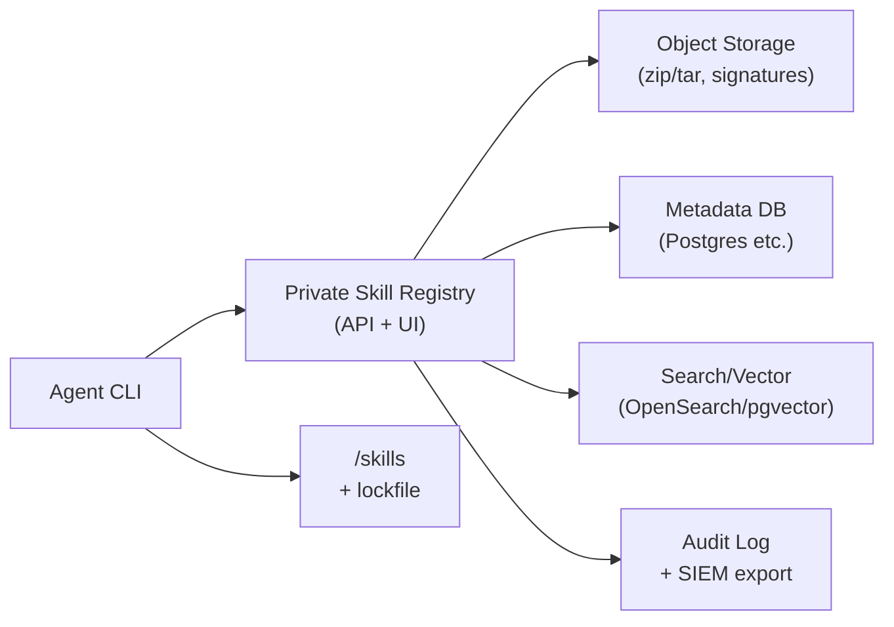
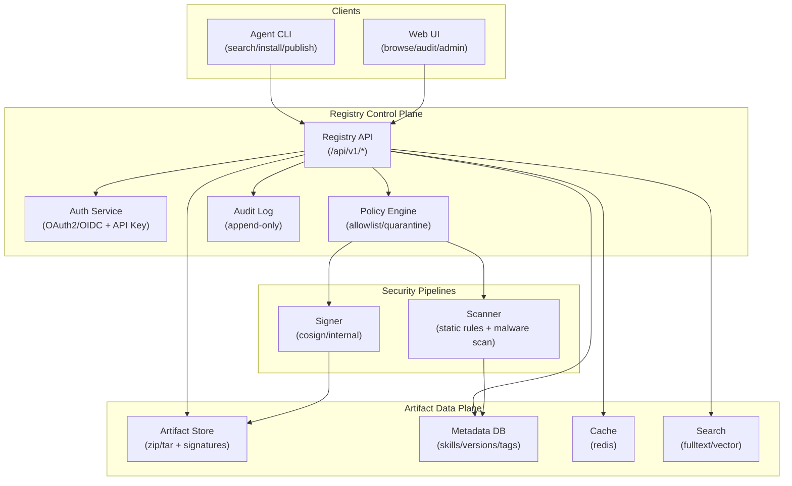
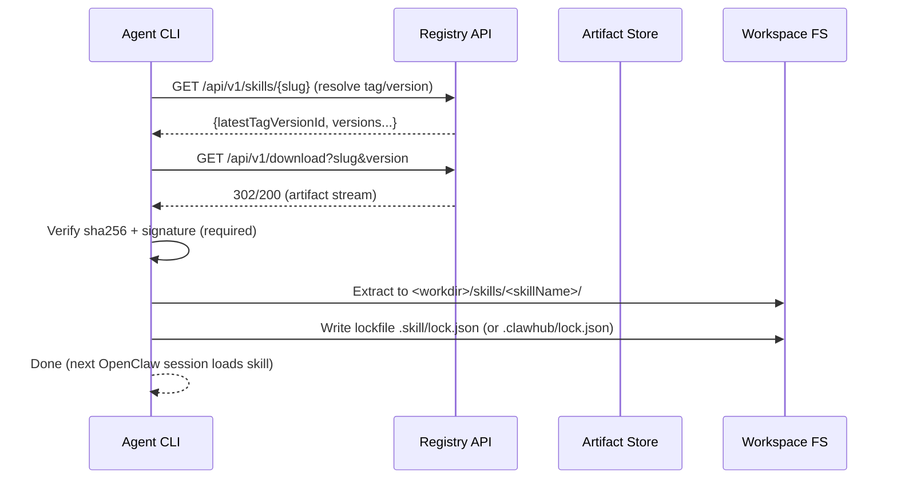
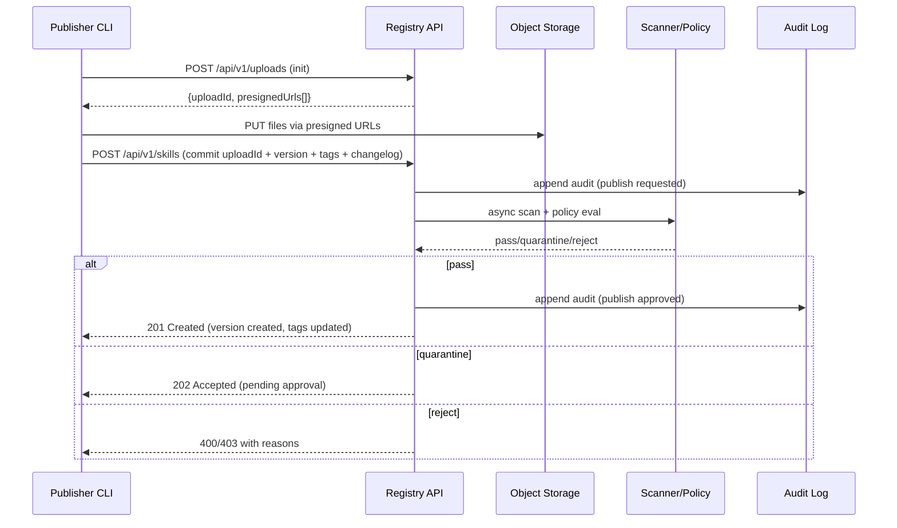

# 工作空间与 Skill 商店设计方案深度调研与技术方案建议

## 执行摘要

基于 OpenClaw 的官方技能体系（Skills）规范与接口、ClawHub 的公开商店实现与 CLI 行为，以及软件供应链安全与包发布/回滚实践（npm、SemVer、签名与更新框架），本报告给出一个面向「agent 命令行使用」的 Skill 商店技术方案：在**不破坏 OpenClaw 的技能加载约定**前提下，提供一个**可私有化部署、可镜像/代理第三方、可命令行发布与版本管理**的 Skill Registry。核心结论如下。citeturn3view2turn4view0turn2view3turn7view1

第一，OpenClaw 的技能并非“插件二进制”，而是 AgentSkills 兼容的**技能文件夹**（至少包含 `SKILL.md`，YAML frontmatter + Markdown 指令），通过**路径优先级**加载：`<workspace>/skills`（最高）→ `~/.openclaw/skills`（本机共享）→ 安装包内置（最低），并可通过 `skills.load.extraDirs` 增加额外目录（最低优先级）。这决定了“安装位置/工作空间模型”和“商店包格式”的边界条件：**安装的最终产物必须是一个技能目录树**。citeturn3view2turn9view0turn4view0

第二，ClawHub（OpenClaw 的公开技能商店）已经形成了一套对我们高度可复用的事实标准：**semver 版本 + tags（含 `latest`）+ zip 版本包下载 + CLI 安装到工作目录下 `skills/` + 本地锁文件 `.clawhub/lock.json` + 通过内容哈希判断本地改动与是否覆盖**。对内建商店而言，最“省心”的兼容策略是：**实现 ClawHub v1 风格的核心 API 子集**（`/api/v1/search`、`/api/v1/skills`、`/api/v1/download`、`/api/v1/whoami`、发布接口等），让 agent 能复用现有交互模型，并用 `--registry` 指向私有域名，从而天然支持“第三方 + 自建”。citeturn2view3turn7view1turn7view0

第三，公开技能市场已经出现明显的供应链风险信号：研究与媒体披露了 ClawHub 上存在恶意技能/社会工程投递链条，且技能常以 Markdown 指令诱导用户/agent 执行恶意命令、窃取凭据。对企业/团队场景，“可私有化、可审计、可强制签名与审批、可隔离执行（sandbox）”不再是加分项，而是底线能力。citeturn24view0turn24view1turn5view0turn3view1

第四，三种商店架构路线中，**推荐默认走“混合方案（第三方 + 私有镜像/代理 + 内部发布）”**：用代理缓存与策略门控吸收第三方生态的搜索/内容，同时对内部私有技能与合规要求提供自主管控；当内部技能量与安全要求上升后，再逐步演进到“完全自建私有商店”。混合方案能显著降低初期研发与运维复杂度，同时降低第三方不可用/合规不可控的风险。citeturn11search7turn2view3turn3view1

（下文给出：现状调研、工作空间设计对比、三方案详细对比表、私有化技术架构、API/CLI 草案、版本与发布流程、私有化部署、权限与安全、运维监控、迁移兼容、风险与路线图与时间估算。）

## 背景与目标

目标用户是“agent（及其操作者）”，其核心诉求是通过命令行完成技能全生命周期管理：**搜索 → 下载/安装 → 列出/更新 → 卸载 → 版本回退**，并且需要同时支持多来源：第三方（如 ClawHub、类 Vercel Marketplace 的第三方分发渠道）与自建私有商店；此外，团队还需要通过命令行把技能上传到自建商店，行为类似 `npm publish`：支持 semver、tag、回滚、审计与权限控制。citeturn2view3turn7view1turn14view0

本报告采用的关键前提与假设（用户未指定部分）：

- 包格式：默认 **zip / tar + manifest JSON**；对 OpenClaw/AgentSkills 兼容而言，包内必须包含技能目录（含 `SKILL.md`）。citeturn9view0turn3view2  
- 认证：支持 **OAuth2 + API Key**；CLI 优先走浏览器/设备授权流，CI/无人值守用 API Key。OAuth2 的基本目标是“以 token 授权而非共享密码”。citeturn16view0  
- 部署环境：支持多云与本地；对象存储可选云厂商对象存储或 S3 兼容方案；需要支持“可断网/半断网”的私有化形态（至少支持离线安装与内网镜像）。  
- 安全边界：把 skill 视作“可导致本地执行/敏感数据接触的供应链输入”，对第三方 skill 采用零信任原则；执行层面建议结合 OpenClaw 的 Docker sandbox 能力降低爆炸半径。citeturn3view1turn5view0turn24view0  

## 现状调研：OpenClaw 技能体系与 Skill 商店生态

### 技能格式与加载机制

OpenClaw 明确以 AgentSkills 兼容的技能目录作为扩展机制：每个 skill 是一个目录，至少包含 `SKILL.md`（YAML frontmatter + Markdown 指令），并在加载时对技能进行过滤（环境/配置/二进制存在性等）。citeturn3view2turn9view0

技能来源与优先级（决定“安装位置”和“工作空间策略”）：

- Bundled skills：随安装包内置（npm 包或 macOS 应用）。citeturn3view2turn3view0  
- Managed/local skills：`~/.openclaw/skills`，作为本机共享覆盖层。citeturn3view2turn3view0  
- Workspace skills：`<workspace>/skills`，最高优先级；名称冲突时 workspace 覆盖其他层。citeturn3view2turn3view0  
- 可配置额外目录：`skills.load.extraDirs`（最低优先级）。citeturn3view2turn4view0  

多 agent 场景下的共享与隔离：每个 agent 有自己的 workspace，因此 `<workspace>/skills` 天然是“按 agent 隔离”的；而 `~/.openclaw/skills` 则在同一机器上对所有 agent 可见。citeturn3view2turn12search6

### Gating、配置覆盖与环境注入

OpenClaw 支持在 `SKILL.md` 的 `metadata.openclaw` 下声明 gating 条件：OS 限制、二进制存在性（`requires.bins/anyBins`）、所需环境变量（`requires.env`）、所需配置项（`requires.config`），并可声明 `primaryEnv` 用于将 `skills.entries.<key>.apiKey` 映射到某个实际 env 名称。citeturn3view3turn3view1

技能相关配置集中在 `~/.openclaw/openclaw.json` 的 `skills` 下：支持 `allowBundled`、`load.extraDirs`、watcher、安装器偏好（如 nodeManager）以及 `entries.<skillKey>` 的 per-skill enable/env/apiKey/config 覆盖。citeturn4view0turn3view1

环境注入的边界非常关键：OpenClaw 在每次 agent run 开始时把 `skills.entries.*.env/apiKey` 注入到 host `process.env`，构建 system prompt，然后在 run 结束后恢复原环境；且明确提醒这些值属于 host 进程（非 sandbox 容器），应避免出现在 prompt/logs 中。citeturn3view1turn3view2  
同时，当 session 运行在 Docker sandbox 内时，sandbox 不继承 host `process.env`，需要通过 sandbox 配置显式传入或烘焙到镜像。citeturn4view0turn5view0

### 工作空间在 OpenClaw 中的安全语义

工作空间（workspace）是 agent 的“家目录”，也是 file tools 的默认工作目录与 workspace context 的主要来源，但它**不是硬隔离**：相对路径会按 workspace 解析，但如果不启用 sandbox，绝对路径仍可能触达 host 其他位置。OpenClaw 建议需要隔离时启用 `agents.defaults.sandbox`。citeturn13view0turn5view0  
这直接影响技能商店设计：商店只负责“把技能落盘到技能目录”，但真正的风险控制必须与执行层（sandbox、tool policy、审批）联动。citeturn5view0turn5view1

### ClawHub：公开 skill 商店的功能与接口形态

OpenClaw 官方文档把 ClawHub 定位为“公开 skills registry”，并给出典型 CLI 流程：`clawhub install <skill-slug>` 安装到当前工作目录的 `./skills`（或回落到配置 workspace），OpenClaw 之后会在下一 session 识别 `<workspace>/skills`。citeturn3view2turn2view3

ClawHub 服务能力与 CLI 行为的重要特征（这些几乎就是我们要对齐的“用户心智模型”）：

- 版本管理：发布生成 semver `SkillVersion`，tag（如 `latest`）指向版本，移动 tag 可回滚。citeturn2view1turn2view3  
- 下载：以“每版本一个 zip”形式提供下载。citeturn2view1turn2view4  
- CLI 参数：`--workdir`、`--dir`、`--registry` 等；安装/更新/发布/同步等命令齐全；本地以 `.clawhub/lock.json` 记录安装。citeturn2view3turn7view1  
- 更新策略：CLI 用内容哈希对比本地技能与 registry 版本；当本地内容不匹配任何已发布版本时，默认拒绝覆盖，需交互确认或 `--force`。citeturn2view3turn7view1  
- 搜索：不仅关键词，还强调 embedding/向量搜索。citeturn2view4turn27view0  
- 安全与治理：开放上传但有门槛与举报/隐藏机制（GitHub 账号年龄、举报阈值自动隐藏等）。citeturn2view3turn7view0  

从实现侧看，ClawHub 的公开 README 描述：后端采用 entity["company","Convex","backend platform"]（DB + file storage + HTTP actions）与 Convex Auth（GitHub OAuth），并使用 embedding + 向量索引进行搜索。citeturn27view0turn22search0turn22search3  
其 schema 还显示了 API token、rate limit、审计日志、恶意扫描/分析字段（例如 `auditLogs`、`apiTokens`、`rateLimits`、`vtAnalysis`、`llmAnalysis` 等），说明“商店侧安全能力”正快速演进。citeturn27view2

### 生态风险：公开技能市场的供应链攻击正在发生

媒体与研究披露：ClawHub 上出现大量恶意技能，伪装成加密交易自动化等，用社会工程方式诱导执行恶意命令、窃取凭据；并强调技能形态（指令 + 可执行脚本/命令）天然扩大攻击面。citeturn24view0turn24view1turn24view2  
OpenClaw 官方文档也明确把第三方 skill 视作不可信输入：应在启用前阅读，且对不可信输入/高风险工具优先启用 sandbox；并提醒 `skills.entries.*.env/apiKey` 会把 secrets 注入 host 进程。citeturn3view1turn5view0

## 方案对比：工作空间设计与商店架构选择

### 工作空间的设计方案对比

这里的“工作空间方案”本质上是回答两个问题：**技能安装到哪里**、**多 agent 场景如何隔离/共享**。OpenClaw 已提供三层技能目录与冲突优先级，因此我们的设计目标是让 CLI/商店把技能“落到正确的层”，并配套锁文件/可重复性。citeturn3view2turn13view0

#### 方案对比表

| 维度 | Workspace-scoped（默认安装到 `<workspace>/skills`） | Host-shared（安装到 `~/.openclaw/skills`） | Bundled+Override（仅把少量 override 放 workspace/local） |
|---|---|---|---|
| 隔离性 | 强：天然 per-agent（多 agent 各自 workspace）citeturn3view2 | 中：同机所有 agent 共享，易交叉影响citeturn3view2 | 取决于 override 放置层级 |
| 可重复性 | 强：可用 lockfile 固定版本，随 workspace 迁移citeturn7view1 | 中：容易“机器状态漂移”，需额外导出/同步机制 | 强：基线由安装包保证，override 用 lockfile 固化 |
| 更新策略 | 适合项目/任务维度管理；冲突时 workspace 覆盖citeturn3view2 | 适合“全局工具包”；但升级可能影响所有 agent | 适合强管控环境（基线稳定，局部可控更新） |
| 风险面 | workspace 可被代码仓库/同步机制污染，需要严格控制写入者citeturn28view0 | 一处污染影响全机；但更易做访问控制（OS 权限） | 风险集中在 override 的分发与启用流程 |
| 推荐场景 | 绝大多数：agent 在任务/项目中按需装技能 | 少数：团队共享技能包、内网工具集 | 强合规：希望“官方基线 + 受控增量” |

#### 技能优先级示意图（与 OpenClaw 一致）



此优先级模型决定了我们在 CLI 侧的默认策略应与 ClawHub 一致：默认安装到 workdir 下的 `skills/`，由 OpenClaw 在下一 session 加载；同时保留把技能安装到 shared 层的能力（用于“跨 workspace 复用/缓存”）。citeturn3view2turn2view3turn7view1

### Skill 商店的三种架构方案对比

以下对比围绕用户要求的三条路线：完全第三方、混合镜像/代理、完全自建私有商店。

#### 方案一：完全依赖第三方商店（ClawHub / 其他第三方）



该路线优点是最快上线、可直接获得社区生态与（可能的）向量搜索体验；但缺点集中在：无法托管私有技能、合规/审计不可控、供应链风险外溢、可用性与 SLA 受制于第三方。近期公开报道指出公开技能市场已成为攻击面，进一步放大此路线的风险权重。citeturn2view4turn24view0turn24view1

#### 方案二：混合（第三方 + 私有镜像/代理 + 内部发布）



混合方案的思想与“私有包管理代理”一致：代理既可缓存上游又可托管内部包；类似 entity["organization","Verdaccio","npm proxy registry"] 这类工具在 npm 生态中提供“代理 + 缓存 + 私有发布”的组合能力。citeturn11search7turn11search3  
对技能商店而言，混合方案可以做到：对上游技能做准入/复制/二次签名/隔离扫描，对内网技能提供私密发布与权限控制，同时不牺牲第三方生态的覆盖度。

#### 方案三：完全自建私有商店



完全自建适合强合规/强隔离与可断网环境，但研发与运维投入最大；同时需要自行承担安全扫描、内容治理、搜索质量、可用性与性能等“平台型能力”的长期成本。

#### 三方案对比总表（关键维度）

| 对比维度 | 第三方商店 | 混合（代理/镜像） | 完全自建私有商店 |
|---|---|---|---|
| 架构复杂度 | 低 | 中 | 高 |
| API 兼容性 | 取决于第三方 | 可对齐 ClawHub v1 并扩展（推荐）citeturn7view1 | 完全可控（但需自行定义/维护） |
| CLI 交互 | 直接用第三方 CLI（如 `clawhub`）citeturn2view3 | 可继续用同一 CLI + `--registry` 指向代理/私库 | 需自研 CLI 或兼容层 |
| 认证与授权 | 第三方账号体系（不可控） | 内部账号体系 + 代理侧策略门控 | 完全内部账号体系（RBAC/审计可控） |
| 版本/Tag/回滚 | 依赖第三方实现（ClawHub 支持 semver + tag 回滚）citeturn2view1 | 代理可复用上游语义，并对内部包实施同一语义 | 需自建：semver、tag、不可变版本等 |
| 包格式与签名 | 依赖第三方；zip 下载常见citeturn2view1 | 可在代理层做“强制签名/二次签名/准入” | 可强制签名与合规模板 |
| 安全与合规 | 风险最高（公开市场已出现恶意技能）citeturn24view0 | 中：可控准入、缓存、隔离、审批 | 最强：内网、全审计、可断网 |
| 成本估算（方向） | 研发最低；第三方不可控 | 研发/运维中等；对上游依赖降到可接受 | 研发/运维最高；长期平台化投入 |

#### 成本估算的可落地模型（不绑定云厂商）

商店的主要成本项通常是：对象存储（版本包）、流量（下载）、计算（API/搜索/扫描）、数据库与缓存。以对象存储为例：不同厂商差异显著，例如公开定价中，entity["company","Amazon","cloud provider"] 的 S3、entity["company","Cloudflare","internet infrastructure"] 的 R2（强调零 egress）与 entity["company","Google","technology company"] 的 Cloud Storage 均按“GB-month + 请求/操作”计费。实际数字会随区域/时间变化，应以当期官方价格页为准。citeturn23search0turn23search1turn23search2  
因此建议把“成本估算”工程化为这类公式：  
- 月存储费 ≈ Σ(artifact 大小 GB-month × 单价)  
- 月请求费 ≈ PUT/GET 等操作次数 × 单价  
- 月流量费 ≈ egress GB × 单价（如 R2 可为 0，但仍有请求费）citeturn23search1  

## 技术设计建议：私有化 Skill 商店

本节给出一个“兼容 OpenClaw/ClawHub、支持代理上游、支持私有发布与审计”的设计方案（推荐作为混合方案与完全自建的共同基座）。

### 设计原则与兼容目标

兼容目标优先级建议如下：

- **技能格式兼容**：严格遵守 AgentSkills 的 `SKILL.md` 约束与目录结构（`SKILL.md` 必须存在，frontmatter 的 `name`/目录名规则等）。citeturn9view0  
- **OpenClaw 加载兼容**：安装产物必须落到 `<workspace>/skills/<skillName>/...` 形式，避免引入 OpenClaw 未声明支持的多层命名空间目录结构；同名冲突由 OpenClaw 优先级机制解决。citeturn3view2turn13view0  
- **ClawHub API/CLI 兼容（强烈推荐）**：优先实现 ClawHub v1 风格 API（至少覆盖搜索/列表/inspect/download/publish/whoami），让 agent 可直接复用 `--registry` 切换第三方与私库的交互，降低 CLI 生态碎片化。citeturn2view3turn7view1  

### 核心对象模型与元数据约定

参考 ClawHub 的公开 spec/README/schema，建议私有商店至少具备这些对象（括号为实现建议）：

- Skill（`skillId/slug` 全局唯一；`displayName/summary`；`owner`；`latestVersion`；`tags: tag -> version`；`status`；`createdAt/updatedAt`）citeturn7view0turn27view0turn27view2  
- SkillVersion（`version`=semver；`changelog`；`files[]` 含 `path/size/sha256`；`createdBy/createdAt`；`softDeletedAt`；可选 `fingerprint/contentHash`）citeturn7view0turn27view2  
- Tag（至少内置 `latest`；支持移动 tag 做回滚）citeturn2view1turn7view0  
- AuthN/AuthZ（用户、组织、团队、service account/API token；角色）citeturn7view0turn27view2  
- AuditLog（所有发布/删除/回滚/权限变更必记）citeturn7view0turn27view2  
- Scan/Policy（恶意检测、规则命中、隔离状态；ClawHub schema 显示了 vt/llm analysis 等演进方向）citeturn27view2turn24view0  

关于 `SKILL.md` frontmatter 的推荐字段：AgentSkills 规范只强制 `name/description`，并允许 `metadata` 扩展；OpenClaw 则在 `metadata.openclaw` 下使用 `requires/*/primaryEnv/install` 等字段做 gating 与安装提示。建议商店侧在索引与安全扫描时，把 `metadata.openclaw.requires` 当作“声明式契约”，用于静态策略（例如：声明需要 `exec`/网络/特定二进制时，强制进入高风险审核队列）。citeturn9view0turn3view3turn3view1

### 存储、数据库、缓存、搜索的推荐组合

一个可私有化部署且易扩展的推荐组合是：

- 对象存储：保存每个版本的 zip/tar 包、签名/证明文件、可选 SBOM。  
- 元数据数据库：保存 skill/version/tag/权限/审计/扫描结果，建议选择能做全文/向量扩展的关系库（或配合专用搜索）。  
- 缓存：对下载与热元数据做缓存。  
- 搜索：至少提供关键词/过滤；若要对齐 ClawHub 的体验，可引入 embedding + 向量检索（ClawHub 明确使用 embedding 与向量索引来做搜索）。citeturn2view4turn27view0turn27view2  

推荐的私有化架构示意：



### 镜像/代理策略（混合方案的关键）

混合方案建议对“上游来源”做分层：

- **Source A：可信上游（例如 ClawHub）**：默认不直连客户端，统一经由代理（便于审计、缓存、准入策略、断网容灾）。ClawHub CLI 已支持 `--registry` 与环境变量覆盖 registry URL，为代理架构提供了天然入口。citeturn2view3turn7view1  
- **Source B：第三方 Marketplace（如 Vercel 一类生态）**：通常不是“skill registry”协议，往往需要“适配器层”（把第三方的 package/模板/集成描述转换为 skill 包）。Vercel Marketplace 的 API 与认证模式体现了第三方平台常见的“平台调用伙伴 API + 伙伴调用平台 API”，并区分 user/system authentication（JWT/OIDC）。因此，对此类来源更现实的做法是：在代理侧做“内容导入/转换/发布到私库”，而不是在 CLI 直接对接多种异构协议。citeturn21view0turn21view1  

代理侧缓存策略建议：

- On-demand 缓存：首次下载触发拉取与缓存；后续命中缓存（降低上游依赖与成本）。  
- Prefetch：对白名单/热门技能定时预取，确保离线可用。  
- 准入门控：对上游引入的版本默认进入 quarantine，需扫描通过/人工审批后才对组织内可见；与近期公开市场恶意技能案例的风险形势匹配。citeturn24view0turn24view1  

### 包签名、溯源与审计

#### 签名建议（v1 可落地）

建议把签名作为“强制执行”的安全基线：发布时由 CI 或发布者签名；安装时强制校验签名与哈希。

可选实现路径：

- 基于 entity["organization","Sigstore","software signing project"] 的 cosign：支持 blob 签名与验证，bundle 内含签名/证书/时间戳/透明日志证明；并支持以 OIDC 身份进行 keyless 签名。citeturn17view0turn17view1  
- 离线/私有化环境：使用“自建 CA/自管私钥/KMS”签名模式，安装端仅信任企业根证书或固定公钥（避免依赖外部透明日志）。cosign 的 verify 支持以公钥或证书链进行校验。citeturn17view1  

#### 防回滚与更新框架（中长期）

技能商店本质上是“更新系统”。为对抗回滚/镜像被攻破等场景，可评估引入 The Update Framework：其目标包括防回滚攻击、在部分密钥或仓库被攻破时仍维持更新系统安全。citeturn19view0turn19view1  
若暂不实现完整 TUF，可先在 v1 采用“不可变版本 + tag 回滚 + 客户端 pin + 服务器端审计”组合，后续再演进为 TUF 元数据与镜像体系。

#### 供应链溯源（建议对齐 SLSA 思路）

SLSA 将“provenance（构建来源与过程）”作为逐级增强的软件供应链保障机制，强调以溯源与验证降低构建与发布环节被篡改的风险。技能商店可在每次发布时生成 provenance（如：Git commit、CI job、依赖锁、构建输入输出）并与签名一起分发。citeturn20view0turn20view1  

### 权限模型（组织/团队/用户/agent）

建议以 RBAC + 资源范围（scope）实现：

- 资源层级：Org → Team → Skill → Version。  
- 角色示例：OrgOwner / OrgAdmin / Maintainer / Publisher / Viewer / Auditor。  
- Agent 身份：通常不应具备“发布”权限；默认只授予“读取/安装”能力（可细分为只读某些 namespace、只能安装已审批版本等）。  
- 关键动作强审计：publish、yank/undelete、tag 移动（回滚）、权限变更、签名信任根变更等，全部写入审计日志（append-only），按需导出到 SIEM。citeturn27view2turn7view0  

### 安全措施清单（与 OpenClaw 执行层联动）

商店侧（Supply）：

- 强制签名与校验（见上）。citeturn17view0turn17view1  
- 依赖/内容审计：静态规则（可疑命令片段、外联下载脚本、凭据收集提示等）+ 恶意扫描；对高风险版本 quarantine。citeturn24view1turn27view2  
- 发布审批：对“来源不明/新发布者/高权限声明（requires bins/env/exec）”启用人工审批。citeturn3view3turn24view0  
- 审计日志与可追溯：发布者身份、签名者、上传 IP、artifact 哈希、tag 变更完整链路。citeturn27view2turn7view0  

执行侧（Run）——建议作为“强制配套”：

- 启用 Docker sandbox 降低工具执行爆炸半径；OpenClaw 明确 sandbox 用于降低文件系统/进程访问面，且可配置 workspace 访问为 none/ro/rw。citeturn5view0  
- 将敏感 skill 默认在 sandbox 运行，严格控制网络与 bind mounts；OpenClaw 明确指出 binds 会绕过 sandbox 文件系统，应限制危险路径。citeturn5view0  
- 最小权限工具策略：把 `exec`、browser、网络等高危工具限制在可信 agent/会话；OpenClaw 安全文档强调硬防护来自 tool policy、审批、sandbox 与 allowlists，而不是系统 prompt。citeturn28view3turn5view0  
- 对“动态技能更新”保持警惕：OpenClaw 可在 session 中途刷新 skills（watcher/remote nodes），官方建议把 skill 文件夹视为 trusted code 并限制写入者。citeturn28view0  
- 漏洞响应流程：隔离（quarantine）→ 旋转密钥/凭据 → 审计与复盘。OpenClaw 安全指南包含 incident response 与 rotate 的基本思路，可参考其流程编写企业版 runbook。citeturn28view4turn5view1  

## API/CLI 规范草案

本草案以“兼容 ClawHub v1”作为优先目标，并在此基础上补齐企业私有化能力（组织/权限/镜像/签名/审计）。

### API 约定

- Base URL：`https://<registry-host>/api/v1`（与 ClawHub 文档/CLI 引用一致）。citeturn7view1  
- Auth：
  - OAuth2（Bearer Token）：`Authorization: Bearer <access_token>`。OAuth2 的目标是让客户端以 access token 获得有限访问权限。citeturn16view0  
  - API Key：`Authorization: ApiKey <key>` 或 `X-API-Key: <key>`（用于 CI/agent service account）。  
- 响应统一结构（成功可直接返回对象；错误返回标准 error envelope）。

错误响应示例（JSON）：

```json
{
  "error": {
    "code": "SKILL_VERSION_CONFLICT",
    "message": "skill 'pdf-processing' version '1.2.3' already exists",
    "requestId": "req_01JNE9...",
    "details": {
      "skill": "pdf-processing",
      "version": "1.2.3"
    }
  }
}
```

### 核心 API 列表（草案）

| 类别 | Method | Path | 说明 | 认证 |
|---|---:|---|---|---|
| 健康检查 | GET | `/health` | liveness/readiness | 否/内网 |
| 身份 | GET | `/whoami` | 校验 token（ClawHub CLI 用于 `whoami`）citeturn7view1 | 是 |
| 搜索 | GET | `/search?q=...&limit=...` | 搜索 skills（ClawHub CLI 约定）citeturn7view1 | 否/可选 |
| 浏览 | GET | `/skills?limit=...&sort=...&tag=...` | 列表/排序（对齐 ClawHub `explore`）citeturn7view1 | 否/可选 |
| 详情 | GET | `/skills/{slug}` | skill 元数据与 tag 指针 | 否/可选 |
| 版本列表 | GET | `/skills/{slug}/versions?limit=...&cursor=...` | 版本历史 | 否/可选 |
| 下载 | GET | `/download?slug=...&version=...` | 返回该版本 zip（ClawHub install 行为）citeturn7view1turn2view1 | 否/可选 |
| 文件预览 | GET | `/skills/{slug}/file?version=...&path=...` | 仅文本，限制大小（对齐 inspect 的“fetch raw file”思路）citeturn7view1 | 否/可选 |
| 发布 | POST | `/skills` | multipart 上传（ClawHub CLI 文档指出发布走此路径）citeturn7view1 | 是 |
| 软删除 | DELETE | `/skills/{slug}` | owner/mod/admin 可软删除（对齐 ClawHub delete）citeturn7view1turn27view0 | 是 |
| 恢复 | POST | `/skills/{slug}/undelete` | 对齐 ClawHub undelete | 是 |
| Tag 变更 | POST | `/skills/{slug}/tags` | 设置/移动 tag（用于回滚） | 是 |
| Tag 删除 | DELETE | `/skills/{slug}/tags/{tag}` | 删除 tag | 是 |
| 版本 yank | POST | `/skills/{slug}/versions/{version}/yank` | 让版本不可被下载/安装（企业版推荐） | 是 |
| 签名查询 | GET | `/skills/{slug}/signatures?version=...` | 返回签名/证明（cosign bundle 等） | 否/可选 |
| 审计查询 | GET | `/audit?from=...&to=...&actor=...` | 管理员/审计员查询 | 是 |

说明：ClawHub 的实现细节可能与上述路径略有差异（例如下载参数名），但其 CLI 文档已明确关键端点：`/api/v1/search`、`/api/v1/skills`、`/api/v1/download`、`/api/v1/whoami`、以及发布 `POST /api/v1/skills`。因此兼容层应优先以这些端点为“硬对齐目标”。citeturn7view1

### 发布（Upload）协议建议：两阶段上传 + 可审计提交

参考 ClawHub spec 中的上传流程思路（先申请上传会话、再上传文件、再提交元数据/版本/tag），私有商店可采用同样的“两阶段 API”，以支持大文件/断点与更好的审计。citeturn7view0turn22search7

建议协议：

1) `POST /api/v1/uploads` → 返回 `uploadId` 与每个文件的预签名 URL（或分片 URL）。  
2) 客户端直传对象存储。  
3) `POST /api/v1/skills`（commit）→ 关联 `uploadId`，写入版本、changelog、tags、签名、扫描任务。  

### CLI 规范草案（兼容 + 扩展）

#### 设计建议：以 ClawHub CLI 交互为基线

ClawHub CLI 已提供 `--workdir`、`--dir`、`--registry`、`--no-input` 等全局选项，并覆盖 login/search/install/update/list/publish/delete/sync 等流程。为了“第三方 + 自建”的统一体验，建议：

- 继续采用相同交互模型（workdir/dir/registry/lockfile）。citeturn2view3turn7view1  
- 私有商店实现兼容 API 后，agent 可以直接使用：  
  - `clawhub --registry <private> search ...`  
  - `clawhub --registry <private> install ...`  
  - `clawhub --registry <private> publish ...`  
  （从而以最小成本满足“从第三方/自建商店安装 + 向自建商店上传”）

同时，为支持更多第三方来源（如 Vercel 这种非 skill-registry 协议的平台），建议另提供“registry adapter”机制（可作为后续演进，本报告给出草案）。

#### CLI 命令表（草案，名称可沿用 clawhub 或包装为 openclaw skill）

| 命令 | 示例 | 说明 |
|---|---|---|
| `login` | `skill login --registry private` | OAuth2 设备/浏览器登录，写入本地凭据 |
| `whoami` | `skill whoami --registry private` | 校验 token（对应 `/whoami`）citeturn7view1 |
| `search` | `skill search "postgres backups" --registry clawhub` | 搜索（对应 `/search`）citeturn2view3 |
| `install` | `skill install my-skill --tag latest --workdir .` | 下载并解压到 `<workdir>/skills/<name>`；写 lockfileciteturn7view1 |
| `list` | `skill list --workdir .` | 读取 lockfile 并列出已安装citeturn7view1 |
| `update` | `skill update --all --workdir .` | 对比本地 hash 与 registry 版本；必要时 `--force` 覆盖citeturn2view3 |
| `uninstall` | `skill uninstall my-skill --yes` | 删除本地目录并更新 lockfileciteturn7view1 |
| `inspect` | `skill inspect my-skill --versions --files` | 不安装，查看版本/文件/文本预览citeturn7view1 |
| `publish` | `skill publish ./my-skill --version 1.0.0 --tags latest` | 上传并创建新版本（multipart 或两阶段）citeturn7view1 |
| `tag set` | `skill tag set my-skill latest 1.2.3` | 移动 tag（回滚）citeturn2view1 |
| `rollback` | `skill rollback my-skill --tag latest --to 1.2.2` | tag 移动的语法糖 |
| `yank` | `skill yank my-skill@1.2.3` | 禁止安装但保留审计（企业推荐） |
| `config` | `skill config set registry.private.url ...` | 配置多 registry 与凭据 |

#### CLI 配置文件示例（YAML）

```yaml
# ~/.skillrc.yaml
registries:
  clawhub:
    type: clawhub-v1
    url: "https://clawhub.com"
  private:
    type: clawhub-v1
    url: "https://skills.mycorp.internal"
auth:
  private:
    mode: oauth2
    token: "redacted"
defaults:
  workdir: "."
  dir: "skills"
  registry: "private"
trust:
  requireSignature: true
  trustedIssuers:
    - "https://issuer.example.com"
  trustedIdentities:
    - "build-bot@mycorp.example"
policy:
  allowUnsignedForRegistries: ["clawhub"]  # 迁移期策略
```

### 关键流程时序图

#### 安装流程（含校验与锁文件）



上述“安装后生效”的语义应与 OpenClaw 一致：skills 列表在 session 维度快照，配置/技能变化通常在“新 session 或 watcher refresh 后”生效。citeturn3view4turn28view0

#### 发布流程（两阶段上传 + 扫描/签名门控）



## 版本管理、发布流程、私有化部署、权限安全、运维监控、迁移兼容与实施路线图

### 版本管理与发布/回滚策略

建议把“不可变版本 + semver + tag”作为 v1 的最小闭环：

- SemVer 规则：`MAJOR.MINOR.PATCH`，分别表示不兼容变更/兼容新功能/兼容 bugfix；并强调“发布后内容不可修改，只能发布新版本”。citeturn15view0  
- Tag 语义：参照 npm 的 `dist-tag` 与 ClawHub 的 `latest`：默认安装 `latest`，而回滚通过“移动 tag 指针到旧版本”实现。citeturn14view1turn2view1turn7view0  
- 删除策略：企业内部建议优先支持 “yank/soft-delete + 审计保留”，而不是硬删除；npm 的 unpublish 政策强调 registry 数据不可变以保证安全与稳定，并限制 unpublish 条件；这种思路可用于制定你们的内部策略（例如仅允许短窗口撤回，过期只能 deprecate/yank）。citeturn14view3turn14view2turn14view0  

### 私有化部署方案

推荐按部署复杂度提供三档形态（同一代码基座）：

- 单机/小团队：单实例 API + 本地/内网对象存储（或 S3 兼容）+ 单库；适合 PoC/MVP。  
- 标准生产：API 多副本 + DB 主从/托管 + 对象存储 + 缓存 + 搜索集群；前置反向代理与 WAF；支持水平扩容与限流。  
- 高安全/可断网：内网对象存储 + 内网 OAuth/OIDC（或离线 API key）+ 预拉取镜像；发布侧强制走内网 CI；外部上游同步通过“隔离区”导入。

对象存储选型可参考官方计费模型：S3/Cloud Storage/R2 等均按存储与操作计费，差异主要在 egress 与请求单价。citeturn23search0turn23search1turn23search2

### 权限与安全策略（落地建议）

- 默认“最小权限”：agent/service account 仅具备 read/install；publish 必须是受控身份（CI 或人）。  
- 信任策略：默认仅允许安装“已签名 + 已扫描通过 + 在组织 allowlist 内”的版本；迁移期可对 ClawHub 设“允许未签名但需 quarantine 审批”的例外。citeturn24view0turn3view1  
- 与 OpenClaw 执行层联动：对高风险技能（声明 requires.bins/exec/network，或被规则判定）强制在 Docker sandbox 运行，并限制 workspaceAccess、network、bind mounts。citeturn3view3turn5view0  
- 安全基线：参考 OpenClaw “access control before intelligence”的思路，硬防护依赖 tool policy/sandbox/allowlists，而不是 prompt；对不可信输入默认“敌对”。citeturn28view3turn5view1  

### 运维与监控（最小可用清单）

- 指标：QPS、p95 延迟、下载成功率、扫描队列长度、quarantine 数量、签名校验失败数、401/403/429 比例。  
- 日志：请求日志（含 requestId）、审计日志（不可篡改）、下载日志（含 artifact digest）、发布日志（含上传文件哈希）。  
- 追踪：发布链路（上传→扫描→审批→tag 更新）全链路 trace。  
- 容量：对象存储容量增长曲线（按版本大小与保留策略）、DB 索引膨胀、缓存命中率。  
- 备份与恢复：DB 定期备份、对象存储版本化/生命周期策略；确保能基于 digest 恢复任意版本。

### 迁移与兼容性考虑

目标：从“完全第三方”平滑迁移到“混合/私有”，并保持 agent 侧 CLI 使用方式尽量不变。

#### 命名空间与兼容策略

由于 AgentSkills/OpenClaw 对 skill 名称与目录名有约束（主要是小写字母/数字/连字符，且 `SKILL.md` 的 `name` 必须匹配父目录名），不建议在本地目录结构引入类似 `@org/name` 的多级目录命名空间；更现实的做法是：

- registry 层支持“组织/项目命名空间”，但安装落盘仍以 `skillName` 为目录名；若发生同名冲突，按 OpenClaw 优先级模型由 workspace/local/bundled 决定谁生效。citeturn9view0turn3view2  
- 对内部技能建立命名规范：如 `corp-<domain>-<skill>` 或 `team-<skill>`，让名字在生态内可区分。  

#### 数据迁移步骤（建议流程）

1) 盘点：列出当前 agent/workspace 的 lockfile 安装清单（ClawHub 使用 `.clawhub/lock.json`，可据此导出）。citeturn7view1turn2view3  
2) 建立私有 registry，并先以“只读代理”模式接入上游（保证安装路径与 CLI 参数不变）。citeturn7view1  
3) 对白名单技能做预拉取与缓存；引入 quarantine：新版本默认不直接放行。  
4) 内部技能迁移：把内部维护的 skill 统一入库并强制签名；CI 自动 publish。  
5) 切换策略：把默认 registry 指向私有（CLI 默认或环境变量）；对上游仅保留必要例外。  
6) 关闭直连：强制所有 agent 通过私有代理访问，确保审计与策略一致。

### 优缺点与风险评估

| 风险 | 触发方式 | 影响 | 缓解措施 |
|---|---|---|---|
| 供应链恶意技能 | 公开市场投毒/社会工程诱导执行 | 凭据泄露、资产损失 | quarantine + 签名强制 + 扫描 + 最小权限执行（sandbox）citeturn24view0turn5view0turn17view1 |
| 工作空间被污染 | repo 同步/协作写入把恶意 skill 放入 `<workspace>/skills` | 覆盖同名技能（workspace 优先级最高） | 限制 workspace 写入者；对技能目录做完整性监测；结合 OpenClaw 对 dynamic skills 的提醒citeturn3view2turn28view0 |
| Tag 回滚被滥用 | 恶意/误操作移动 `latest` | 大范围回退/植入后门 | tag 变更需审批/强审计/双人复核；保持不可变版本与审计链citeturn2view1turn27view2 |
| 私有化带来的运维负担 | 自建搜索/扫描/高可用 | 成本上升、稳定性风险 | 推荐混合起步；先兼容 API/CLI，逐步补齐平台能力citeturn11search7turn2view3 |
| 认证体系复杂化 | OAuth2/OIDC、API key、多租户 RBAC | 配置错误导致越权 | 按 RFC 6749 实现最小可用 OAuth2；service account 用短期 key；全审计citeturn16view0turn27view2 |

### 实施路线图与时间估算（建议按阶段交付）

时间为工程经验估算（以 1 个后端 + 1 个前端/全栈 + 1 个平台/安全 为基线；若并行做扫描/签名/搜索，可增加人力压缩周期）。

阶段一：兼容接入与只读安装（约 3–4 周）
- 交付物：ClawHub v1 核心只读 API 兼容层（search/skills/download/whoami）、CLI 配置与 `--registry` 切换指南、workdir/dir/lockfile 行为对齐、对象存储落地与缓存。citeturn7view1turn2view3  
- 风险缓解：先不做发布，降低安全面；对上游只做代理与缓存。

阶段二：私有发布与版本/Tag（约 4–6 周）
- 交付物：publish（multipart/两阶段）、semver 校验、tag（latest）、soft-delete/yank、审计日志、基础 RBAC、最小化管理 UI。citeturn15view0turn2view1turn14view0  

阶段三：安全基线与治理（约 4–6 周）
- 交付物：强制签名与校验（cosign 或内部签名）、quarantine + 扫描流水线、策略引擎（allowlist/审批）、与 OpenClaw sandbox 配置模板联动、漏洞响应 runbook。citeturn17view0turn5view0turn28view4  

阶段四：混合生态与迁移完成（约 3–5 周）
- 交付物：上游导入/镜像策略、预拉取、离线安装包导出、迁移工具（从 lockfile 导入/重写 registry 指向）、监控告警与容量/成本看板。citeturn7view1turn23search0turn23search1  

阶段五：增强与规模化（持续迭代）
- 方向：向量搜索（embedding）、provenance（参考 SLSA）、更新框架（评估 TUF）、多区域部署与灾备。citeturn27view0turn20view0turn19view0